## Pseudo Random Numbers

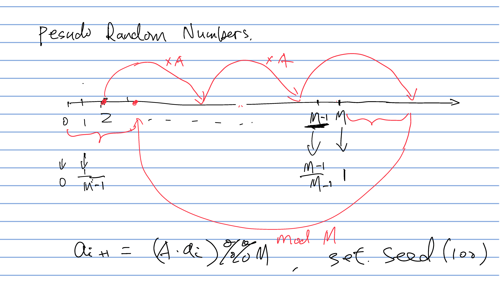

## Example: Generating $\mathrm{Unif}(a,b)$

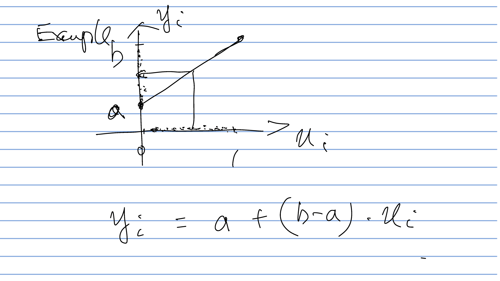

## Inverting C.D.F. (Continuous Case)

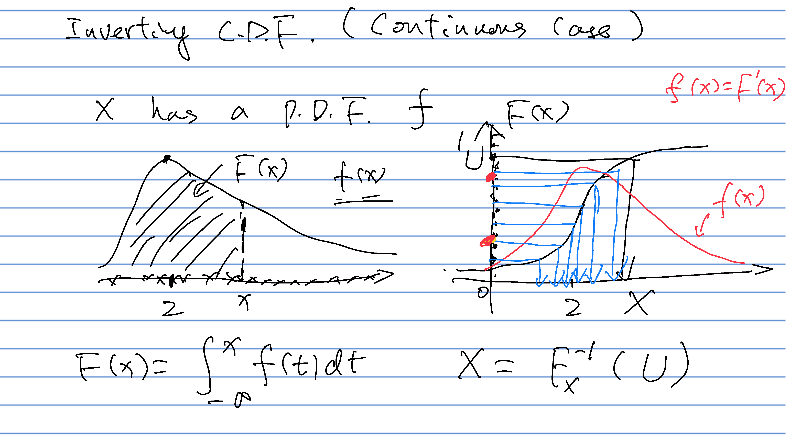

## Proof: Validity of the Inverse-CDF Method

**Pf:** $X = F_X^{-1}(U)$, $\quad U = F_X(X)$

$$
P(X \le x) = P\big(F_X^{-1}(U) \le x\big)
$$

$$
= P\big(U \le F_X(x)\big)
$$

$$
= F_X(x)
$$

$$
f_X(x) = f_U\big(F_X(x)\big)\cdot \left|\frac{du}{dx}\right| = f_U\big(F_X(x)\big) f(x) = 1 \times f(x)
$$

## Example: Exponential Distribution

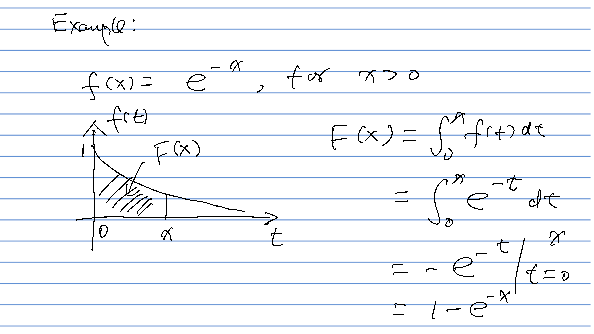

## Example: Exponential Distribution (cont'd)

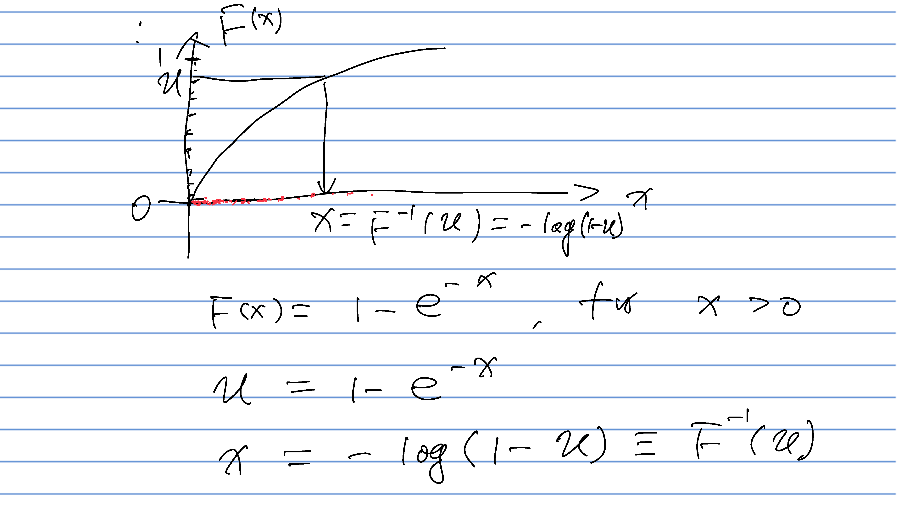

## Assignment 1, Q2

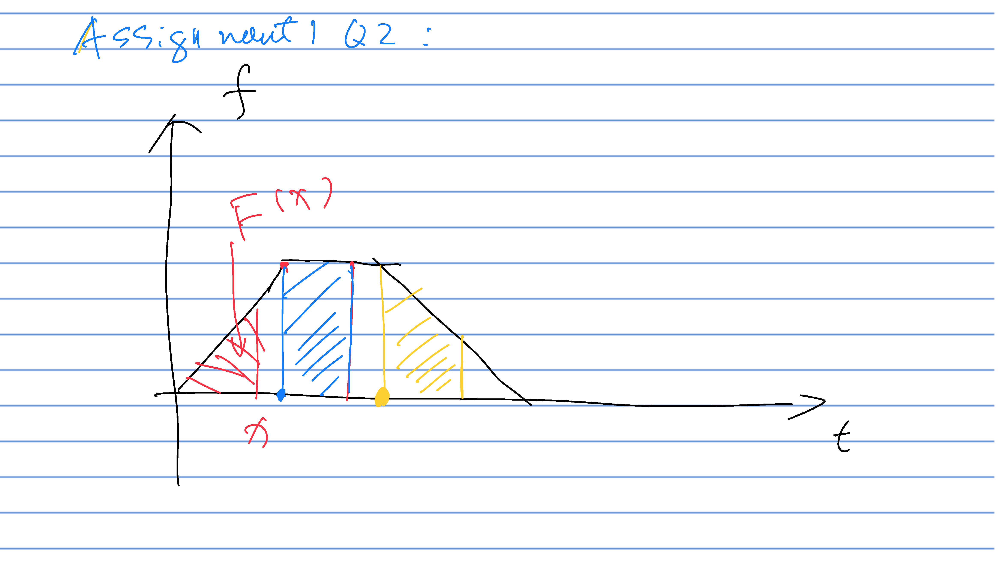

## Generating $N(0,1)$ Random Variables

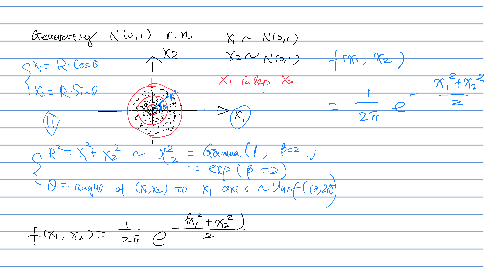

## The Law of Large Numbers

**Theorem 5.1.1** (Strong Law of Large Numbers) *If random variables $X_1, X_2, \ldots$, iid from a distribution with finite mean $\mu$, then*

$$
P\left(\frac{X_1 + \ldots + X_n}{n} \to \mu\right) = 1 \tag{5.1}
$$

This theorem says that if we can simulate $X_i$ long enough, the sample average will almost surely converge to the true mean.

## The Central Limit Theorem

**Theorem 5.1.2** (Central Limit Theorem) *If random variables $X_1, X_2, \ldots$, iid from a distribution with finite mean $\mu$ and finite standard deviation $\sigma$, then*

$$
\frac{\bar X - \mu}{\sigma/\sqrt n} \to^d N(0,1) \tag{5.2}
$$

CLT can be used to calculate error bound given a confidence level. For instance, given confidence level $\alpha = 95\%$, we can conclude from CLT:

$$
P(-1.96\,\sigma/\sqrt n \le \bar X - \mu \le 1.96\,\sigma/\sqrt n) \approx 0.95 \tag{5.3}
$$

Obviously, we see that the width of error bound will decrease with $n$, in a rate of square root.

$$
-1.96 < \frac{\bar X - \mu}{\sigma/\sqrt n} < 1.96 \iff |\bar X - \mu| < 1.96\cdot\frac{\sigma}{\sqrt n}
$$

$$
\iff \bar X - 1.96\frac{\sigma}{\sqrt n} < \mu < \bar X + 1.96\frac{\sigma}{\sqrt n}
$$

## A Toy Example: Estimating $\pi$ with Monte Carlo Method

Suppose random variables $X, Y$ are uniformly distributed over rectangle $S = (-1,1)\times(-1,1)$, as displayed in Figure 5.2. The probability that $(X,Y)$ lies in the ball $C = \{(x,y)\mid x^2+y^2 \le 1\}$ is $\pi/4$, in other words,

$$
E(4\times I((X,Y)\in C)) = \pi.
$$

We can draw samples of $(X,Y)$ uniformly from $S$ and count how much proportion of these samples fall into $C$, then $\pi$ is estimated by:

$$
\hat\pi_n = 4\times \frac{\sum_{i=1}^n I((X_i,Y_i)\in C)}{n} \tag{5.4}
$$

## Figure 5.2: Estimating $\pi$

::: columns
::: {.column width="45%"}
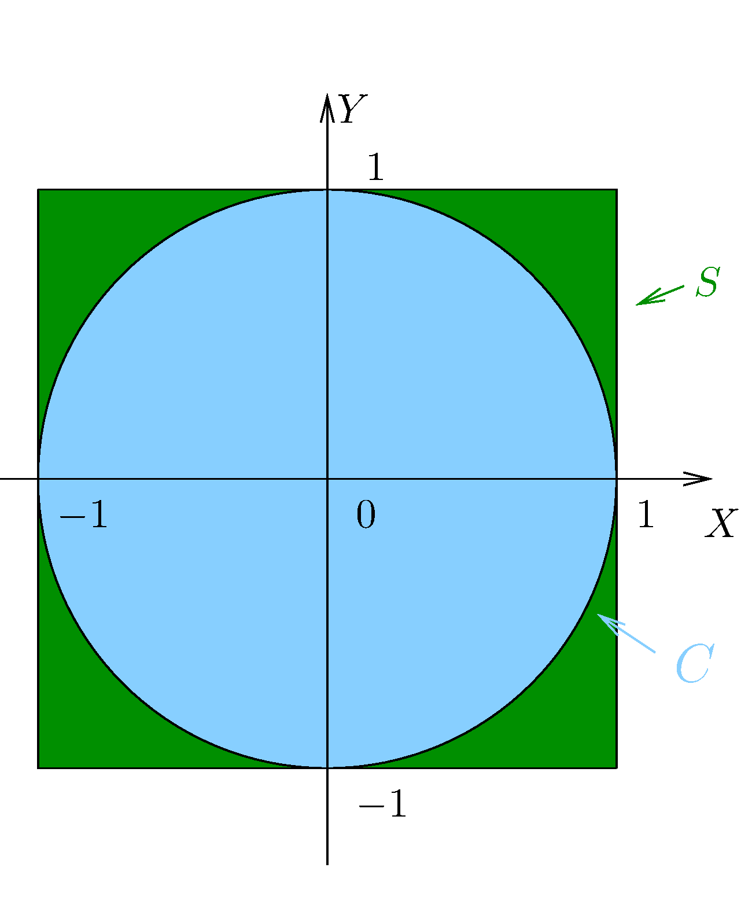
:::
::: {.column width="55%"}
$(X,Y)\sim \mathrm{Unif}(S)$

The probability that $(X,Y)$ lies in the ball $C=\{(x,y)\mid x^2+y^2\le 1\}$ is $\pi/4$

$$P((X,Y)\in C) = \frac{\pi}{4}$$

$$E(I((X,Y)\in C)) = \frac{\pi}{4}$$

$$
I((X,Y)\in C) =
\begin{cases}
1, & (X,Y)\in C \\
0, & \text{o.w.}
\end{cases}
$$

$$
Z = 4\cdot I((X,Y)\in C), \quad E(Z) = \pi
$$

$$
Z_1, Z_2, \ldots, Z_n \;\Rightarrow\; \bar Z = \frac{Z_1+\cdots+Z_n}{n} = \hat\pi
$$
:::
:::

## Evaluation of Point Estimators

$$
\hat\theta^{(1)} = \hat\theta\big(X_1^{(1)}, \ldots, X_n^{(1)}\big)
$$

$$
\hat\theta^{(2)} = \hat\theta\big(X_1^{(2)}, \ldots, X_n^{(2)}\big)
$$

$$
\vdots
$$

$$
\hat\theta^{(N)} = \hat\theta\big(X_1^{(N)}, \ldots, X_n^{(N)}\big)
$$

We evaluate a point estimator $\hat\theta$ by its Mean Squared Error:

$$
\mathrm{MSE} = E\big((\hat\theta - \theta)^2\big)
$$

Estimated by Monte Carlo with $N$ repetitions:

$$
\widehat{\mathrm{MSE}} = \frac{\sum_{i=1}^N (\hat\theta^{(i)} - \theta)^2}{N}
$$

## Example of Hypothesis Testing

| $Y_i$ | $X_i$ | $Z_i$ |
|:---:|:---:|:---:|
| $Y_1$ | $X_1$ | $0$ |
| $Y_2$ | $X_2$ | $0$ |
| $\vdots$ | $\vdots$ | $\vdots$ |
| $Y_i$ | $\vdots$ | $1$ |
| $\vdots$ | $\vdots$ | $\vdots$ |
| $Y_n$ | $X_n$ | $1$ |

$$
H_0: \mathrm{corr}(Y,X) = 0 \;\Big|\; H_1: \mathrm{corr}(Y,X) \ne 0
$$

$$
\mathrm{corr}(Y,Z) = 0
$$

## Hypothesis Test

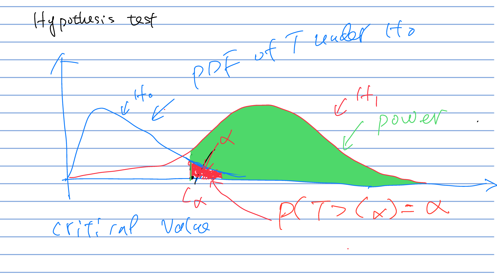

## Two Types of Errors

|          | $T > c_\alpha$      | $T \le c_\alpha$      |
|----------|---------------------|-----------------------|
| $H_0$    | Type I error (FP)   | TN                    |
| $H_1$    | TP                  | Type II error (FN)    |

$$
P(FP) = \hat P(T > c_\alpha \mid H_0) = \alpha
$$

$$
\text{power} = P(TP) = \hat P(T > c_\alpha \mid H_1).
$$

power is also called sensitivity.

## Estimating the Critical Value $c_\alpha$ by Monte Carlo

Under $H_0$:

| Replicate | Test statistic | $c_\alpha$ | $T^{(i)} > c_\alpha$ |
|:---:|:---:|:---:|:---:|
| $1$ | $T^{(1)}$ | $c_\alpha$ | $1$ |
| $2$ | $T^{(2)}$ | $c_\alpha$ | $1$ |
| $\vdots$ | $\vdots$ | $\vdots$ | $\vdots$ |
| $N$ | $T^{(N)}$ | $c_\alpha$ | $0$ |

$$
\hat P(T > c_\alpha \mid H_0) = \frac{\sum_{i=1}^N I\big(T^{(i)} > c_\alpha\big)}{N} \; \dot= \; \alpha
$$

## P-value (Definition)

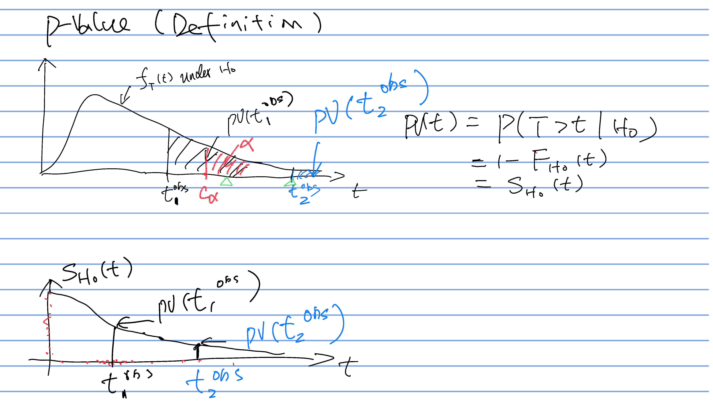

## Uniformity of $pv(T)$ under $H_0$

$$
pv(T) \mid H_0 \sim \mathrm{Unif}((0,1))
$$

**Pf:**

$pv(T) = 1 - F_{H_0}(T)$, where $F_{H_0}$ is the CDF of $T\mid H_0$.

Under $H_0$:

$$
F_{pv(T)}(t) = P(pv(T) < t) = P(1 - F_{H_0}(T) < t)
$$

$$
= P(F_{H_0}(T) > 1-t)
$$

$$
= P\big(T > F_{H_0}^{-1}(1-t)\big)
$$

$$
= 1 - F_{H_0}\big(F_{H_0}^{-1}(1-t)\big) = 1-(1-t)
$$

$$
= t
$$

## Under $H_0$: Density, Survival Function and P-value

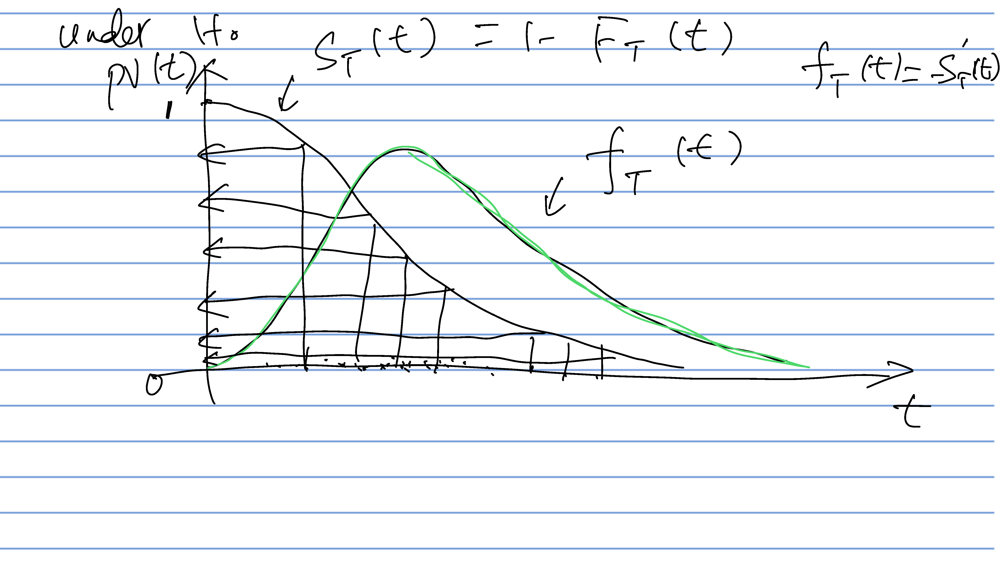

## P-value Distribution under $H_0$ vs. $H_1$

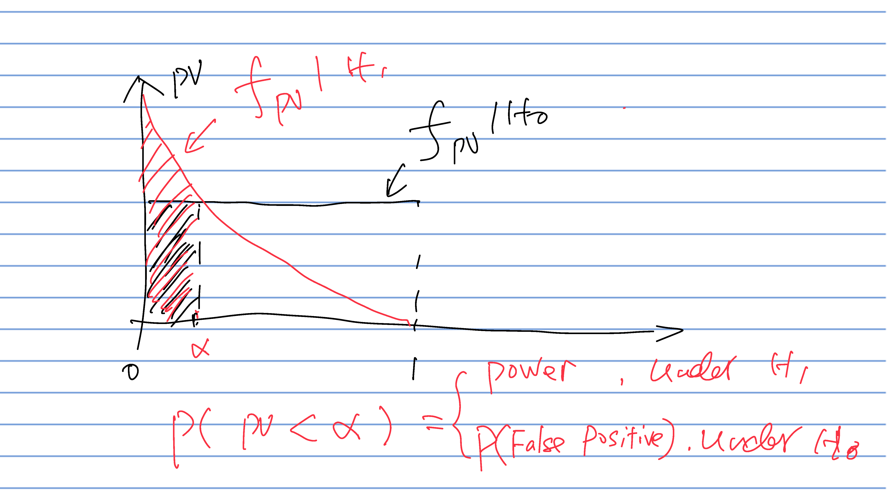

## Monte Carlo Estimate of $\hat P(pv < \alpha)$ under $H_0$

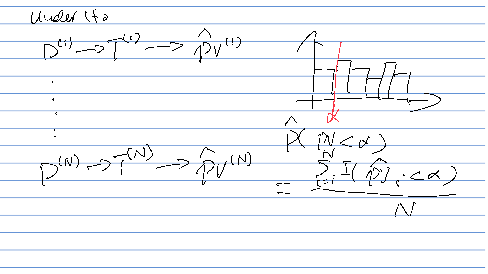

## Monte Carlo Estimate of $\hat P(pv < \alpha)$ under $H_1$ (Power)

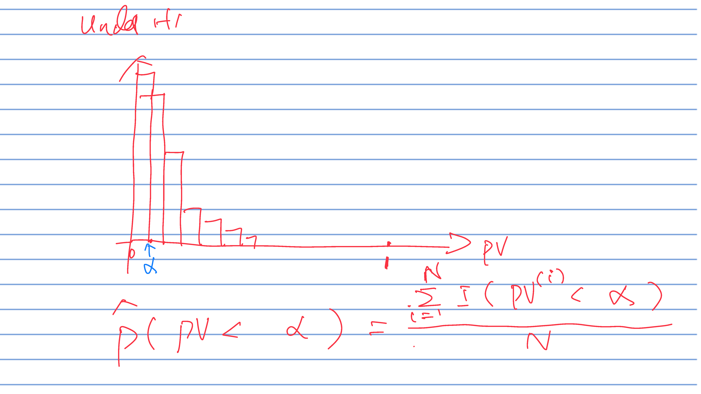

## Example: One-Sample $t$-test

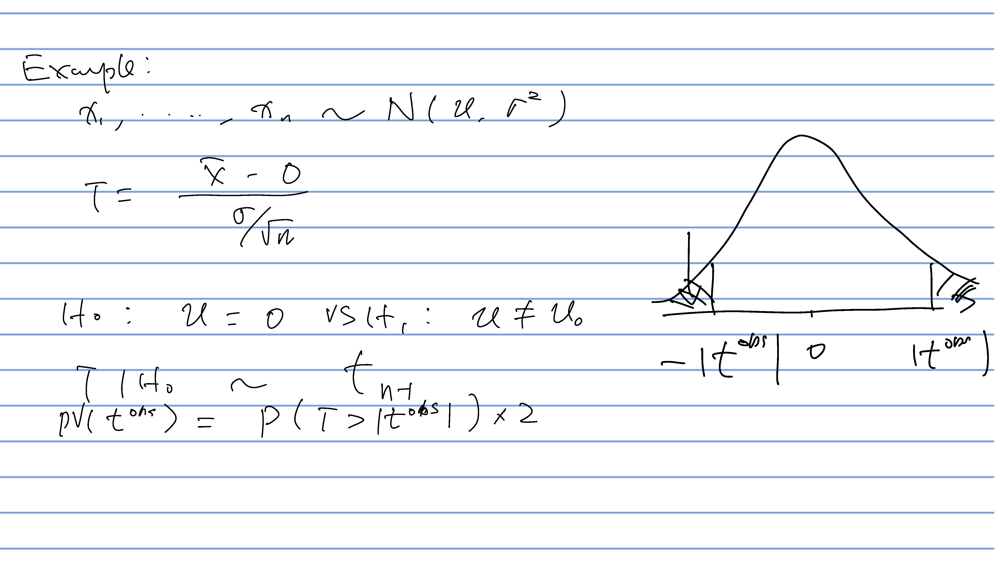

## Monte Carlo for Calculating $pv(t)$

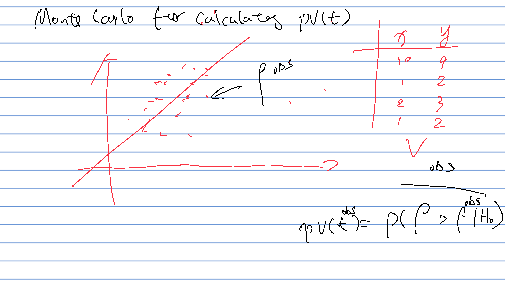

## Permutation Test

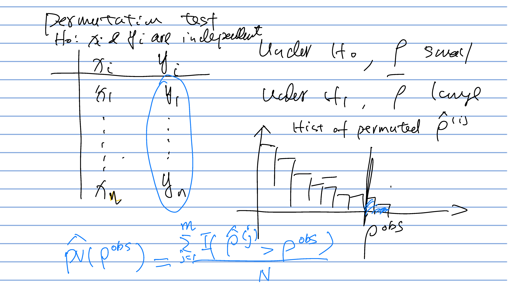

## Evaluating $pv(\rho^{obs})$ by Simulation

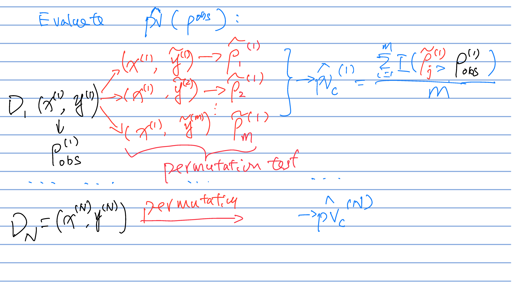

## Power of Linear Models

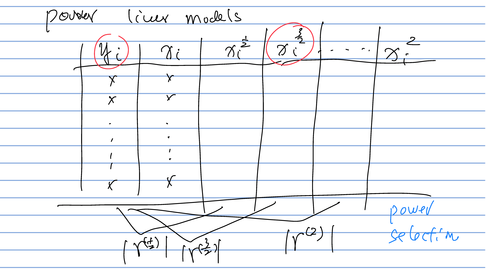

## A Naive (Incorrect) Test

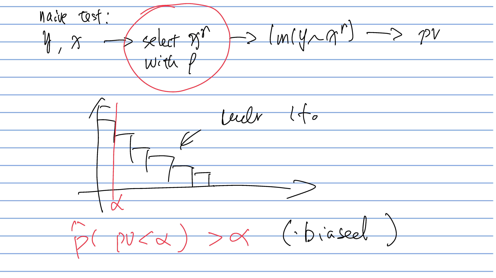

## Simulation for Evaluating the Naive Test (Power/Size)

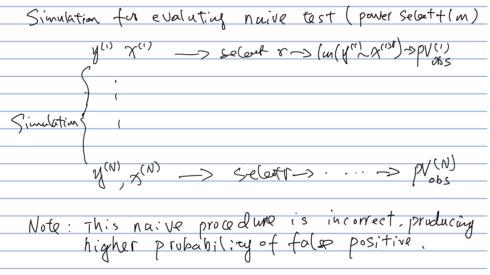

## Permutation Test (Full Procedure)

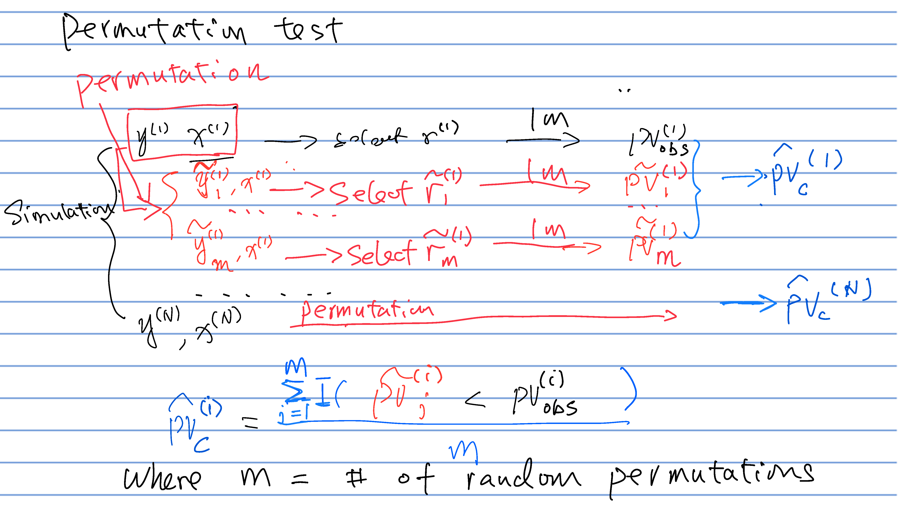

## Question 1 of Assignment 1

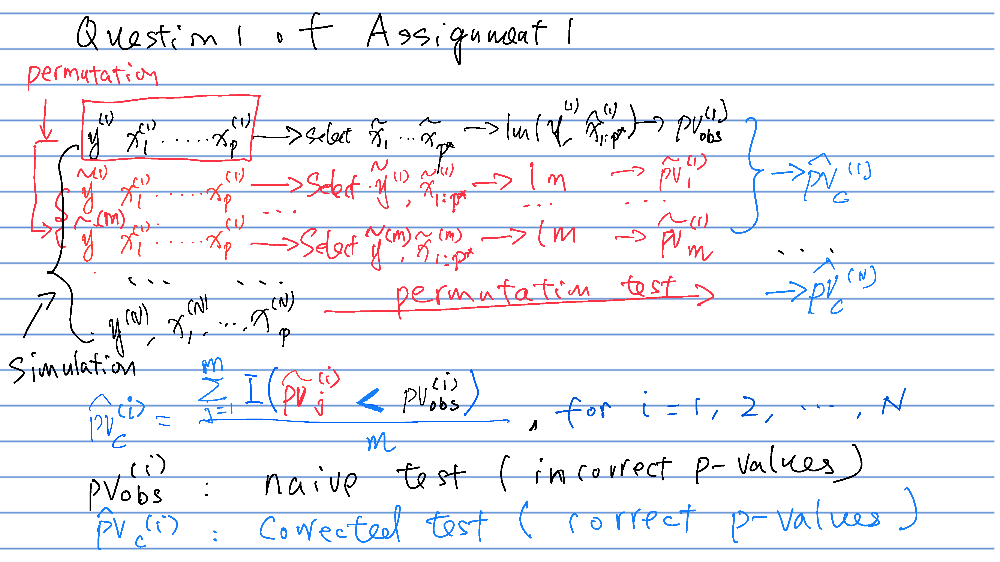
