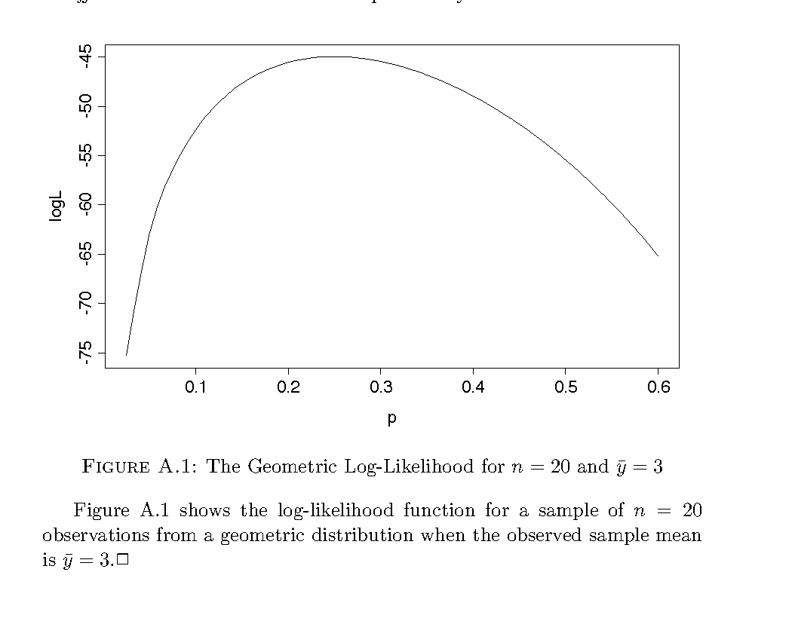
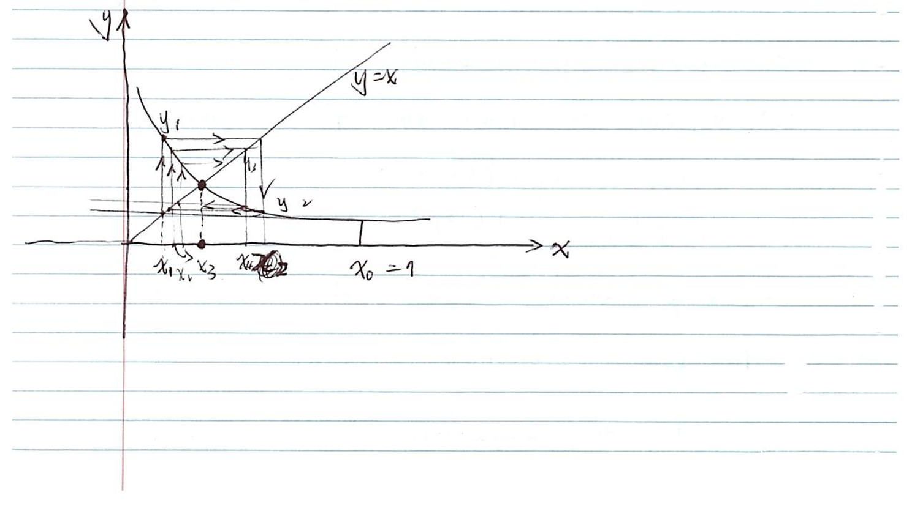
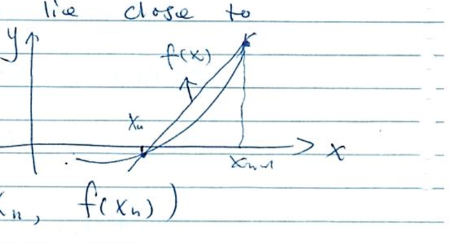
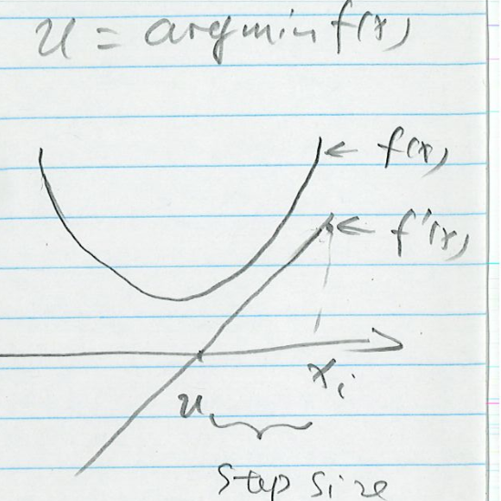
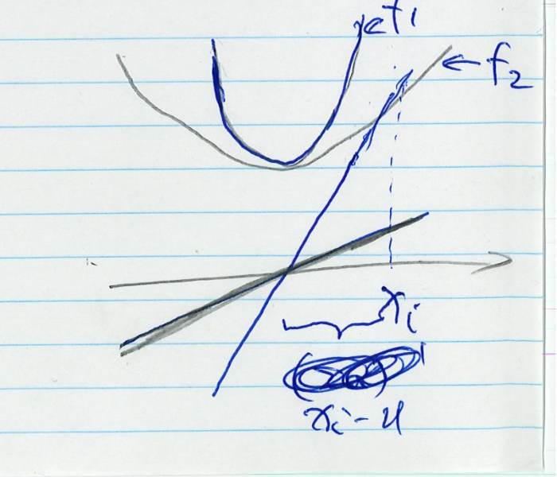
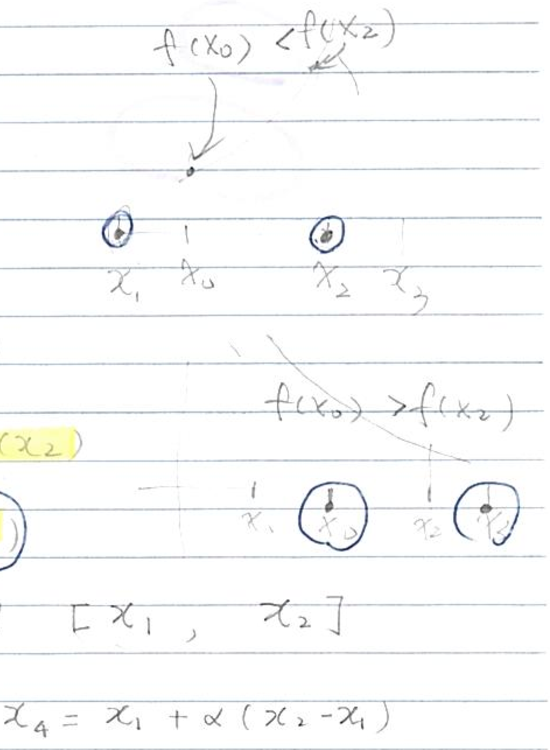
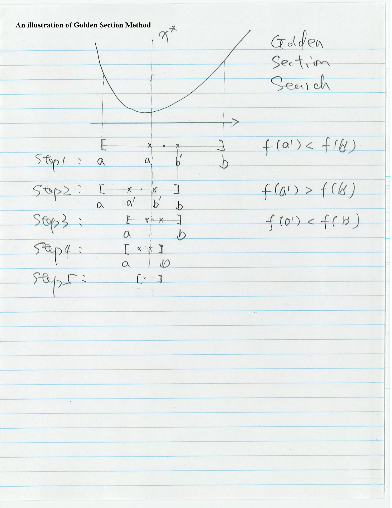
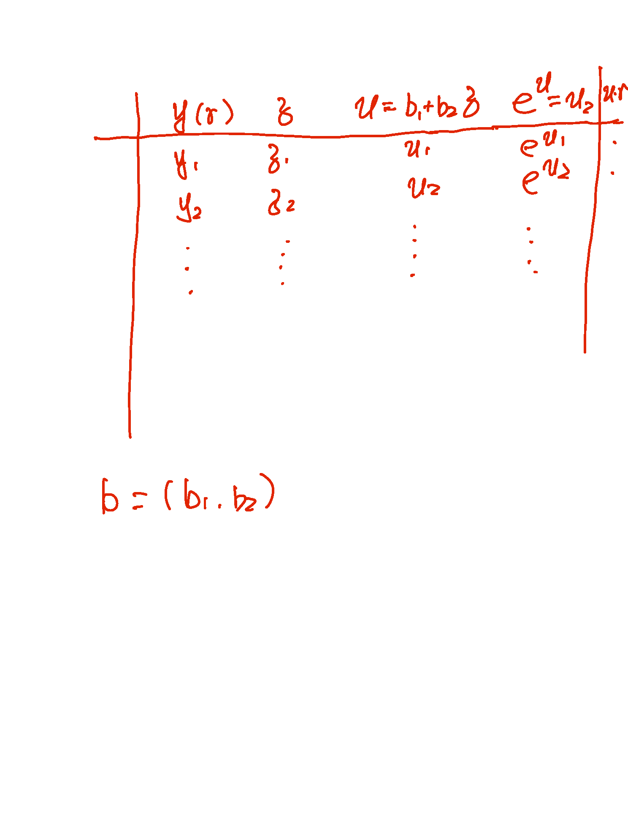

## A.1 Maximum Likelihood Estimation

This is a brief summary of some of the key results we need from likelihood theory.

Let $Y_1,\dots,Y_n$ be $n$ independent random variables (r.v.'s) with probability density functions (pdf) $f_i(y_i;\boldsymbol\theta)$ depending on a vector-valued parameter $\boldsymbol\theta$.

### A.1.1 The Log-likelihood Function

The joint density of $n$ independent observations $\mathbf{y}=(y_1,\dots,y_n)'$ is

$$f(\mathbf{y};\boldsymbol\theta)=\prod_{i=1}^n f_i(y_i;\boldsymbol\theta)=\mathrm{L}(\boldsymbol\theta;\mathbf{y}). \tag{A.1}$$

This expression, viewed as a function of the unknown parameter $\boldsymbol\theta$ given the data $\mathbf{y}$, is called the *likelihood* function.

Often we work with the natural logarithm of the likelihood function, the so-called *log-likelihood* function:

$$\log \mathrm{L}(\boldsymbol\theta;\mathbf{y})=\sum_{i=1}^n \log f_i(y_i;\boldsymbol\theta). \tag{A.2}$$

A sensible way to estimate the parameter $\boldsymbol\theta$ given the data $\mathbf{y}$ is to maximize the likelihood (or equivalently the log-likelihood) function, choosing the parameter value that makes the data actually observed as likely as possible. Formally, we define the *maximum-likelihood estimator* (mle) as the value $\hat{\boldsymbol\theta}$ such that

## A.1.1 The Log-likelihood Function (cont'd)

$$\log \mathrm{L}(\hat{\boldsymbol\theta};\mathbf{y}) \ge \log \mathrm{L}(\boldsymbol\theta;\mathbf{y}) \text{ for all } \boldsymbol\theta. \tag{A.3}$$

*Example: The Log-Likelihood for the Geometric Distribution.* Consider a series of independent Bernoulli trials with common probability of success $\pi$. The distribution of the number of *failures* $Y_i$ before the first success has pdf

$$\Pr(Y_i=y_i)=(1-\pi)^{y_i}\pi. \tag{A.4}$$

for $y_i=0,1,\dots$. Direct calculation shows that $\mathrm{E}(Y_i)=(1-\pi)/\pi$.

The log-likelihood function based on $n$ observations $\mathbf{y}$ can be written as

$$
\begin{aligned}
\log \mathrm{L}(\pi;\mathbf{y}) &= \sum_{i=1}^n \{y_i\log(1-\pi)+\log\pi\} \tag{A.5}\\
&= n(\bar y \log(1-\pi)+\log\pi), \tag{A.6}
\end{aligned}
$$

where $\bar y=\sum y_i/n$ is the sample mean. The fact that the log-likelihood depends on the observations only through the sample mean shows that $\bar y$ is a *sufficient* statistic for the unknown probability $\pi$.

{fig-align="center" height="480"}

## A.1.2 The Score Vector

The first derivative of the log-likelihood function is called Fisher's *score function*, and is denoted by

$$\mathbf{u}(\boldsymbol\theta)=\frac{\partial \log \mathrm{L}(\boldsymbol\theta;\mathbf{y})}{\partial \boldsymbol\theta}. \tag{A.7}$$

Note that the score is a vector of first partial derivatives, one for each element of $\boldsymbol\theta$.

If the log-likelihood is concave, one can find the maximum likelihood estimator by setting the score to zero, i.e. by solving the system of equations:

$$\mathbf{u}(\hat{\boldsymbol\theta})=\mathbf{0}. \tag{A.8}$$

*Example: The Score Function for the Geometric Distribution.* The score function for $n$ observations from a geometric distribution is

$$u(\pi)=\frac{\mathrm{d}\log \mathrm{L}}{\mathrm{d}\pi}=n\Big(\frac{1}{\pi}-\frac{\bar y}{1-\pi}\Big). \tag{A.9}$$

Setting this equation to zero and solving for $\pi$ leads to the maximum likelihood estimator

$$\hat\pi=\frac{1}{1+\bar y}. \tag{A.10}$$

Note that the m.l.e. of the probability of success is the reciprocal of the number of trials. This result is intuitively reasonable: the longer it takes to get a success, the lower our estimate of the probability of success would be.

Suppose now that in a sample of $n=20$ observations we have obtained a sample mean of $\bar y=3$. The m.l.e. of the probability of success would be $\hat\pi=1/(1+3)=0.25$, and it should be clear from Figure A.1 that this value maximizes the log-likelihood.

### A.1.3 The Information Matrix

The score is a random vector with some interesting statistical properties. In particular, the score evaluated at the true parameter value $\theta$ has mean zero

$$\mathrm{E}[\mathbf{u}(\boldsymbol\theta)]=\mathbf{0}$$

and variance-covariance matrix given by the *information matrix*:

$$\mathrm{var}[\mathbf{u}(\boldsymbol\theta)]=\mathrm{E}[\mathbf{u}(\boldsymbol\theta)\mathbf{u}'(\boldsymbol\theta)]=\mathbf{I}(\boldsymbol\theta). \tag{A.11}$$

## A.1.3 The Information Matrix (cont'd)

Under mild regularity conditions, the information matrix can also be obtained as minus the expected value of the second derivatives of the log-likelihood:

$$\mathbf{I}(\boldsymbol\theta)=-\mathrm{E}\Big[\frac{\partial^2 \log \mathrm{L}(\boldsymbol\theta)}{\partial\boldsymbol\theta\partial\boldsymbol\theta'}\Big]. \tag{A.12}$$

The matrix of negative observed second derivatives is sometimes called the *observed* information matrix.

Note that the second derivative indicates the extent to which the log-likelihood function is peaked rather than flat. This makes the interpretation in terms of information intuitively reasonable.

*Example: Information for the Geometric Distribution.* Differentiating the score we find the observed information to be

$$-\frac{\mathrm{d}^2\log \mathrm{L}}{\mathrm{d}\pi^2}=-\frac{\mathrm{d}u}{\mathrm{d}\pi}=n\Big(\frac{1}{\pi^2}+\frac{\bar y}{(1-\pi)^2}\Big). \tag{A.13}$$

To find the expected information we use the fact that the expected value of the sample mean $\bar y$ is the population mean $(1-\pi)/\pi$, to obtain (after some simplification)

$$\mathrm{I}(\pi)=\frac{n}{\pi^2(1-\pi)}. \tag{A.14}$$

Note that the information increases with the sample size $n$ and varies with $\pi$, increasing as $\pi$ moves away from $\tfrac{2}{3}$ towards 0 or 1.

In a sample of size $n=20$, if the true value of the parameter was $\pi=0.15$ the expected information would be $I(0.15)=1045.8$. If the sample mean turned out to be $\bar y=3$, the observed information would be $971.9$. Of course, we don't know the true value of $\pi$. Substituting the mle $\hat\pi=0.25$, we estimate the expected and observed information as $426.7$. $\square$

### A.1.4 Newton-Raphson and Fisher Scoring

Calculation of the mle often requires iterative procedures. Consider expanding the score function evaluated at the mle $\hat{\boldsymbol\theta}$ around a trial value $\boldsymbol\theta_0$ using a first order Taylor series, so that

$$\mathbf{u}(\hat{\boldsymbol\theta}) \approx \mathbf{u}(\boldsymbol\theta_0) + \frac{\partial \mathbf{u}(\boldsymbol\theta)}{\partial \boldsymbol\theta}(\hat{\boldsymbol\theta}-\boldsymbol\theta_0). \tag{A.15}$$

Let $\mathbf{H}$ denote the Hessian or matrix of second derivatives of the log-likelihood function

$$\mathbf{H}(\boldsymbol\theta)=\frac{\partial^2\log \mathrm{L}}{\partial\boldsymbol\theta\partial\boldsymbol\theta'}=\frac{\partial \mathbf{u}(\boldsymbol\theta)}{\partial\boldsymbol\theta}. \tag{A.16}$$

## A.1.4 Newton-Raphson and Fisher Scoring (cont'd)

Setting the left-hand-side of Equation A.15 to zero and solving for $\hat{\boldsymbol\theta}$ gives the first-order approximation

$$\hat{\boldsymbol\theta}=\boldsymbol\theta_0-\mathbf{H}^{-1}(\boldsymbol\theta_0)\mathbf{u}(\boldsymbol\theta_0). \tag{A.17}$$

This result provides the basis for an iterative approach for computing the mle known as the *Newton-Raphson* technique. Given a trial value, we use Equation A.17 to obtain an improved estimate and repeat the process until differences between successive estimates are sufficiently close to zero. (Or until the elements of the vector of first derivatives are sufficiently close to zero.) This procedure tends to converge quickly if the log-likelihood is well-behaved (close to quadratic) in a neighborhood of the maximum and if the starting value is reasonably close to the mle.

An alternative procedure first suggested by Fisher is to replace minus the Hessian by its expected value, the information matrix. The resulting procedure takes as our improved estimate

$$\hat{\boldsymbol\theta}=\boldsymbol\theta_0+\mathbf{I}^{-1}(\boldsymbol\theta_0)\mathbf{u}(\boldsymbol\theta_0), \tag{A.18}$$

and is known as *Fisher Scoring*.

*Example: Fisher Scoring in the Geometric Distribution.* In this case setting the score to zero leads to an explicit solution for the mle and no iteration is needed. It is instructive, however, to try the procedure anyway. Using the results we have obtained for the score and information, the Fisher scoring procedure leads to the updating formula

$$\hat\pi=\pi_0+(1-\pi_0-\pi_0\bar y)\pi_0. \tag{A.19}$$

If the sample mean is $\bar y=3$ and we start from $\pi_0=0.1$, say, the procedure converges to the mle $\hat\pi=0.25$ in four iterations. $\square$

### A.2 Tests of Hypotheses

We consider three different types of tests of hypotheses.

#### A.2.1 Wald Tests

Under certain regularity conditions, the maximum likelihood estimator $\hat{\boldsymbol\theta}$ has approximately in large samples a (multivariate) normal distribution with mean equal to the true parameter value and variance-covariance matrix given by the inverse of the information matrix, so that

## A.2.1 Wald Tests (cont'd)

$$\hat{\boldsymbol\theta} \sim N_p(\boldsymbol\theta,\mathbf{I}^{-1}(\boldsymbol\theta)). \tag{A.20}$$

The regularity conditions include the following: the true parameter value $\boldsymbol\theta$ must be interior to the parameter space, the log-likelihood function must be thrice differentiable, and the third derivatives must be bounded.

This result provides a basis for constructing tests of hypotheses and confidence regions. For example under the hypothesis

$$H_0: \boldsymbol\theta=\boldsymbol\theta_0 \tag{A.21}$$

for a fixed value $\boldsymbol\theta_0$, the quadratic form

$$W=(\hat{\boldsymbol\theta}-\boldsymbol\theta_0)'\mathrm{var}^{-1}(\hat{\boldsymbol\theta})(\hat{\boldsymbol\theta}-\boldsymbol\theta_0) \tag{A.22}$$

has approximately in large samples a chi-squared distribution with $p$ degrees of freedom.

This result can be extended to arbitrary linear combinations of $\boldsymbol\theta$, including sets of elements of $\boldsymbol\theta$. For example if we partition $\boldsymbol\theta'=(\boldsymbol\theta_1',\boldsymbol\theta_2')$, where $\boldsymbol\theta_2$ has $p_2$ elements, then we can test the hypothesis that the last $p_2$ parameters are zero

$$H_o:\boldsymbol\theta_2=0,$$

by treating the quadratic form

$$W=\hat{\boldsymbol\theta}_2'\,\mathrm{var}^{-1}(\hat{\boldsymbol\theta}_2)\,\hat{\boldsymbol\theta}_2$$

as a chi-squared statistic with $p_2$ degrees of freedom. When the subset has only one element we usually take the square root of the Wald statistic and treat the ratio

$$z=\frac{\hat\theta_j}{\sqrt{\mathrm{var}(\hat\theta_j)}}$$

as a z-statistic (or a t-ratio).

These results can be modified by replacing the variance-covariance matrix of the mle with any consistent estimator. In particular, we often use the inverse of the expected information matrix evaluated at the mle

$$\widehat{\mathrm{var}}(\hat{\boldsymbol\theta})=\mathbf{I}^{-1}(\hat{\boldsymbol\theta}).$$

Sometimes calculation of the expected information is difficult, and we use the observed information instead.

## A.2.1 Wald Tests — Example; A.2.2 Score Tests

*Example: Wald Test in the Geometric Distribution.* Consider again our sample of $n=20$ observations from a geometric distribution with sample mean $\bar y=3$. The mle was $\hat\pi=0.25$ and its variance, using the estimated expected information, is $1/426.67=0.00234$. Testing the hypothesis that the true probability is $\pi=0.15$ gives

$$\chi^2=(0.25-0.15)^2/0.00234=4.27$$

with one degree of freedom. The associated p-value is $0.039$, so we would reject $H_0$ at the 5% significance level. $\square$

#### A.2.2 Score Tests

Under some regularity conditions the score itself has an asymptotic normal distribution with mean 0 and variance-covariance matrix equal to the information matrix, so that

$$\mathbf{u}(\boldsymbol\theta) \sim N_p(0,\mathbf{I}(\boldsymbol\theta)). \tag{A.23}$$

This result provides another basis for constructing tests of hypotheses and confidence regions. For example under

$$H_0:\boldsymbol\theta=\boldsymbol\theta_0$$

the quadratic form

$$Q=\mathbf{u}(\boldsymbol\theta_0)'\,\mathbf{I}^{-1}(\boldsymbol\theta_0)\,\mathbf{u}(\boldsymbol\theta_0)$$

has approximately in large samples a chi-squared distribution with $p$ degrees of freedom.

The information matrix may be evaluated at the hypothesized value $\boldsymbol\theta_0$ or at the mle $\hat{\boldsymbol\theta}$. Under $H_0$ both versions of the test are valid; in fact, they are asymptotically equivalent. One advantage of using $\boldsymbol\theta_0$ is that calculation of the mle may be bypassed. In spite of their simplicity, score tests are rarely used.

*Example: Score Test in the Geometric Distribution.* Continuing with our example, let us calculate the score test of $H_0:\pi=0.15$ when $n=20$ and $\bar y=3$. The score evaluated at $0.15$ is $u(0.15)=-62.7$, and the expected information evaluated at $0.15$ is $\mathbf{I}(0.15)=1045.8$, leading to

$$\chi^2=62.7^2/1045.8=3.76$$

with one degree of freedom. Since the 5% critical value is $\chi^2_{1,0.95}=3.84$ we would accept $H_0$ (just). $\square$

## A.2.3 Likelihood Ratio Tests

The third type of test is based on a comparison of maximized likelihoods for nested models. Suppose we are considering two models, $\omega_1$ and $\omega_2$, such that $\omega_1 \subset \omega_2$. In words, $\omega_1$ is a subset of (or can be considered a special case of) $\omega_2$. For example, one may obtain the simpler model $\omega_1$ by setting some of the parameters in $\omega_2$ to zero, and we want to test the hypothesis that those elements are indeed zero.

The basic idea is to compare the maximized likelihoods of the two models. The maximized likelihood under the smaller model $\omega_1$ is

$$\max_{\boldsymbol\theta\in\omega_1} \mathrm{L}(\boldsymbol\theta,\mathbf{y})=\mathrm{L}(\hat{\boldsymbol\theta}_{\omega_1},\mathbf{y}), \tag{A.24}$$

where $\hat{\boldsymbol\theta}_{\omega_1}$ denotes the mle of $\boldsymbol\theta$ under model $\omega_1$.

The maximized likelihood under the larger model $\omega_2$ has the same form

$$\max_{\boldsymbol\theta\in\omega_2} \mathrm{L}(\boldsymbol\theta,\mathbf{y})=\mathrm{L}(\hat{\boldsymbol\theta}_{\omega_2},\mathbf{y}), \tag{A.25}$$

where $\hat{\boldsymbol\theta}_{\omega_2}$ denotes the mle of $\boldsymbol\theta$ under model $\omega_2$.

The ratio of these two quantities,

$$\lambda=\frac{\mathrm{L}(\hat{\boldsymbol\theta}_{\omega_1},\mathbf{y})}{\mathrm{L}(\hat{\boldsymbol\theta}_{\omega_2},\mathbf{y})}, \tag{A.26}$$

is bound to be between 0 (likelihoods are non-negative) and 1 (the likelihood of the smaller model can't exceed that of the larger model because it is *nested* on it). Values close to 0 indicate that the smaller model is not acceptable, compared to the larger model, because it would make the observed data very unlikely. Values close to 1 indicate that the smaller model is almost as good as the large model, making the data just as likely.

Under certain regularity conditions, minus twice the log of the likelihood ratio has approximately in large samples a chi-square distribution with degrees of freedom equal to the difference in the number of parameters between the two models. Thus,

$$-2\log\lambda=2\log \mathrm{L}(\hat{\boldsymbol\theta}_{\omega_2},y)-2\log \mathrm{L}(\hat{\boldsymbol\theta}_{\omega_1},y) \to \chi^2_\nu, \tag{A.27}$$

where the degrees of freedom are $\nu=\dim(\omega_2)-\dim(\omega_1)$, the number of parameters in the larger model $\omega_2$ minus the number of parameters in the smaller model $\omega_1$.

## A.2.3 Likelihood Ratio Tests (cont'd)

Note that calculation of a likelihood ratio test requires fitting two models ($\omega_1$ and $\omega_2$), compared to only one model for the Wald test ($\omega_2$) and sometimes no model at all for the score test.

*Example: Likelihood Ratio Test in the Geometric Distribution.* Consider testing $H_0:\pi=0.15$ with a sample of $n=20$ observations from a geometric distribution, and suppose the sample mean is $\bar y=3$. The value of the likelihood under $H_0$ is $\log \mathrm{L}(0.15)=-47.69$. Its unrestricted maximum value, attained at the mle, is $\log \mathrm{L}(0.25)=-44.98$. Minus twice the difference between these values is

$$\chi^2=2(47.69-44.99)=5.4$$

with one degree of freedom. This value is significant at the 5% level and we would reject $H_0$. Note that in our example the Wald, score and likelihood ratio tests give similar, but not identical, results. $\square$

The three tests discussed in this section are asymptotically equivalent, and are therefore expected to give similar results in large samples. Their small-sample properties are not known, but some simulation studies suggest that the likelihood ratio test may be better that its competitors in small samples.

# Chapter 7: Numerical Methods for Maximizing Likelihood Functions

## Chapter 7: Numerical Methods for Maximizing Likelihood Functions

The log-likelihood function: $\log(f(D\mid\theta))$

**Definition:**

(1) Specified a parametric statistical model:
$$f(D\mid\theta), \quad D \text{ is data set}$$

(2) Estimate $\theta$ (unknown $\theta$) using the value that appears most likely to have generated the data $D$. $\hat\theta_{mle}$ is defined as

$$\hat\theta_{mle}=\arg\max_\theta \log(f(D\mid\theta))$$

The function $\log(f(D\mid\theta))$ is usually called the log-likelihood function.

$\Rightarrow$ There is not a "closed-form" for $\hat\theta_{mle}$.

> **Note:** "Closed-form" means we have exactly a formula to solve the problem, and then given an exact solution.

## Example: MLE for the Cauchy Distribution

*Example:* Cauchy$(\alpha,\beta)$ distribution.

If $X \sim \text{Cauchy}(\alpha,\beta)$

$$\text{pdf: } p(x) = \frac{1}{2\beta}\cdot\frac{1}{\left[1+\left(\frac{x-\alpha}{\beta}\right)^2\right]} = \frac{1}{2\beta\left[1+\left(\frac{x-\alpha}{\beta}\right)^2\right]}$$

Suppose $X_1,X_2,\dots,X_n \overset{iid}{\sim} \text{Cauchy}(\theta,1)$

$$f(x_1,\dots,x_n\mid\theta) \longrightarrow (\text{model})$$

$$=\prod_{i=1}^n \frac{1}{1+(x_i-\theta)^2}$$

$\Rightarrow$ log-likelihood function

$$\log f(x_1,x_2,\dots,x_n\mid\theta) = \sum_{i=1}^n -\log\big(1+(x_i-\theta)^2\big)$$

$$\Rightarrow \hat\theta_{mle} = \arg\max_\theta \sum_{i=1}^n -\log\big(1+(x_i-\theta)^2\big)$$

## Consistency of the MLE

**Show** $\hat\theta_{mle} = \arg\max_\theta (f(D\mid\theta))$

$$\lim_{n\to\infty}\hat\theta_{mle} = \lim_{n\to\infty}\arg\max_\theta (f(D\mid\theta)) = \theta_*$$

> **Note:** the Law of Large Numbers is a theorem that describes the result of performing the same experiment a large number of times. According to the law of large numbers, the average of the results obtained from a large number of trials should be close to the expected value.

Maximizing the log likelihood function $\log(f(D\mid\theta))$

$=$ maximizing $\displaystyle M_n(\theta) = \frac{1}{n}\sum_i \log\frac{f(x_i\mid\theta)}{f(x_i\mid\theta_*)}$

By the law of large numbers, for each $\theta$, $M_n(\theta)$ will converge to

$$\mathrm{E}\left(\log\frac{f(x_i\mid\theta)}{f(x_i\mid\theta_*)}\right) = \int \log\frac{f(x\mid\theta)}{f(x\mid\theta_*)}\cdot f(x\mid\theta_*)\, dx$$

$$\le \int \left(\frac{f(x\mid\theta)}{f(x\mid\theta_*)}-1\right) f(x\mid\theta_*)\, dx = \int \big[f(x\mid\theta)-f(x\mid\theta_*)\big]\, dx = 1-1 = 0$$

## Properties of the MLE

$\Rightarrow$ Properties of MLE $\hat\theta_{mle}$

**(1)** The MLE $\hat\theta_{mle}$ is *consistent*:
$$\hat\theta_{mle} \to \theta_* \quad \text{when } n\to\infty$$

**(2)** MLE $\hat\theta_{mle}$ is *asymptotically normal*:

$$\hat\theta_{mle} \sim N\big(\theta_*,\; (nI(\theta_*))^{-1}\big)$$

$$I(\theta_*) = -\mathrm{E}\left(\frac{\partial^2}{\partial\theta^2}\log(f(X\mid\theta))\Big|_{\theta_*}\right) = -\mathrm{E}\left(\left(\frac{\partial^2 \log(f(X\mid\theta))}{\partial\theta_i\partial\theta_j}\right)_{p\times p}\right) \;\leftarrow\; \text{Hessian matrix}$$

> **Note:** The Hessian matrix is the matrix of second derivatives of the log-likelihood function with respect to the parameters:
> $$H(\theta) = \frac{\partial^2 \log(f(x\mid\theta))}{\partial\theta_i\partial\theta_j}$$

## Properties of the MLE (cont'd)

**(3)** Plugging in $\hat\theta_{mle}$ in $I(\theta_*)$, the fact still holds:

$$\hat\theta_{mle} \sim N\big(\theta_*,\; (n\cdot I(\hat\theta_{mle}))^{-1}\big)$$

$\Rightarrow$ **expected fisher information:** $I(\hat\theta_{mle})$

$\Rightarrow$ $I(\theta_*)$ can be estimated by

$$-\frac{1}{n}\sum_i \frac{\partial^2}{\partial\theta^2}\log\big(f(x_i\mid\theta)\big)\Big|_{\hat\theta_{mle}}$$

which is called **the observed fisher information**.

**(4)** MLE $\hat\theta_{mle}$ is asymptotically optimal.

### 7.2 Univariate problems [how to find $\hat\theta_{mle}$]

**7.2.1** Find the root by using algorithms.

$$F(\theta) = \log(f(D\mid\theta)) \quad\Rightarrow\quad F'(\theta) = \frac{\partial}{\partial\theta}\big(\log f(D\mid\theta)\big)$$

$\ll$ Many methods to find the $\hat\theta_{mle}$ $\gg$

**1. Simple iteration (fixed point method)**

if the equation can be written as

## Method 1: Simple Iteration (Fixed-Point Method)

$$x = f(x)$$

We can use the simple iteration method. The algorithm starts with a rough guess $x_0$. The iteration is as follows:

$$x_1 = f(x_0)$$
$$x_2 = f(x_1)$$
$$\vdots$$
$$x_n = f(x_{n-1})$$

{fig-align="center" height="480"}

## Method 2: Bisection Method

**Definition:** Bisection Method is a root-finding algorithm which works by repeatedly dividing an interval in half and then selecting the subinterval in which a root exists.

**Example:**

(1) Solve the equation $f(x)=0$, the interval is $[a,b]$, given the two points $a,b$, and $f(a)$, and $f(b)$ have opposite signs, $f(a)\cdot f(b) < 0$.

(2) Dividing interval in two, by computing $c = \dfrac{a+b}{2}$. Then, $f(c)$ has two possibilities:

  (a) $f(a)\cdot f(c) < 0$, OR
  (b) $f(c)\cdot f(b) < 0$

(3) Choose the (subinterval with the) opposite sign. Continue to repeat the above steps.

## Bisection Error; Newton-Raphson Method

The absolute error of the bisection method is halved (reduced by half) at each step (prone to error). After $n$ steps, the maximum absolute error is

$$|b-a|/2^{n+1}$$

**Note that:** the bisection method is less efficient than Newton's method.

**3. Newton-Raphson method.**

(1) Starts with initial guess which is reasonably close to true root.

(2) The function is approximated by its tangent line.

(3) Compute the x-intercept of this tangent line. The x-intercept will typically be a better approximation to the function's root than original guess.

(4) Repeat the method again.

## Newton-Raphson Method — Derivation

**Example:** $f(x): [a,b] \to \mathbb{R}$

(1) Formula for converging on the root: suppose we have some current approximation $x_n$.

(2) Find the better approximation $x_{n+1}$

$$f'(x_n) = \frac{\Delta y}{\Delta x} = \frac{f(x_n)-0}{x_n-x_{n+1}} = -\frac{f(x_n)}{x_{n+1}-x_n}$$

$$x_{n+1}-x_n = -\frac{f(x_n)}{f'(x_n)}$$

$$\boxed{x_{n+1} = x_n - \frac{f(x_n)}{f'(x_n)}}$$

**4. Secant Method:**

The secant method is defined by the recurrence relation

$$x_{n+1} = x_n - \frac{1}{f'(x_n)}\cdot f(x)$$

$$\boxed{x_{n+1} = x_n - \frac{x_n-x_{n-1}}{f(x_n)-f(x_{n-1})}\cdot f(x_n)}$$

## Secant Method — Derivation

The secant method requires two initial values, $x_0$ and $x_1$, which should ideally be chosen to lie close to the root.

{fig-align="center" height="260"}

Given two points $(x_{n-1}, f(x_{n-1}))$ and $(x_n, f(x_n))$:

$$y - f(x_n) = \frac{f(x_n)-f(x_{n-1})}{x_n-x_{n-1}}(x-x_n)$$

When $x = x_{n+1}$ is the root, $\Rightarrow y = 0$:

$$f(x_n) + \frac{f(x_n)-f(x_{n-1})}{x_n-x_{n-1}}(x_{n+1}-x_n) = 0$$

$$\boxed{x_{n+1} = x_n - \frac{x_n-x_{n-1}}{f(x_n)-f(x_{n-1})}f(x_n)}$$

## Understanding Newton-Raphson (Quadratic Case)

**Understanding NR**

$$f(x)=a(x-u)^2+c \qquad u=\arg\min f(x)$$
$$f'(x)=2a(x-u)$$
$$f''(x)=2a$$

$$x_{i+1} = x_i - \frac{f'(x_i)}{f''(x_i)} = x_i - \frac{2a(x_i-u)}{2a} = x_i - \frac{(x_i-u)}{\text{step size}}$$

$[f''(x_i)]^{-1} = (2a)^{-1}$ is the **perfect** step-size modifier for $x_i$ with slope $f'(x_i)$, if $f(x)$ is quadratic.

::: {layout-ncol=2}
{fig-align="center" height="320"}

{fig-align="center" height="320"}
:::

## Newton's Method vs. Secant Method; Illinois Method

**Comparing Newton's method with the secant method:**

(1) Newton's method converges faster than secant method.

(2) Newton's method requires the evaluation of both $f$ and its derivative at each step; secant method only requires the evaluation of $f$. Therefore, the secant method may be faster in practice.

**5) Illinois method:** it is safer.

## Fisher's Scoring Method; Truncated Poisson Example

**6) Fisher's scoring method**

Replacing $-f'(\theta_m)$ with the expected fisher information $nI(\theta_m)$:

$$x_{n+1} = x_n - \frac{f(x_n)}{f''(x_n)}$$

$$\boxed{\theta_{m+1} = \theta_m + (nI(\theta_m))^{-1}S(\theta_m)}$$

**Example: Finding MLE for Truncated Poisson Data**

R.V. $X_1,X_2,\dots,X_n \overset{iid}{\sim}$ following Poisson distribution (non-zero).

Recall: $X \sim \text{Poisson}(\lambda) \Rightarrow$ pdf $f(x) = \dfrac{\lambda^x}{x!}\exp(-\lambda)$

**Truncated Poisson Distribution:**

$$P(x_1,x_2,\dots,x_n\mid\theta) = \prod_{i=1}^n\left[\frac{\exp(-\lambda)\lambda^{x_i}}{x_i!}\cdot\frac{1}{1-\exp(-\lambda)}\right]$$

## Truncated Poisson — Log-likelihood and Score Function

The log-likelihood function:

$$
\begin{aligned}
L(\lambda) &= \log P(x_1,\dots,x_n\mid\theta) \\
&= \log \prod_{i=1}^n \frac{e^{-\lambda}\lambda^{x_i}}{x_i!}\cdot\frac{1}{1-e^{-\lambda}} \\
&= \log \frac{e^{-n\lambda}\cdot \lambda^{\sum_{i=1}^n x_i}}{\prod_{i=1}^n x_i!}\cdot\left(\frac{1}{1-e^{-\lambda}}\right)^n \\
&= \log e^{-n\lambda} + \log \lambda^{\sum_{i=1}^n x_i} - \log\prod_{i=1}^n x_i! + \log\left(\frac{1}{1-e^{-\lambda}}\right)^n \\
&= -n\lambda + \sum_{i=1}^n x_i \log\lambda - n\log(1-e^{-\lambda}) - \log\prod_{i=1}^n x_i!
\end{aligned}
$$

Note that because $\log\prod_{i=1}^n x_i!$ does not depend on $\lambda$, we can ignore it. We get the likelihood function:

$$\boxed{l(\lambda) = -n\lambda + \sum x_i\log\lambda - n\log(1-e^{-\lambda})}$$

The score function $S(\lambda) = l'(\lambda)$:

$$S(\lambda) = \frac{1}{\lambda}\sum x_i - n - nx\cdot\frac{e^{-\lambda}}{1-e^{-\lambda}}$$

$$\boxed{S(\lambda) = \frac{\sum x_i}{\lambda} - \frac{n}{1-e^{-\lambda}}}$$

## Truncated Poisson — Fisher Information

The fisher information based on $n$ samples is:

$$n\cdot I(\lambda) = -\mathrm{E}(S'(\lambda)) = -\mathrm{E}(l''(\lambda))$$

$$= -\mathrm{E}\left(-\frac{\sum x_i}{\lambda^2} + \frac{ne^{-\lambda}}{(1-e^{-\lambda})^2}\right)$$

$$= \frac{1}{\lambda^2}\cdot n\cdot\frac{\lambda}{1-e^{-\lambda}} - n\frac{e^{-\lambda}}{(1-e^{-\lambda})^2}$$

$$\boxed{= \frac{1}{\lambda(1-e^{-\lambda})} - n\frac{e^{-\lambda}}{(1-e^{-\lambda})^2}}$$

## 7.2.2 Golden Section Method

$$\alpha = 1-0.618$$

(1) Given interval $[x_1,x_3]$:

$$x_0 = x_1+\alpha(x_3-x_1)$$
$$x_2 = x_3-\alpha(x_3-x_1)$$

(2) Then evaluate $f(x_0)$, $f(x_2)$.

$\Rightarrow$ If $f(x_0) < f(x_2)$: New interval $[x_1,x_2]$; next point: $x_4 = x_1+\alpha(x_2-x_1)$.

If $f(x_0) > f(x_2)$: New interval $[x_0,x_3]$; next point: $x_5 = x_3-\alpha(x_3-x_0)$.

{fig-align="center" height="420"}

## Illustration of Golden Section Search

{fig-align="center" height="820"}

Step 1: $[a,b]$, points $a',b'$ with $f(a')<f(b')$

Step 2: $[a,b']$, since $f(a')>f(b')$ (relabeled), interval shrinks

Step 3: further shrinks toward $x^*$, and so on through Steps 4-5 until the interval is small.

## 7.3 Descent Methods for Multivariate Problems

**Goal:** Minimize a multivariate function $f$.

**Method:** Reducing multivariate problems into univariate problems.

**Procedure:**

**(1)** Finding a direction $D$ such that

$$g(\lambda; D, x_n) = f(x_n+\lambda D)$$

$g(\lambda,D,x_n)$ is a decreasing function of $\lambda$.

**(2)** Move $x_n \to x_n+\lambda D$ where function $f$ is smaller — equivalent to find direction $D$ such that

$$\lim_{\lambda\to 0^+} \frac{g(\lambda;D,x_n)-g(0,D,x_n)}{\lambda} < 0$$

$$g'(0,D,x_n) < 0$$

$$\frac{\partial}{\partial x_i}g(\lambda;D,x_n) = g'(\lambda,D,x_n) = \frac{\partial f}{\partial x_i}f(x_n+\lambda D)\cdot D_i$$

$$g'(0,D,x_n) = \frac{\partial f}{\partial x_i}f(x_n)\cdot D_i$$

## Descent Methods — Inner Product and Gradient

$$\sum_i \frac{\partial}{\partial x_i}f(x_n)\cdot D_i < 0$$

**Note that:**

**(1) Review the inner product.** An inner product is a generalization of the dot product in a vector space; it is a way to multiply vectors together, with the result of this multiplication being a scalar.

Example: vectors $\vec x = (x_1,\dots,x_n)$, $\vec y = (y_1,\dots,y_n)^T$

$$\langle \vec x,\vec y\rangle = x_1y_1+\dots+x_ny_n$$

**(2) Gradient of function $f$ at $x_n$.** Example $f(x,y,z)$:

$$\nabla f = \nabla f(\vec x,\vec y,\vec z) = \frac{\partial f}{\partial x}\vec x + \frac{\partial f}{\partial y}\vec y + \frac{\partial f}{\partial z}\vec z$$

$$D^T = (D_1,D_2,\dots,D_n)$$
$$\nabla f(x_n) = \left(\frac{\partial f(x_n)}{\partial x_1},\frac{\partial f(x_n)}{\partial x_2},\dots,\frac{\partial f(x_n)}{\partial x_n}\right)$$
$$\sum_i \frac{\partial}{\partial x_i}f(x_n)\cdot D_i = D^T\cdot \nabla f(x_n)$$

## Choosing the Descent Direction — Cauchy-Schwarz Inequality

**(2)** Finding $\lambda$ by minimizing $g(\lambda;D,x_n)$ with respect to $\lambda$.

**Review the Cauchy-Schwarz inequality.** Vectors $\vec x, \vec y$:

$$|\langle x,y\rangle|^2 \le \langle x,x\rangle\cdot\langle y,y\rangle$$

$$D=(D_1,D_2,\dots,D_n)^T \qquad \nabla f(x_n) = \left(\frac{\partial f(x_n)}{\partial x_1},\dots,\frac{\partial f(x_n)}{\partial x_n}\right)$$

$$\Rightarrow D^T\circ \nabla f(x_n) = \langle D^T,\nabla f(x_n)\rangle$$

$$|D^T\cdot\nabla f(x_n)|^2 \le \langle D^T,D^T\rangle\cdot\langle \nabla f(x_n),\nabla f(x_n)\rangle$$

$$|D^T\cdot\nabla f(x_n)|^2 \le |D|_2^2\,|\nabla f(x_n)|^2$$

$$\frac{|D^T\cdot\nabla f(x_n)|}{|D|_2} \le |\nabla f(x_n)|_2$$

Taking $D = \nabla f(x_n)$ gives equality.

$\Rightarrow$ $\nabla f(x_n)$ is the direction of the most rapid increase in $f$ at $x_n$.

## Steepest Descent and Newton-Raphson for Multivariate Problems

...and $-\nabla f(x_n)$ is the direction of most rapid decrease.

**(3)** Considering $D = -\nabla f(x_n)$ in the above algorithm. This is called the **"method of steepest descent."**

This method turns out to perform poorly for most functions.

### 7.3.1 Newton-Raphson method for multivariate problems

**Review:** Newton-Raphson method:

$$x_{n+1} = x_n - [f'(x_n)]^{-1}\cdot f(x_n)$$

Let $D = -(\nabla^2 f(x_n))^{-1}\nabla f(x_n)$, with $\lambda=1$:

$$\Rightarrow x_{n+1} = x_n - (\nabla^2 f(x_n))^{-1}(\nabla f(x_n))$$

Matrix $\nabla^2 f(x_n)$ is called the **Hessian matrix**.

$-\nabla^2 f(x_n)$ is called the **observed fisher information matrix** at $x_n$, based on all data points.

## Multivariate Newton-Raphson — Derivation

**Multivariate NR**

$$\nabla f(x) \approx \nabla f(x_i) + \nabla^2 f(x_i)\cdot(x-x_i)$$

Suppose $x = (x_1,\dots,x_p)'$. Solving $\nabla f(x_{i+1})=0$ for $x_{i+1}$:

$$\nabla f(x_i) + \nabla^2 f(x_i)(x_{i+1}-x_i) = 0$$

$$\Rightarrow \underset{p\times 1}{x_{i+1}} = \underset{p\times 1}{x_i} - \underset{p\times p}{[\nabla^2 f(x_i)]^{-1}}\;\underset{p\times 1}{\nabla f(x_i)}$$

**Fisher Scoring:**

$$f(\theta) = l(\theta), \qquad S(\theta) = \nabla l(\theta)$$

Applying NR to $f^*(\theta) = -l(\theta)$:

$$
\begin{aligned}
\theta_{i+1} &= \theta_i - [\nabla^2 f^*(\theta_i)]^{-1}\nabla f^*(\theta_i) \\
&= \theta_i - [-\nabla^2 l(\theta_i)]^{-1}(-S(\theta_i)) \\
&= \theta_i + [-\nabla^2 l(\theta_i)]^{-1}S(\theta_i)
\end{aligned}
$$

Replacing $-\nabla^2 l(\theta_i)$ with $I(\theta_i) = \mathrm{E}(-\nabla^2 l(\theta_i))$:

$$\boxed{\theta_{i+1} = \theta_i + [I(\theta_i)]^{-1}S(\theta_i)}$$

## Example: MLE for Logistic Regression — Setup

Recap:

- log-likelihood function $\Rightarrow f(x_n)$
- score function $\Rightarrow \nabla f(x_n)$
- observed fisher information matrix at $x_n$ $\Rightarrow -\nabla^2 f(x_n)$

**Example: MLE for logistic regression models**

**Review: Linear Regression**

$$y_i\mid x_i \sim N(x_i^T\beta, \sigma^2), \qquad x_i = (1,x_{i1},\dots,x_{ip})^T$$

$$P(y_i\mid x_i,\beta) = \frac{1}{\sqrt{2\pi}\,\sigma}\, e^{-\frac{(y_i-x_i^T\beta)^2}{2\sigma^2}}$$

$\Rightarrow$ log-likelihood function:

$$l(\beta) = \sum_{i=1}^n \log P(y_i\mid x_i,\beta) = \sum_{i=1}^n -\frac{(y_i-x_i^T\beta)^2}{2\sigma^2} - n\log(\sqrt{2\pi}\,\sigma)$$

## Logistic Regression Model

$$Y = X\beta + E$$

MLE: $\hat\beta_{mle} = \arg\min \sum_{i=1}^n (y_i-x_i^T\beta)^2$

$$\hat\beta_{mle} = (X^TX)^{-1}X^TY$$

where $X = (x_1^T,x_2^T,\dots,x_n^T)^T$ (design matrix), $Y=(y_1,y_2,\dots,y_n)^T$ (response).

$\Rightarrow$ **Logistic Regression**

$y_i$ is binary, taking $0/1$. $z_i = (1,z_{i1},\dots,z_{ip})^T \Rightarrow$ covariate.

**Model 1:** $\beta = (\beta_0,\beta_1,\dots,\beta_p)^T$

$$P(y_i=1\mid z_i) = \frac{e^{z_i^T\beta}}{1+e^{z_i^T\beta}} = \pi_i(z_i^T,\beta) \quad\leftarrow \text{logistic function}$$

$$P(y_i=0\mid z_i) = \frac{1}{1+e^{z_i^T\beta}}$$

$$P(y_i\mid z_i,\beta) = \left(\frac{e^{z_i^T\beta}}{1+e^{z_i^T\beta}}\right)^{y_i}\left(\frac{1}{1+e^{z_i^T\beta}}\right)^{1-y_i} = \frac{e^{y_iz_i^T\beta}}{1+e^{z_i^T\beta}} = \pi_i^{y_i}(1-\pi_i)^{1-y_i}$$

## Illustration: Logistic Transform

{fig-align="center" height="700"}

A sketch of the linear predictor $u = b_1+b_2 z$ being mapped through the exponential/logistic transform to give $u_2 = e^u$, tabulated against paired values $(y_i, z_i)$, with $b=(b_1,b_2)$.

## Logistic Regression — Log-likelihood and Gradient

$\Rightarrow$ **Log-likelihood function:**

$$l(\beta) = \sum_{i=1}^n \log P(y_i\mid z_i,\beta) = \sum_{i=1}^n \log\frac{e^{y_iz_i^T\beta}}{1+e^{z_i^T\beta}}$$

$$= \sum_{i=1}^n y_iz_i^T\beta - \sum_{i=1}^n \log(1+e^{z_i^T\beta})$$

$$= Y^TZ\beta - b^T\mathbf{1}$$

where $Y=(y_1,\dots,y_n)^T$, $Z=(z_1^T,\dots,z_n^T)^T$, $b=(b_1,\dots,b_n)^T$, with $b_i = -\log(1+e^{z_i^T\beta})$.

$\Rightarrow$ **Newton-Raphson iteration.** First we compute the gradient of $l(\beta)$ from the derivatives:

$$\frac{\partial Y^TZ\beta}{\partial \beta} = Y^TZ, \qquad \frac{\partial b^T\mathbf{1}}{\partial\beta_j} = \sum_{i=1}^n \frac{\partial b_i}{\partial\beta_j} = \sum_{i=1}^n -\frac{e^{z_i\beta}z_{ij}}{1+e^{z_i\beta}} = -\sum_{i=1}^n \pi_i\cdot z_{ij}$$

## Logistic Regression — Newton-Raphson Iteration

$$\nabla l(\beta) = \frac{\partial l(\beta)}{\partial\beta} = Z^T(Y-\Pi) \quad (\text{score function})$$

where $\Pi=(\pi_1,\pi_2,\dots,\pi_n)^T$, $\displaystyle \pi_i = \frac{e^{z_i^T\beta}}{1+e^{z_i^T\beta}}$.

**Second, find the Hessian matrix:**

$$\nabla^2 l(\beta) = -Z^TWZ$$

where $W$ is the diagonal matrix

$$W = \begin{bmatrix} \pi_1(1-\pi_1) & 0 & \cdots & 0 \\ 0 & \pi_2(1-\pi_2) & \cdots & 0 \\ \vdots & \vdots & \ddots & \vdots \\ 0 & 0 & \cdots & \pi_n(1-\pi_n)\end{bmatrix}$$

**Third, estimate $\hat\beta_{mle}$ using the Newton-Raphson iteration method.** Recall that $x_{n+1}=x_n-(f'(x_n))^{-1}f(x_n)$:

$$\beta^{(t+1)} = \beta^{(t)} - \nabla^2 l(\beta^{(t)})^{-1}\nabla l(\beta^{(t)}) = \beta^{(t)} + (Z^TWZ)^{-1}Z^T(Y-\Pi^{(t)})$$

## Notes: Newton-Raphson = Fisher Scoring = IRLS

**Note that:**

**(1)** $\nabla^2 l(\beta)$ does not depend on $Y$.

**(2)** $\mathrm{E}(\nabla^2 l(\beta)) = \nabla^2 l(\beta)$

$\Rightarrow$ Newton = Fisher Scoring

**(3)** Also, Newton = IRLS (Iteratively Reweighted Least Squares).

## 7.3.2 Improving the Newton-Raphson Method

**(1)** $x_{n+1}(\lambda) = x_n - \lambda[\nabla^2 f(x_n)]^{-1}\nabla f(x_n)$

Starting from $\lambda=1$, if the proposed point does not yield a better function value, **go back** to use a smaller $\lambda$.

**(2)** Positive definite modification on the Hessian matrix:

$$\nabla^2 f(x_n) + \alpha I$$

**(3)** At the beginning, use a more stable method, for example use smaller $\lambda$ and larger $\alpha$ in the above modification; at the latter stage, use N-R iterations.

**(4)** Replacing $\nabla^2 f(x_n)$ with another positive definite matrix to avoid computing it.

The BFGS algorithm uses:

$$A_{n+1} = A_n + \frac{1}{y^Ts}y^Ty - \frac{1}{s^TA_ns}A_ns^TsA_n$$

## BFGS Algorithm and Fisher Scoring (cont'd)

where

$$y = \nabla f(x_{n+1}) - \nabla f(x_n)$$
$$s = x_{n+1} - x_n$$

**(5) Fisher scoring method:** replacing $\nabla^2 f(x_n)$ with $\mathrm{E}(\nabla^2 f(x_n))$.
