## Likelihood Function

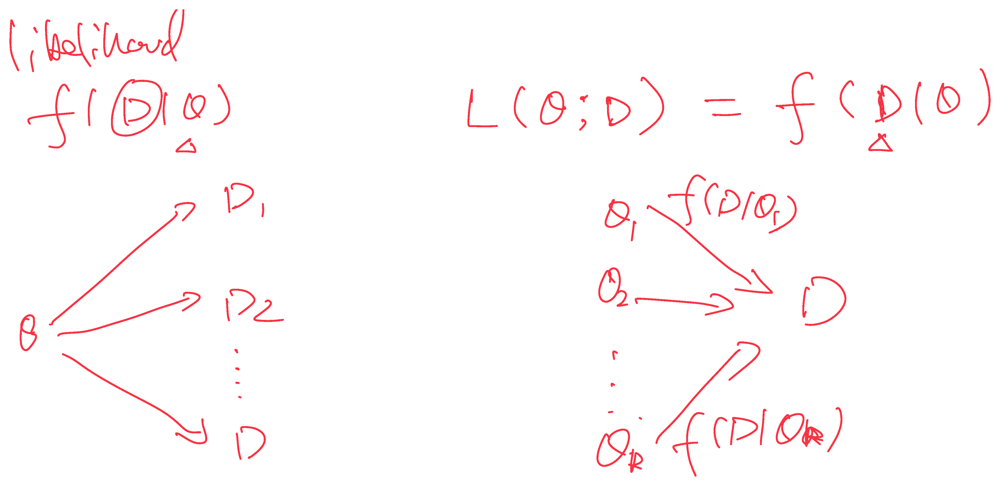

## Maximum Likelihood Estimator

$$
\hat\theta_{MLE} = \arg\max_\theta L(\theta; D)
$$

**Example:** $Y_1, Y_2, Y_3 \mid \theta \overset{iid}{\sim} \mathrm{Bern}(\theta)$, $\theta$ is the population proportion $\in [0,1]$.

$y_1 = 1,\ y_2 = 1,\ y_3 = 0$

| $\theta$ | $P(y_1=1, y_2=1, y_3=0 \mid \theta) = \prod_{i=1}^3 P(y_i \mid \theta)$ |
|:---:|:---|
| $0$ | $0 \cdot 0 \cdot 1 = 0$ |
| $1/2$ | $\tfrac12\cdot\tfrac12\cdot\tfrac12 = 1/8 = 0.1250$ |
| $2/3$ | $\tfrac23\cdot\tfrac23\cdot\tfrac13 = 4/27 = 0.1481$ **(max)** |
| $3/4$ | $\tfrac34\cdot\tfrac34\cdot\tfrac14 = 9/64 = 0.1406$ |
| $1$ | $1 \cdot 1 \cdot 0 = 0$ |

## Likelihood for iid Bernoulli Data

$$
P(y_i \mid \theta) = \theta^{y_i} (1-\theta)^{1-y_i}
$$

$$
L(\theta \mid y_1, \ldots, y_n) = \prod_{i=1}^n P(y_i \mid \theta)
$$

$$
= \prod_{i=1}^n \theta^{y_i} (1-\theta)^{1-y_i}
$$

$$
= \theta^{\sum_{i=1}^n y_i} (1-\theta)^{n - \sum_{i=1}^n y_i}
$$

$$
= \theta^{n_1} (1-\theta)^{n_0}
$$

## Log-Likelihood Function

$$
\ell(\theta) = \log L(\theta) = n_1 \log\theta + n_0 \log(1-\theta)
$$

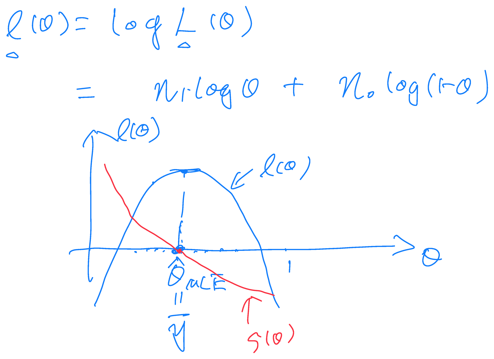

## Score Function

**Score function:** $S(\theta) = \ell'(\theta) \equiv 0$

$$
\ell(\theta) = n_1 \log\theta + n_0 \log(1-\theta)
$$

$$
S(\theta) = \frac{n_1}{\theta} - \frac{n_0}{1-\theta} \equiv 0
$$

$$
\frac{n_1}{\theta} = \frac{n_0}{1-\theta} \iff \frac{\theta}{1} = \frac{n_1}{n} = \frac{\sum_{i=1}^n y_i}{n} = \bar y
$$

where $n = n_1 + n_0$.

## MLE for the Normal Distribution

**Example:** $X_1, \ldots, X_n \overset{iid}{\sim} N(\mu, \sigma_0^2)$

$$
f(x_i \mid \mu) = \frac{1}{\sqrt{2\pi}\,\sigma_0} e^{-\frac{(x_i-\mu)^2}{2\sigma_0^2}}
$$

$$
\ell(\mu; x_1,\ldots,x_n) = \sum_{i=1}^n \log f(x_i \mid \mu)
$$

$$
= \sum_{i=1}^n \left[ \log\!\left(\frac{1}{\sqrt{2\pi}\,\sigma_0}\right) - \frac{(x_i - \mu)^2}{2\sigma_0^2} \right]
$$

## MLE for the Normal Distribution (cont'd)

$$
= n \log\!\left(\frac{1}{\sqrt{2\pi}\,\sigma_0}\right) - \frac{\sum_{i=1}^n (x_i-\mu)^2}{2\sigma_0^2}
$$

$$
= C - \frac{1}{2\sigma_0^2} \sum_{i=1}^n (\mu - x_i)^2
$$

$$
= C - \frac{1}{2\sigma_0^2} \sum_{i=1}^n \left[(\mu-\bar x)^2 + (\bar x - x_i)^2 + 2(\mu-\bar x)(\bar x - x_i)\right]
$$

$$
= C_2 - \frac{n}{2\sigma_0^2}(\mu - \bar x)^2
$$

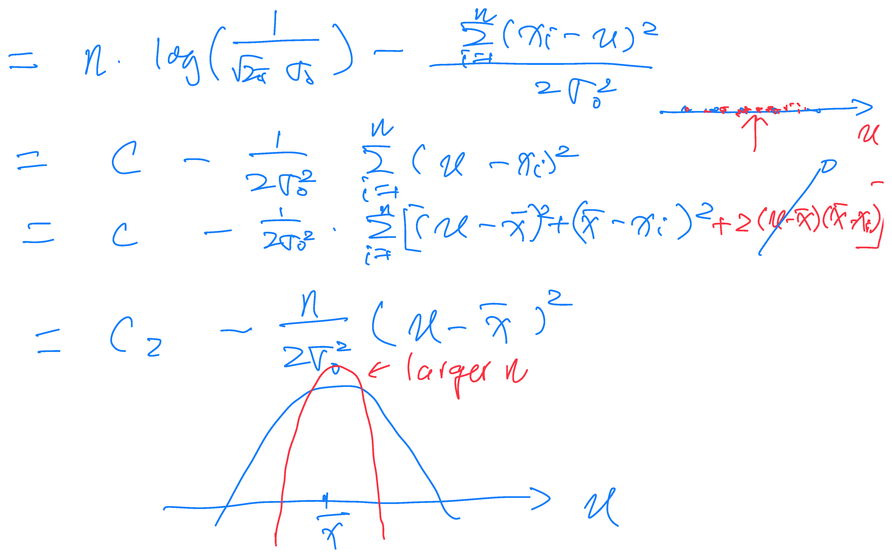

*(The bottom plot compares the log-likelihood curvature for a larger $n$: it becomes narrower/more peaked around $\bar x$.)*

## Score Function (Normal Case)

$$
S(\mu; x_1,\ldots,x_n) = \frac{\partial}{\partial \mu}\, \ell(\mu; x_1,\ldots,x_n)
$$

$$
= 0 - \frac{\sum_{i=1}^n 2(\mu - x_i)}{2\sigma_0^2}
$$

$$
= -\frac{n\mu - \sum x_i}{\sigma_0^2} = -\frac{n}{\sigma_0^2}(\mu - \bar x)
$$

$$
-\ell''(\mu; x) = \frac{n}{\sigma_0^2} \quad \Leftarrow \text{Fisher information}
$$

## Solving the Score Equation (Normal Case)

$$
S(\mu; x_1,\ldots,x_n) \equiv 0
$$

$$
n\mu - \sum x_i = 0
$$

$$
\implies \mu = \frac{\sum x_i}{n} = \bar x
$$

$$
\hat\mu_{MLE} = \bar x
$$

## Log-likelihood, Score, and Hessian Functions

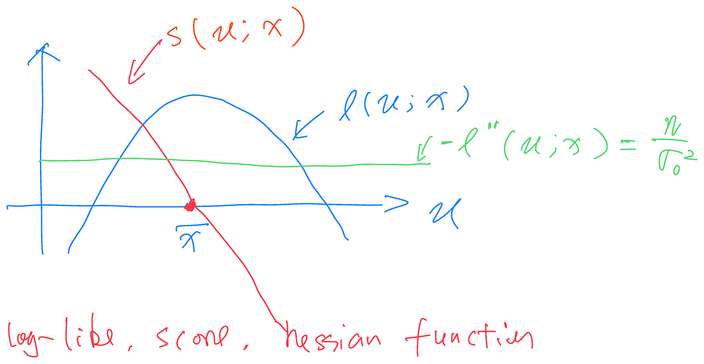

The score function $S(\mu;x)$ crosses zero exactly where the log-likelihood $\ell(\mu;x)$ is maximized; $-\ell''(\mu;x) = n/\sigma_0^2$ (green) stays constant (does not depend on $\mu$).

## Effect of Sample Size on Curvature

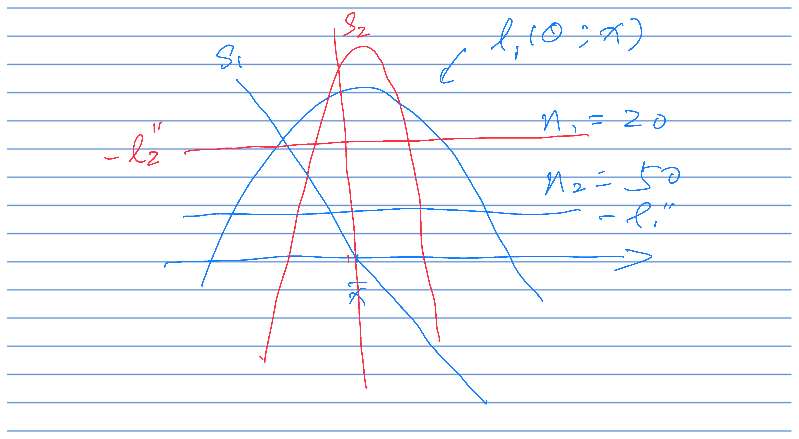

Larger sample size ($n_2=50$ vs. $n_1=20$) makes the log-likelihood more peaked, the score function steeper, and $-\ell''$ (the Fisher information) larger.

## Example (Cauchy Model)

$X_1,\ldots,X_n \sim \mathrm{Cauchy}(\theta)$

$$
f(x_i;\theta) = \frac{1}{\pi}\cdot\frac{1}{1+(x_i-\theta)^2}, \qquad x = (x_1,\ldots,x_n)
$$

$$
\implies \ell(\theta;x) = -\log(\pi)\cdot n - n\sum_{i=1}^n \log\!\left(1+(x_i-\theta)^2\right)
$$

$$
\implies S(\theta;x) = -n \sum_{i=1}^n \left[\frac{1}{1+(x_i-\theta)^2}\cdot 2(\theta - x_i)\right]
$$

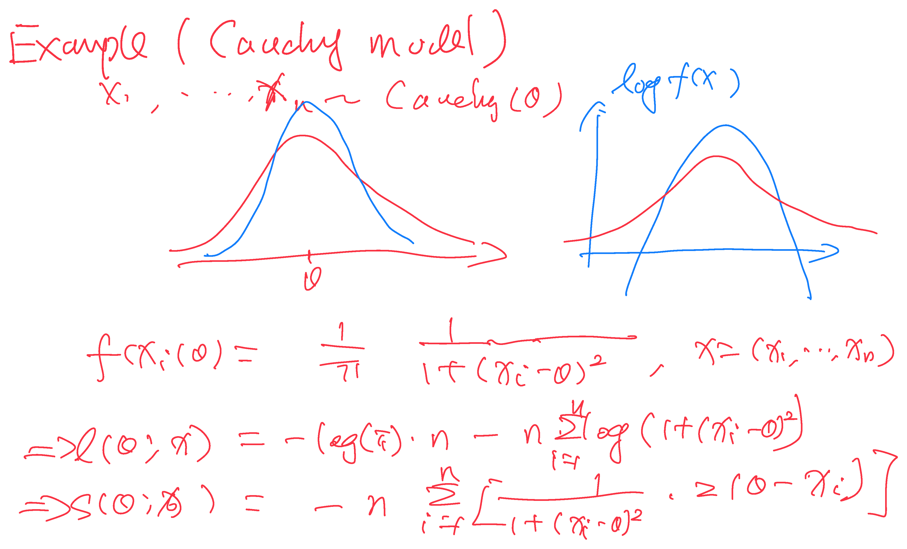

*(Cauchy density has heavier tails than the Normal — right plot compares $\log f(x)$ for the two models.)*

## Properties of MLE

Under some regularity conditions (satisfied by most statistical models used in practice), the MLE $\hat\theta_{mle}$ for iid samples has the following properties:

1. The MLE is **consistent**: $\hat\theta_{mle} \to \theta_*$ when $n \to \infty$

2. The MLE is **asymptotically normal**:
$$
\hat\theta_{mle} \to N\!\big(\theta_*, (nI(\theta_*))^{-1}\big)
$$
where
$$
I(\theta_*) = -E\!\left(\frac{\Delta^2}{\Delta\theta^2}\log(f(X\mid\theta))\Big|_{\theta_*}\right) = E\!\left(\left(\frac{d^2}{d\theta_i d\theta_j}\log(f(X\mid\theta))\right)_{p\times p}\right)
$$
(expectation is taken **with respect to $X$**)

3. Plugin $\hat\theta_{mle}$ in $I(\theta_*)$, the fact still holds:
$$
\hat\theta_{mle} \to N\!\big(\theta_*, (nI(\hat\theta_{mle}))^{-1}\big)
$$
$I(\hat\theta_{mle})$ is called the **expected Fisher information**. In contrast, $I(\theta_*)$ can also be estimated by the **observed Fisher information**:
$$
-\frac{1}{n}\sum_i \frac{\Delta^2}{\Delta\theta^2}\log(f(X_i\mid\theta))\Big|_{\hat\theta_{mle}}, \qquad n\cdot I(\theta_*) = -\frac{\partial^2}{\partial\theta^2}\ell(\theta_*;x)
$$
This avoids computing the expected value, which might be difficult or impossible. Recall: $E[f(X)] \approx \dfrac{f(x_1)+\cdots+f(x_n)}{n}$

4. The MLE is **asymptotically optimal**.

## Log-likelihood Setup (General)

Suppose $X_1,\ldots,X_n \overset{iid}{\sim} f(x_i\mid\theta)$

$$
\ell(\theta\mid x_1,\ldots,x_n) = \sum_{i=1}^n \log f(x_i\mid\theta)
$$

$$
-\ell''(\theta\mid x_1,\ldots,x_n) = \ \ldots
$$

## Simple Iteration (Fixed-Point Method)

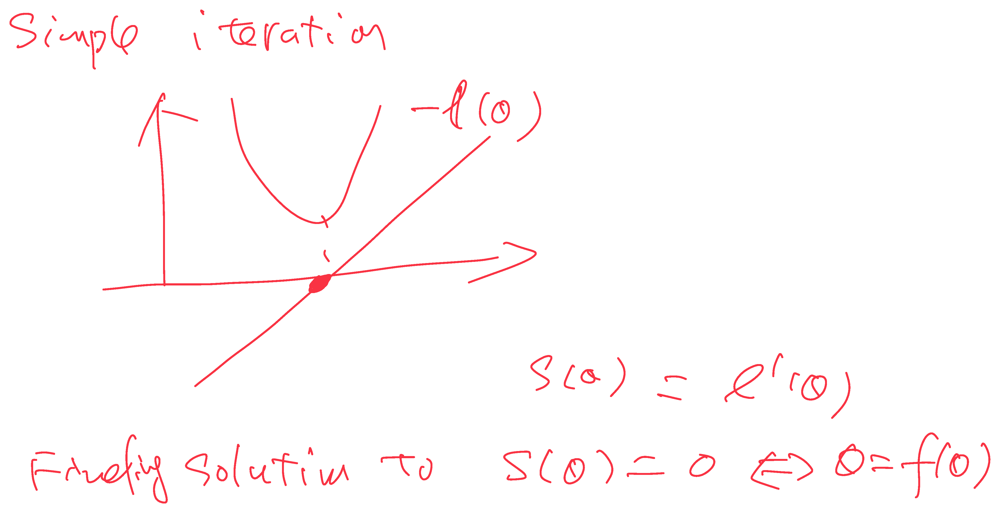

Finding a solution to $S(\theta) = 0 \iff \theta = f(\theta)$

## Fixed-Point Iteration: Illustration

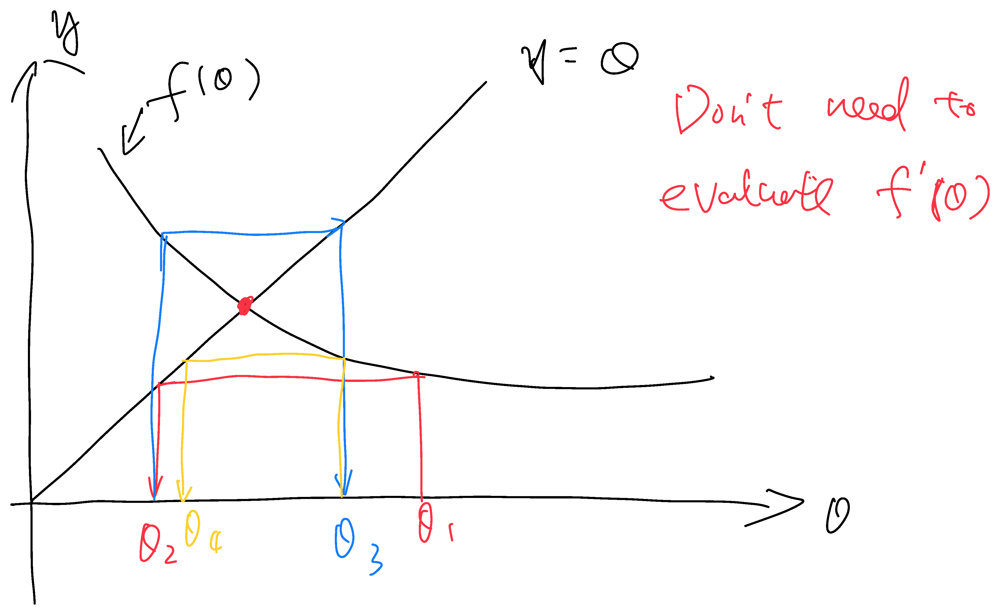

An advantage of this scheme: **don't need to evaluate $f'(\theta)$**.

## Bisection Method

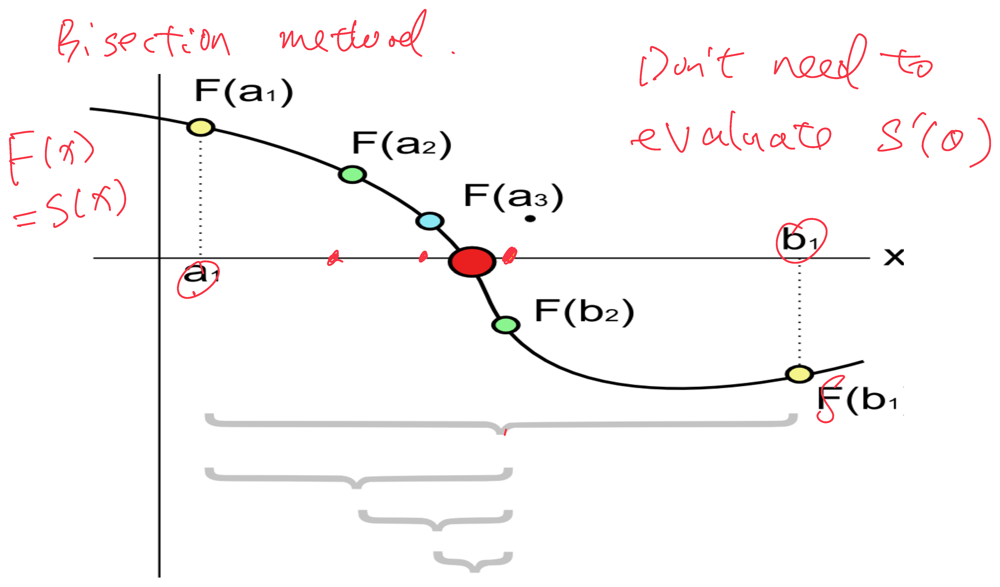

Here $F(x) = S(x)$. Don't need to evaluate $S'(\theta)$.

## Newton–Raphson Iteration

$$
\frac{S(\theta_i) - 0}{\theta_i - \theta_{i+1}} = S'(\theta_i)
$$

$$
\frac{\theta_i - \theta_{i+1}}{S(\theta_i)} = \frac{1}{S'(\theta_i)}
$$

$$
\theta_i - \theta_{i+1} = \frac{S(\theta_i)}{S'(\theta_i)}
$$

$$
\theta_{i+1} = \theta_i - \frac{S(\theta_i)}{S'(\theta_i)} = \theta_i - \frac{-\ell'(\theta_i)}{-\ell''(\theta_i)} \quad (\text{step size})
$$

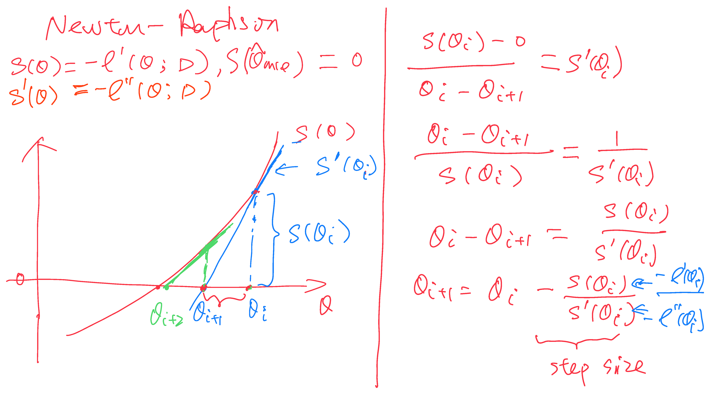

## Illustration of Newton–Raphson

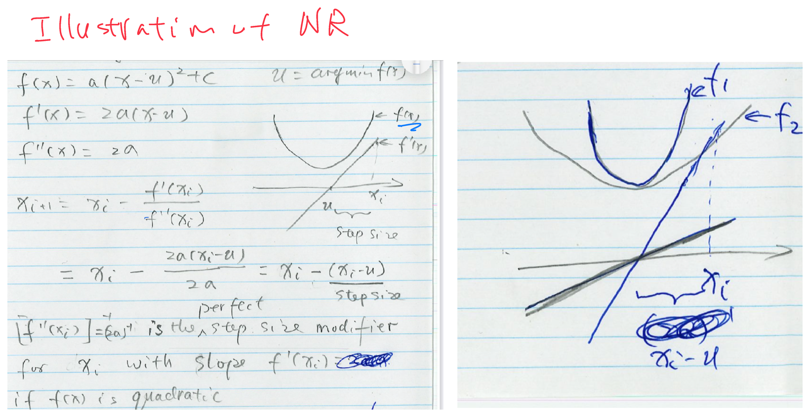

For a quadratic $f(x) = a(x-u)^2 + C$: $f'(x) = 2a(x-u)$, $f''(x)=2a$, and
$$
x_{i+1} = x_i - \frac{f'(x_i)}{f''(x_i)} = x_i - \frac{2a(x_i-u)}{2a} = x_i - \frac{(x_i-u)}{\text{step size}}
$$
$[f''(x_i)]^{-1} = (2a)^{-1}$ is the **perfect** step-size modifier for $x_i$ with slope $f'(x_i)$, if $f(x)$ is quadratic.

## Fisher Scoring vs. Newton–Raphson

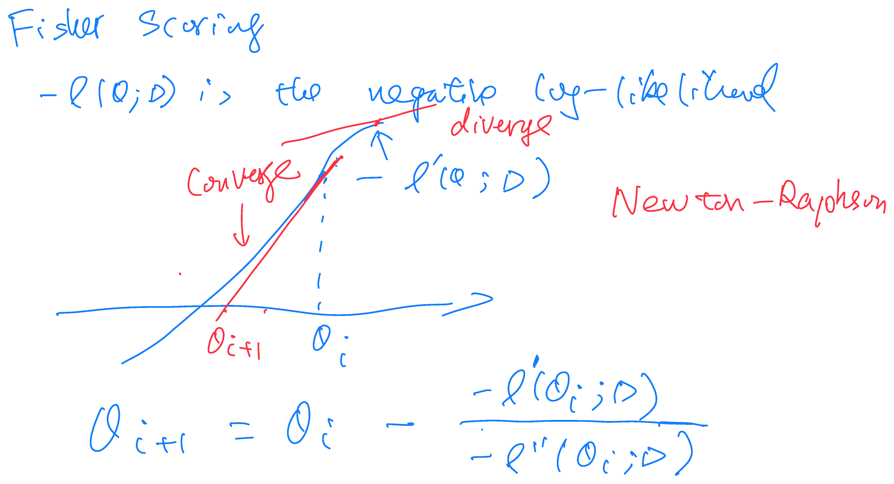

$$
\theta_{i+1} = \theta_i - \frac{-\ell'(\theta_i;D)}{-\ell''(\theta_i;D)}
$$

$-\ell(\theta;D)$ is the negative log-likelihood; depending on the curve, the iteration can **converge** or **diverge**.

## Newton–Raphson: Observed Fisher Information

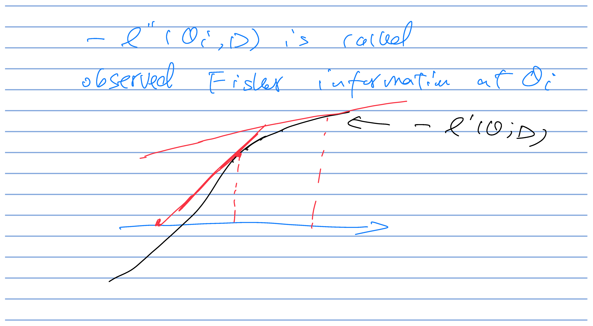

$-\ell''(\theta_i,D)$ is called the **observed Fisher information** at $\theta_i$.

## Fisher Scoring Update

Replacing $-\ell''(\theta_i;D)$ by the Fisher information at $\theta_i$:

$$
n\cdot I(\theta_i) = E_D\big(-\ell''(\theta_i;D)\big) \quad (\text{w.r.t. } D)
$$

$$
\theta_{i+1} = \theta_i + \frac{\ell'(\theta_i;D)}{n\cdot I(\theta_i)}
$$

## Example (Ordinary Poisson)

$X_1, X_2, \ldots, X_n \sim \mathrm{Pois}(\lambda)$

$$
\ell(\lambda) = \sum_{i=1}^n \log f(x_i\mid\lambda) = \sum_{i=1}^n \log\frac{e^{-\lambda}\lambda^{x_i}}{x_i!} = \sum_{i=1}^n \left[-\lambda + x_i\log\lambda - \log x_i!\right]
$$

## MLE for Poisson

$$
= -n\lambda + \sum x_i \log\lambda + C
$$

$$
\ell'(\lambda) = -n + \sum x_i/\lambda \equiv 0
$$

$$
\lambda = \frac{\sum x_i}{n}
$$

$$
\hat\lambda_{MLE} = \bar x
$$

## A Demonstrating Example (Truncated Poisson)

Suppose we only observe nonzero iid samples $X_1,\ldots,X_n$ from a Poisson distribution, whose probability function is:

$$
P(x_1,\ldots,x_n\mid\lambda) = \prod_{i=1}^n \frac{\exp(-\lambda)\lambda^{x_i}}{x_i!}\cdot\frac{1}{1-\exp(-\lambda)} \tag{7.24}
$$

$$
P(x_i\mid\lambda) = \frac{e^{-\lambda}\lambda^{x_i}}{x_i!}\cdot\frac{1}{P(x_i>0)} = \frac{e^{-\lambda}\lambda^{x_i}}{x_i!}\cdot\frac{1}{1-e^{-\lambda}}
$$

## Truncated Poisson: Score and Fisher Information

$$
\ell(\lambda) = -\lambda n + \sum x_i\log(\lambda) - n\log(1-\exp(-\lambda)) \tag{7.25}
$$

The score function $s(\lambda) = \ell'(\lambda)$:
$$
s(\lambda) = \frac{\sum x_i}{\lambda} - \frac{n}{1-\exp(-\lambda)} \tag{7.26}
$$

The equation $s(\lambda) = 0$ is equivalent to:
$$
\frac{\bar x}{\lambda} = \frac{1}{1-e^{-\lambda}} \qquad \lambda = \bar x\,(1-\exp(-\lambda)) \quad \Leftarrow \text{simple iteration} \tag{7.27}
$$

The derivative of the score function:
$$
s'(\lambda) = -\frac{\sum x_i}{\lambda^2} + n\frac{\exp(-\lambda)}{(1-\exp(-\lambda))^2} \tag{7.28}
$$

The Fisher information based on $n$ samples is (using $E(X_i) = \lambda \cdot \frac{1}{1-e^{-\lambda}}$):
$$
nI(\lambda) = -E(s'(\lambda)) = \frac{1}{\lambda(1-\exp(-\lambda))} - n\frac{\exp(-\lambda)}{(1-\exp(-\lambda))^2} \tag{7.29, 7.30}
$$

## Truncated Poisson: Bias Without Truncation Correction

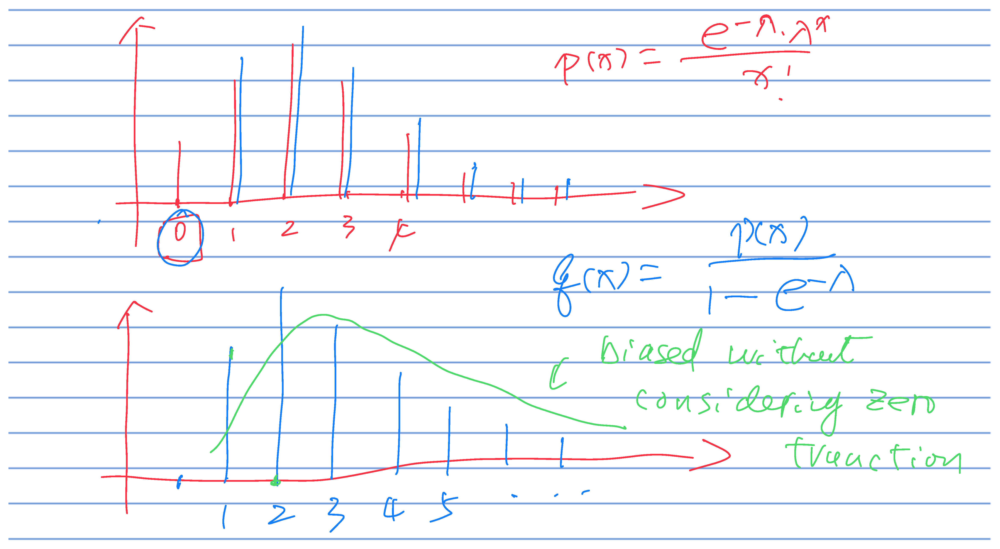

Using the plain Poisson pmf $p(x) = e^{-\lambda}\lambda^x/x!$ (top, including the $x=0$ mass) vs. the truncated pmf $f(x) = p(x)/(1-e^{-\lambda})$ (bottom) — treating truncated data with the ordinary Poisson model is **biased without considering the zero fraction**.

## Truncated Poisson: Expectation Derivation

$Y \sim \mathrm{Pois}(\lambda)$

$$
E(Y) = \sum_{y=0}^{+\infty} \frac{e^{-\lambda}\lambda^y}{y!}\cdot y = \lambda
$$

$X \sim Y \mid Y > 0$

$$
E(X) = \sum_{x=1}^{+\infty} \frac{e^{-\lambda}\lambda^x}{x!}\cdot x \cdot\left(\frac{1}{1-e^{-\lambda}}\right) = \left(\lambda\right)\cdot\frac{1}{1-e^{-\lambda}}
$$

as the first term ($x=0$) in $E(Y)$ is $0$.

## Truncated Poisson: Numerical Illustration

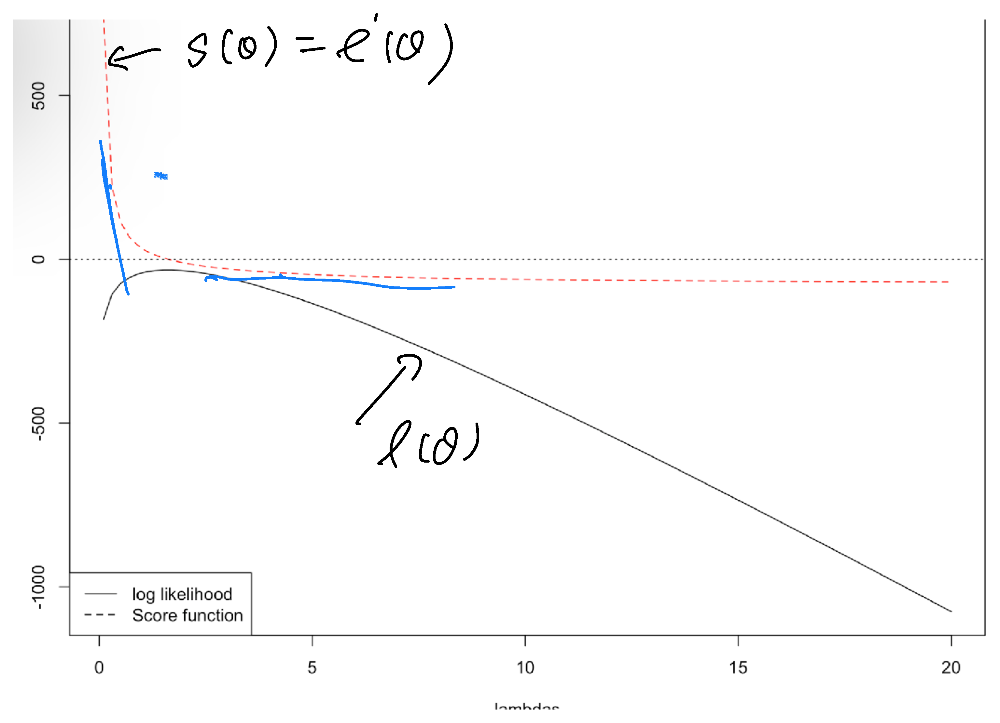

Log-likelihood $\ell(\theta)$ (solid) and score function $S(\theta)=\ell'(\theta)$ (dashed) plotted over a range of $\lambda$ values, from an R simulation.

## Golden Section Method

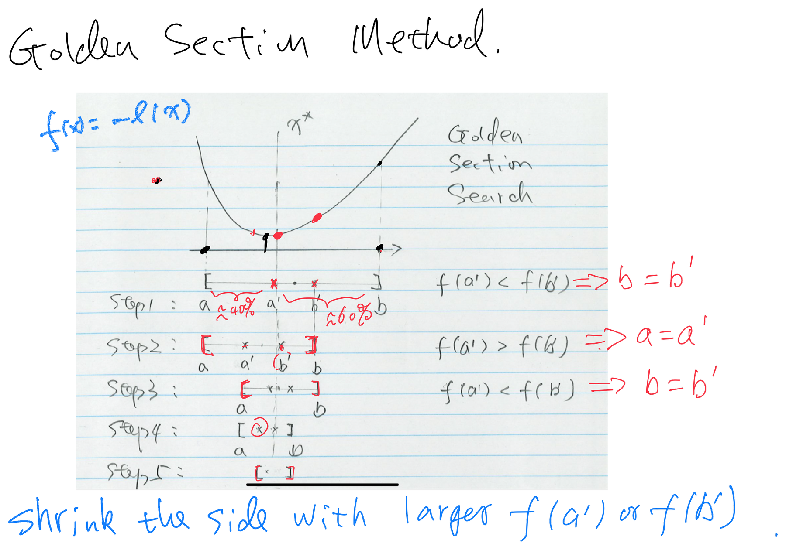

Applied to $f(x) = -\ell(x)$ near its minimum $x^*$: at each step, shrink the side with the larger of $f(a')$ or $f(b')$ (using the golden ratio split, $\approx 40\%/60\%$), narrowing the bracket $[a,b]$ toward $x^*$.

## Example: When Newton–Raphson Fails

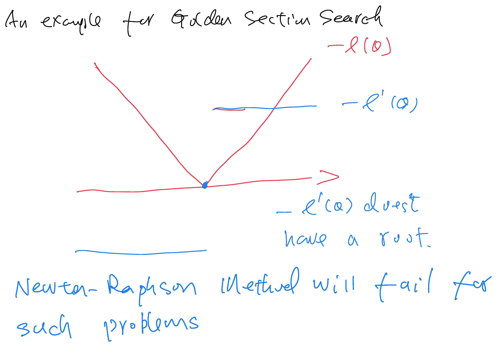

$-\ell'(\theta)$ doesn't have a root, so the **Newton–Raphson method will fail** for such problems — the Golden Section Search still works since it only relies on comparing function values.

## Numerically Evaluating the Derivative

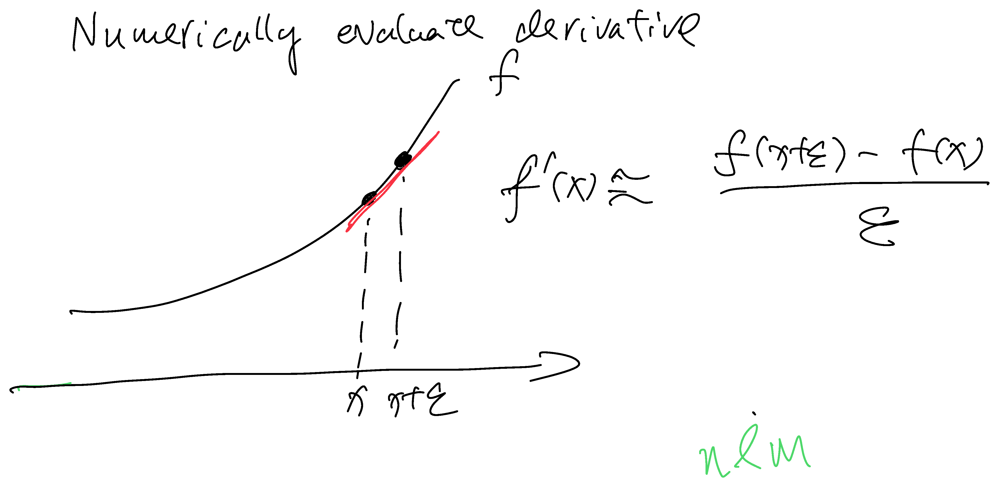

$$
f'(x) \approx \frac{f(x+\varepsilon) - f(x)}{\varepsilon}
$$

(In R, this idea underlies numerical optimizers such as `nlm`.)

# Multivariate Optimization

## Gradient of a Multivariate Function

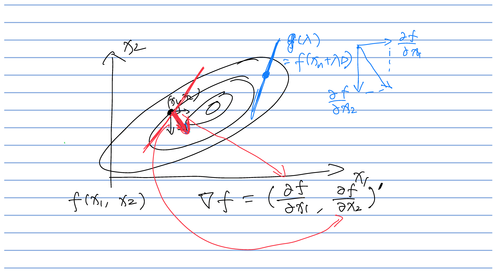

$$
\nabla f = \left(\frac{\partial f}{\partial x_1}, \frac{\partial f}{\partial x_2}\right)'
$$

The gradient $\nabla f$ at a point is a vector formed by stacking the partial derivatives $\partial f/\partial x_1$ and $\partial f/\partial x_2$; it points in the direction of steepest ascent of $f(x_1,x_2)$, and is normal to the contour line through that point.

## Sign of the Gradient Near a Minimum

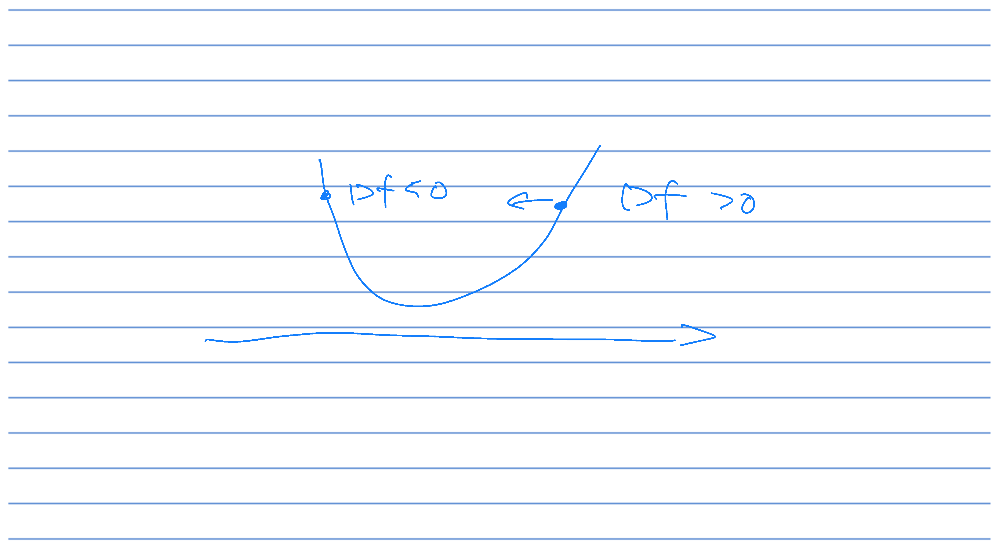

To the left of the minimum, $Df < 0$; to the right, $Df > 0$ — the derivative's sign tells us which direction decreases the function.

## Gradient Directions on a Contour Plot

Gradient vectors (green) point outward, perpendicular to the elliptical contour lines, always pointing toward higher function values.

## The Hessian Matrix

$$
\text{Hessian:}\qquad \nabla^2 f = \begin{pmatrix}
\dfrac{\partial^2 f}{\partial x_1\partial x_1} & \dfrac{\partial^2 f}{\partial x_1\partial x_2} & \cdots & \dfrac{\partial^2 f}{\partial x_1\partial x_p} \\[8pt]
\dfrac{\partial^2 f}{\partial x_2\partial x_1} & \dfrac{\partial^2 f}{\partial x_2\partial x_2} & \cdots & \dfrac{\partial^2 f}{\partial x_2\partial x_p} \\[8pt]
\vdots & \vdots & \ddots & \vdots \\[4pt]
\dfrac{\partial^2 f}{\partial x_p\partial x_1} & \dfrac{\partial^2 f}{\partial x_p\partial x_2} & \cdots & \dfrac{\partial^2 f}{\partial x_p\partial x_p}
\end{pmatrix}_{p\times p}
$$

$$
x = (x_1, x_2, \ldots, x_p)
$$

Compare with the univariate quadratic form: $(x-u)'A(x-u) + C \quad\longleftrightarrow\quad ax^2+bx+c$

## Newton–Raphson Iteration in Multiple Dimensions

$$
x_{n+1} = \underbrace{x_n}_{p\times 1} - \underbrace{\nabla^2 f(x_n)^{-1}}_{p\times p}\, \underbrace{\nabla f(x_n)}_{p\times 1}
$$

Compare with the univariate version:
$$
x_{n+1} = x_n - \frac{S(x_n)}{S'(x_n)}
$$

## Simple Linear Regression Setup

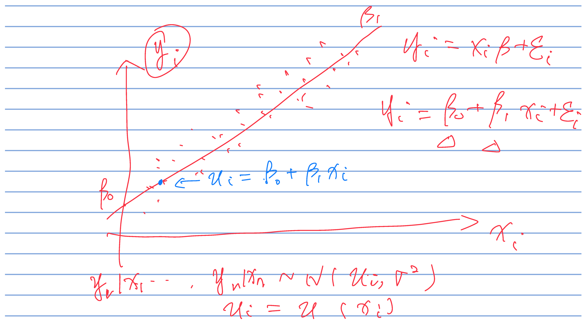

$$
y_i = x_i\beta + \varepsilon_i \qquad\text{or}\qquad y_i = \beta_0 + \beta_1 x_i + \varepsilon_i
$$

$$
u_i = \beta_0 + \beta_1 x_i
$$

$$
y_1\mid x_1, \ldots, y_n\mid x_n \sim N(u_i, \sigma^2), \qquad u_i = u(x_i)
$$

## Bernoulli Random Variable and Logistic Regression

**Bernoulli R.V.:** $y_1, y_2, \ldots, y_n \sim \mathrm{Bern}(p)$

$$
P(y_i) = p^{y_i}(1-p)^{1-y_i} = \begin{cases} p, & \text{if } y_i = 1 \\ 1-p, & \text{if } y_i = 0 \end{cases}
$$

**Logistic Regression:** $y_i \mid x_i \sim \mathrm{Bern}(\pi_i)$, $\pi_i = \pi(x_i)$

## The Logistic Function

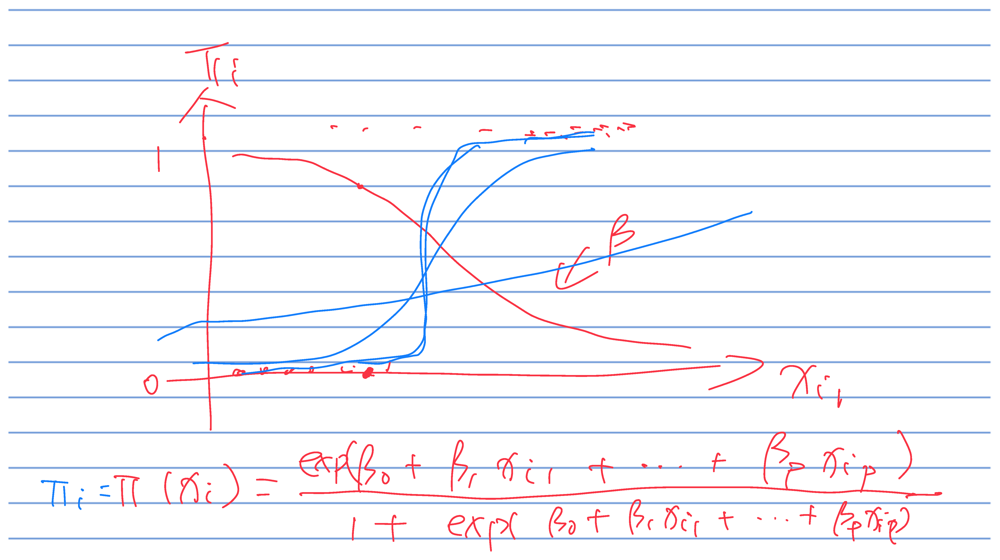

$$
\pi_i = \pi(x_i) = \frac{\exp(\beta_0 + \beta_1 x_{i1} + \cdots + \beta_p x_{ip})}{1 + \exp(\beta_0 + \beta_1 x_{i1} + \cdots + \beta_p x_{ip})}
$$

As the linear predictor $x_i'\beta$ increases, $\pi_i$ approaches 1; as it decreases, $\pi_i$ approaches 0 — this gives the characteristic S-shaped (sigmoid) curve.

## An Algebraic Identity for the Logistic Function

$$
\frac{e^x}{1+e^x} = \frac{1}{1-e^{-x}}
$$

## Likelihood Function for Logistic Regression

$$
f(y_1,\ldots,y_n \mid x_1,\ldots,x_n,\beta) = \prod_{i=1}^n f(y_i\mid x_i,\beta)
$$

$$
= \prod_{i=1}^n \pi_i^{y_i}(1-\pi_i)^{1-y_i}
$$

$$
= \prod_{i=1}^n \left(\frac{e^{x_i\beta}}{1+e^{x_i\beta}}\right)^{y_i}\left(\frac{1}{1+e^{x_i\beta}}\right)^{1-y_i}
$$

$$
= \frac{e^{\sum_{i=1}^n y_i x_i\beta}}{\prod_{i=1}^n (1+e^{x_i\beta})}
$$

## Log-Likelihood Function for Logistic Regression

$$
\ell(\beta; y, x) = \sum_{i=1}^n y_i(\beta_0 + \beta_1 x_{i1} + \cdots + \beta_p x_{ip}) - \sum_{i=1}^n \log\!\left(1 + e^{\beta_0+\beta_1 x_{i1}+\cdots+\beta_p x_{ip}}\right)
$$

## Score Equations for Logistic Regression

$$
\frac{\partial \ell}{\partial \beta_0} = \sum_{i=1}^n y_i - \sum_{i=1}^n \frac{e^{x_i\beta}\cdot 1}{1+e^{x_i\beta}} = \sum_{i=1}^n (y_i - \pi_i)
$$

$$
\frac{\partial \ell}{\partial \beta_1} = \sum_{i=1}^n y_i x_{i1} - \sum_{i=1}^n \frac{e^{x_i\beta}\cdot x_{i1}}{1+e^{x_i\beta}} = \sum_{i=1}^n (y_i - \pi_i)\,x_{i1}
$$

## Note: Log-Likelihood May Not Be Concave

It isn't positive-definite (in general, the Hessian of the logistic log-likelihood need not be negative-definite everywhere, unlike the well-behaved examples seen earlier).

## Gradient Vector for Logistic Regression

$$
\nabla \ell = \begin{pmatrix} \dfrac{\partial \ell}{\partial \beta_0} \\[8pt] \dfrac{\partial \ell}{\partial \beta_1} \\[4pt] \vdots \\[4pt] \dfrac{\partial \ell}{\partial \beta_p} \end{pmatrix}
$$

## Hessian Matrix for Logistic Regression

$$
\nabla^2 \ell = \begin{pmatrix}
\dfrac{\partial^2 \ell}{\partial \beta_0 \partial \beta_0} & \cdots & \dfrac{\partial^2 \ell}{\partial \beta_0 \partial \beta_p} \\[8pt]
\vdots & \ddots & \vdots \\[4pt]
\dfrac{\partial^2 \ell}{\partial \beta_p \partial \beta_0} & \cdots & \dfrac{\partial^2 \ell}{\partial \beta_p \partial \beta_p}
\end{pmatrix}
$$

## Variance of the MLE $\hat\beta$

$$
V(\hat\beta) = \left[n\cdot I(\beta)\right]^{-1} \approx \left[-\nabla^2 \ell(\hat\beta)\right]^{-1}
$$

$$
\hat V(\hat\beta) = \begin{pmatrix} \hat\sigma_{11}^2 & \hat\sigma_{12} & \cdots & \hat\sigma_{1p} \\ \hat\sigma_{p1} & \hat\sigma_{p2} & \cdots & \hat\sigma_{pp}^2 \end{pmatrix}, \qquad \sqrt{\mathrm{diag}\big(\hat V(\hat\beta)\big)} = \widehat{SD}(\hat\beta)
$$

## Gradient Descent Path Example

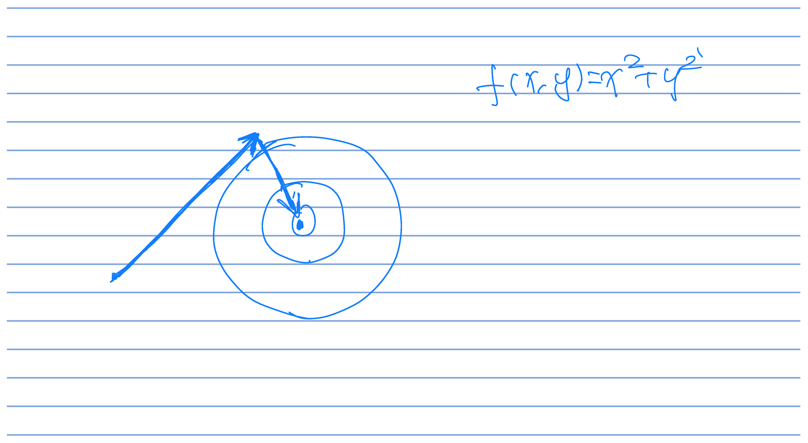

$$
f(x,y) = x^2+y^2
$$

Following the (negative) gradient direction repeatedly produces a zig-zagging path toward the minimum of the circular contours.

## Q-Conjugate Directions

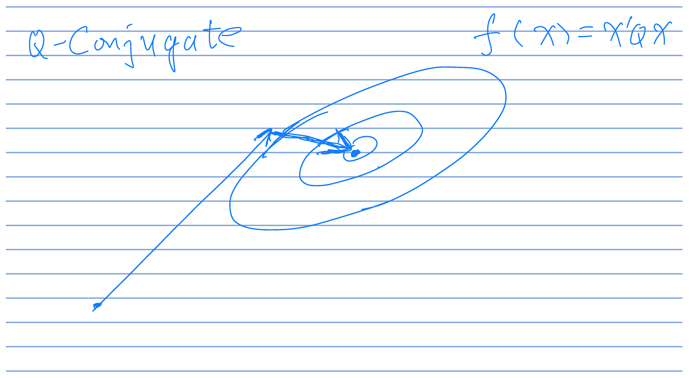

$$
f(x) = x'Qx
$$

Using **Q-conjugate** search directions on elliptical contours reaches the minimum much more directly than the zig-zagging gradient path.

## Neural Network

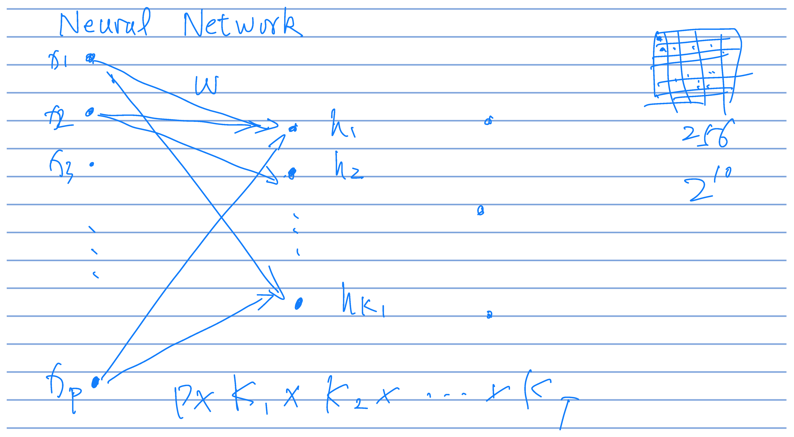

A neural network can be viewed as a composition of layers: inputs $x_1,\ldots,x_p$ feed (via weights $W$) into hidden units $h_1,\ldots,h_{k_1}$, and so on through further layers of sizes $p \times k_1 \times k_2 \times \cdots \times k_T$ — the same MLE / gradient-based optimization ideas extend to fitting such models.
