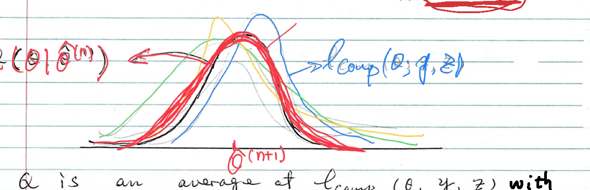
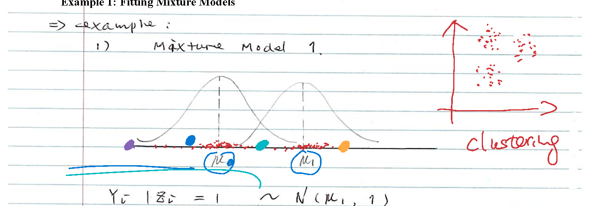
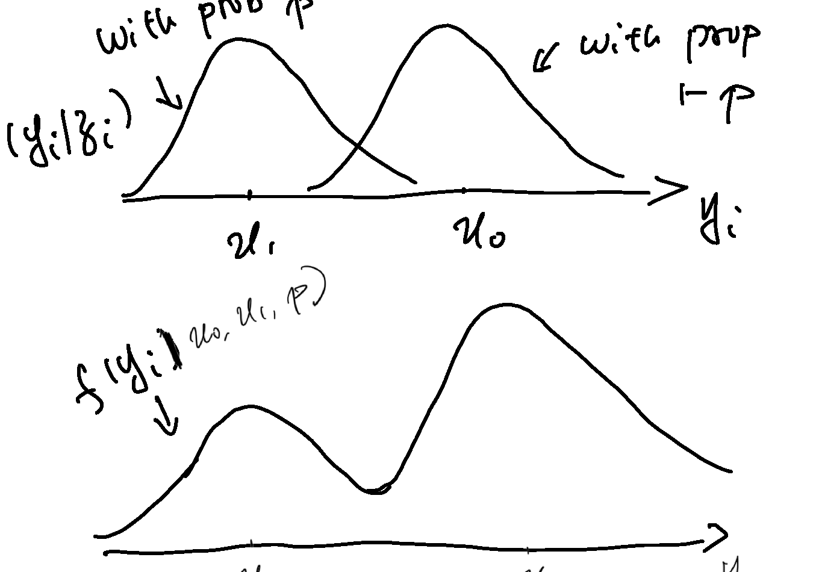
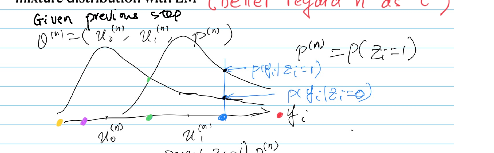
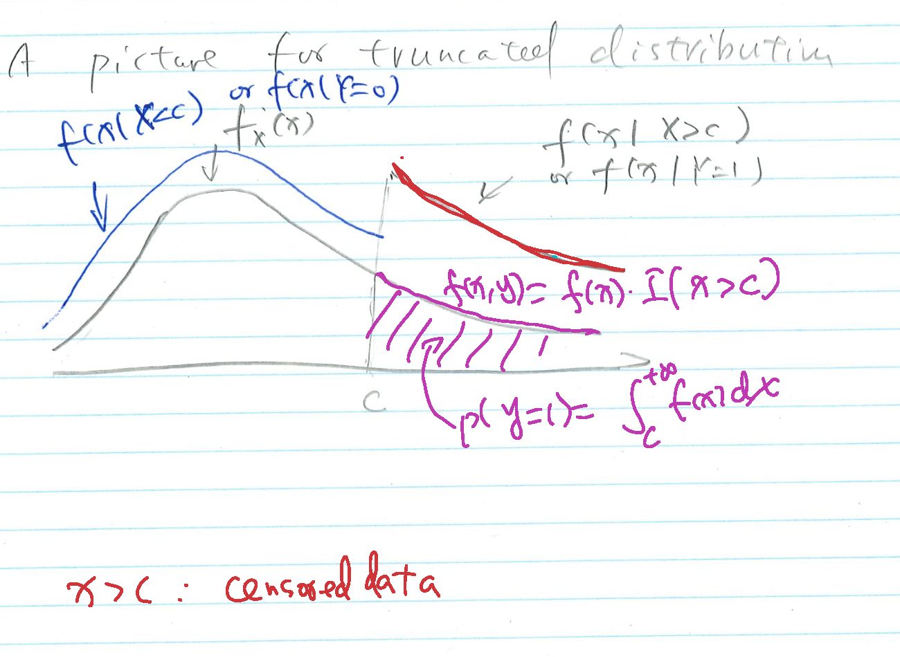
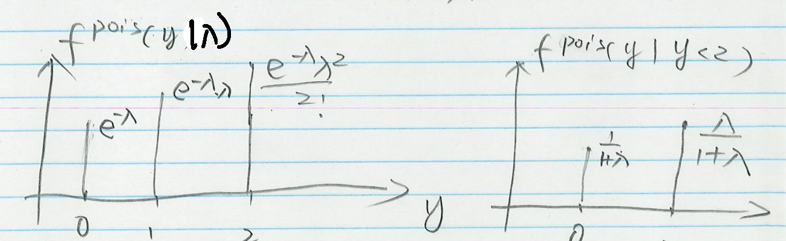
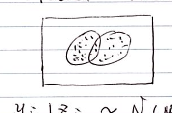

# 1. Overview of EM

## Setup and Motivation

- Observed data $Y$; parameter $\theta$; likelihood $L(\theta) = P(Y\mid\theta)$
- In many models $P(Y\mid\theta)$ is an integral (or sum) over hidden, latent, or missing data $Z$:
$$P(Y\mid\theta) = \int P(Y,Z\mid\theta)\,dZ$$

**Why EM?**

1. Avoid the integral inside the optimization
2. Reuse analytical optimization results for the complete-data model

**Terminology**

| | Likelihood | Log-likelihood |
|---|---|---|
| Observed | $L_{\text{obs}}(\theta) = P(Y\mid\theta)$ | $\ell_{\text{obs}}(\theta) = \log P(Y\mid\theta)$ |
| Complete | $L_{\text{comp}}(\theta) = P(Y,Z\mid\theta)$ | $\ell_{\text{comp}}(\theta;Y,Z) = \log P(Y,Z\mid\theta)$ |

## The EM Algorithm

Start from $\hat\theta^{(0)}$. For $t = 0,1,2,\ldots$:

**E-step**: replace $\ell_{\text{obs}}(\theta)$ by the expected complete log-likelihood
$$Q(\theta\mid\hat\theta^{(t)}) = E_{Z\mid Y,\hat\theta^{(t)}}\big[\ell_{\text{comp}}(\theta;Y,Z)\big]$$

**M-step**:
$$\hat\theta^{(t+1)} = \arg\max_\theta Q(\theta\mid\hat\theta^{(t)})$$

Iterate until $\hat\theta^{(t)}$ converges.

**Caution**: $Q$ is an average of $\ell_{\text{comp}}(\theta;Y,Z)$ over $P(Z\mid Y,\hat\theta^{(t)})$; it is **not** $\ell_{\text{comp}}\big(\theta;Y,E(Z\mid Y,\hat\theta^{(t)})\big)$.

## Q functions in EM

{height="220"}

## Ascending Property of EM

Write $h(Y,Z\mid\theta) = P(Y,Z\mid\theta)$, $\;g(Y\mid\theta) = \int h\,dZ$, $\;K(Z\mid Y,\theta) = h/g$.

**Theorem.** $\;\ell_{\text{obs}}(\hat\theta^{(t+1)}) \ \ge\ \ell_{\text{obs}}(\hat\theta^{(t)})$.

**Key identity.** Since $\log g(Y\mid\theta) = \log h(Y,Z\mid\theta) - \log K(Z\mid Y,\theta)$ for every $Z$, taking $E_{Z\mid Y,\theta_0}$ of both sides gives, for any $\theta_0$,
$$\ell_{\text{obs}}(\theta) = \underbrace{E_{Z\mid Y,\theta_0}\big[\log h(Y,Z\mid\theta)\big]}_{Q(\theta\mid\theta_0)} - \underbrace{E_{Z\mid Y,\theta_0}\big[\log K(Z\mid Y,\theta)\big]}_{H(\theta\mid\theta_0)}$$

**Proof.** Set $\theta_0 = \hat\theta^{(t)}$ and subtract the identity at $\theta = \hat\theta^{(t)}$ from the identity at $\theta = \hat\theta^{(t+1)}$:
$$\ell_{\text{obs}}(\hat\theta^{(t+1)}) - \ell_{\text{obs}}(\hat\theta^{(t)}) = \underbrace{\big[Q(\hat\theta^{(t+1)}\mid\hat\theta^{(t)}) - Q(\hat\theta^{(t)}\mid\hat\theta^{(t)})\big]}_{\ge 0 \text{ by the M-step}} - \underbrace{\big[H(\hat\theta^{(t+1)}\mid\hat\theta^{(t)}) - H(\hat\theta^{(t)}\mid\hat\theta^{(t)})\big]}_{\le 0 \text{ (next slide)}}$$

## Proof: The $H$ Term via Jensen's Inequality

Need: $H(\theta\mid\hat\theta^{(t)}) \le H(\hat\theta^{(t)}\mid\hat\theta^{(t)})$ for every $\theta$, i.e.
$$E_{Z\mid Y,\hat\theta^{(t)}}\left[\log\frac{K(Z\mid Y,\theta)}{K(Z\mid Y,\hat\theta^{(t)})}\right] \le 0$$

**Jensen**: $\log$ is concave, so $E[\log W] \le \log E[W]$. Hence
$$E_{Z\mid Y,\hat\theta^{(t)}}\left[\log\frac{K(Z\mid Y,\theta)}{K(Z\mid Y,\hat\theta^{(t)})}\right]
\le \log \int \frac{K(Z\mid Y,\theta)}{K(Z\mid Y,\hat\theta^{(t)})}\,K(Z\mid Y,\hat\theta^{(t)})\,dZ = \log 1 = 0.\qquad\blacksquare$$

- The quantity on the left is $-KL\big(K(\cdot\mid Y,\hat\theta^{(t)})\,\|\,K(\cdot\mid Y,\theta)\big)$
- EM never decreases the observed likelihood, but it may converge to a local maximum or a saddle point

## EM as Alternating Optimization

Let $\tilde P(\cdot)$ be any distribution on the hidden data $Z$ and define
$$F\big(\tilde P,\theta\big) = \int \tilde P(z)\log P(Y,z\mid\theta)\,dz - \int \tilde P(z)\log\tilde P(z)\,dz$$

Using $P(Y,z\mid\theta) = P(Y\mid\theta)P(z\mid Y,\theta)$,
$$F(\tilde P,\theta) = \ell_{\text{obs}}(\theta) - KL\big(\tilde P\,\|\,P(\cdot\mid Y,\theta)\big),
\qquad KL(P\|q) = \int P\log\frac{P}{q} \ \ge 0$$

- **E-step** = maximize $F$ over $\tilde P$ with $\theta = \hat\theta^{(t)}$ fixed: $KL \ge 0$ with equality iff $\tilde P = P(\cdot\mid Y,\hat\theta^{(t)})$, so the E-step sets $\tilde P$ to the conditional distribution of $Z$
- **M-step** = maximize $F$ over $\theta$ with $\tilde P$ fixed: the second term of $F$ is free of $\theta$, so this is $\arg\max_\theta Q(\theta\mid\hat\theta^{(t)})$

$KL \ge 0$ follows from $\log x \le x - 1$: $\;KL(P\|q) = -\int P\log\frac{q}{P} \ge -\int P\big(\frac{q}{P}-1\big) = -\int(q-P) = 0$.

# 2. Example 1: Two-Component Normal Mixture

## Model and Likelihoods

{height="160"}

$$Z_i \sim \text{Bern}(p), \qquad Y_i\mid Z_i = 1 \sim N(\mu_1,1), \qquad Y_i\mid Z_i = 0 \sim N(\mu_0,1)$$

Observed: $y_1,\ldots,y_n$. Hidden: $z_1,\ldots,z_n$. Parameter $\theta = (\mu_0,\mu_1,p)$.

**Complete likelihood**
$$P(y,z\mid\theta) = \prod_{i=1}^n P(y_i\mid z_i,\theta)P(z_i\mid\theta) = \prod_{i=1}^n \varphi(y_i\mid\mu_{z_i},1)\,p^{z_i}(1-p)^{1-z_i}$$

**Observed likelihood** (sum out each $z_i$)
$$P(y\mid\theta) = \prod_{i=1}^n\Big[\varphi(y_i\mid\mu_1,1)\,p + \varphi(y_i\mid\mu_0,1)(1-p)\Big]$$

## The Mixture Density

Each $y_i$ is drawn from $N(\mu_1,1)$ with probability $p$ or from $N(\mu_0,1)$ with probability $1-p$, giving a (possibly bimodal) marginal density $f(y\mid\mu_0,\mu_1,p)$:

{height="300"}

Maximizing $\prod_i f(y_i\mid\theta)$ directly is awkward because of the sum inside the product; EM works with the complete likelihood instead.

## Complete Log-Likelihood

With $\log\varphi(y\mid\mu,1) = -\tfrac12(y-\mu)^2 - \log\sqrt{2\pi}$,
$$\ell_{\text{comp}}(\theta;y,z) = \sum_{i=1}^n\Big[z_i\log p + (1-z_i)\log(1-p) - \tfrac12(y_i-\mu_{z_i})^2\Big] + C$$

$$= \Big(\sum_{i=1}^n z_i\Big)\log\frac{p}{1-p} + n\log(1-p) - \frac12\sum_{i=1}^n\Big[z_i(y_i-\mu_1)^2 + (1-z_i)(y_i-\mu_0)^2\Big] + C$$

- Linear in each $z_i$, so the E-step only needs $E(Z_i\mid y_i,\hat\theta^{(t)})$
- Given $z$, the parameters separate: $p$ is a Bernoulli proportion, $\mu_1,\mu_0$ are group means

## E-Step: Soft Classification

Given $\hat\theta^{(t)} = (\hat\mu_0^{(t)},\hat\mu_1^{(t)},\hat p^{(t)})$, Bayes' rule gives

$$\hat p_i^{(t)} \equiv P(Z_i=1\mid y_i,\hat\theta^{(t)}) = \frac{\varphi(y_i\mid\hat\mu_1^{(t)},1)\,\hat p^{(t)}}{\varphi(y_i\mid\hat\mu_0^{(t)},1)(1-\hat p^{(t)}) + \varphi(y_i\mid\hat\mu_1^{(t)},1)\,\hat p^{(t)}}$$

:::: {.columns}
::: {.column width="50%"}
{height="230"}
:::
::: {.column width="50%"}
| $i$ | $\varphi_0(y_i)(1-\hat p^{(t)})$ | $\varphi_1(y_i)\hat p^{(t)}$ | $\hat p_i^{(t)}$ |
|---|---|---|---|
| 1 | 20 | 25 | $25/45$ |
| 2 | $\cdots$ | $\cdots$ | 0.2 |
| 3 | $\cdots$ | $\cdots$ | 0.9 |
| $\vdots$ | | | $\vdots$ |
:::
::::

Then
$$Q(\theta\mid\hat\theta^{(t)}) = \Big(\sum_i \hat p_i^{(t)}\Big)\log\frac{p}{1-p} + n\log(1-p) - \frac12\sum_i\Big[\hat p_i^{(t)}(y_i-\mu_1)^2 + (1-\hat p_i^{(t)})(y_i-\mu_0)^2\Big]$$

## M-Step: Weighted Proportions and Means

$Q$ separates into a term in $p$ and terms in $\mu_1$, $\mu_0$.

**Update $p$**: $\displaystyle \frac{\partial Q}{\partial p} = \frac{\sum_i \hat p_i^{(t)}}{p(1-p)} - \frac{n}{1-p} = 0
\;\Longrightarrow\; \hat p^{(t+1)} = \frac1n\sum_{i=1}^n \hat p_i^{(t)}$

**Update $\mu_1$**: $\displaystyle \frac{\partial Q}{\partial \mu_1} = \sum_i \hat p_i^{(t)}(y_i-\mu_1) = 0
\;\Longrightarrow\; \hat\mu_1^{(t+1)} = \frac{\sum_i \hat p_i^{(t)}\,y_i}{\sum_i \hat p_i^{(t)}}$

**Update $\mu_0$** (weights $1-\hat p_i^{(t)}$): $\displaystyle \hat\mu_0^{(t+1)} = \frac{\sum_i (1-\hat p_i^{(t)})\,y_i}{\sum_i (1-\hat p_i^{(t)})}$

Return to the E-step with $\hat\theta^{(t+1)}$ and recompute $\hat p_i^{(t+1)}$.

**Interpretation**: the M-step is the complete-data MLE with each observation split between the two groups according to its soft classification.

# 3. Example 2: Censored Poisson Data

## Truncated Distributions in Brief

Let $X\sim f(x)$ and $Y = I(X>c)$. Then $Y\sim\text{Bern}\big(P(X>c)\big)$, and the conditional distribution of $X$ given $Y$ is $f$ restricted to one side of $c$ and renormalized:

$$f(x\mid Y=1) = \frac{f(x)\,I(x>c)}{\int_c^\infty f}, \qquad
f(x\mid Y=0) = \frac{f(x)\,I(x\le c)}{\int_{-\infty}^c f}$$

{height="260"}

For discrete $X$ the integrals are sums. This is exactly the distribution the E-step needs when an observation is only known to lie on one side of $c$.

## Censored Poisson: Data and Likelihoods

$y_i \overset{iid}{\sim}\text{Pois}(\lambda)$, $i=1,\ldots,n$. The first $m$ values are observed exactly; for $i>m$ we only know $y_i<2$, recorded as $x_i = I(y_i<2) = 1$.

**Observed data**: $y_1,\ldots,y_m$ and $x_{m+1}=\cdots=x_n=1$. **Missing**: $y_{m+1},\ldots,y_n$.

**Complete likelihood**
$$\prod_{i=1}^n f^{\text{Pois}}(y_i\mid\lambda)\cdot\prod_{i=m+1}^n I(y_i<2)$$

**Observed likelihood**
$$\prod_{i=1}^m f^{\text{Pois}}(y_i\mid\lambda)\cdot\prod_{i=m+1}^n P(y_i<2\mid\lambda),
\qquad P(y_i<2\mid\lambda) = e^{-\lambda}(1+\lambda)$$

The second factor makes the MLE nonlinear in $\lambda$; EM sidesteps it.

## E-Step

$$\ell_{\text{comp}}(\lambda) = -n\lambda + (\log\lambda)\sum_{i=1}^m y_i + (\log\lambda)\underbrace{\sum_{i=m+1}^n y_i}_{\text{missing}} - \sum_{i=1}^n\log(y_i!)$$

For $i>m$, $y_i\in\{0,1\}$, and the truncated Poisson given $\lambda^{(t)}$ is
$$P(y_i=0\mid x_i=1) = \frac{1}{1+\lambda^{(t)}}, \qquad P(y_i=1\mid x_i=1) = \frac{\lambda^{(t)}}{1+\lambda^{(t)}}$$

{height="150"}

$$\hat y_i^{(t)} \equiv E(y_i\mid x_i=1,\lambda^{(t)}) = \frac{\lambda^{(t)}}{1+\lambda^{(t)}}$$

Since $y_i! = 1$ for $y_i\in\{0,1\}$, the $\log(y_i!)$ term is a known constant and no further expectation is needed.

## M-Step and the EM Update

$$Q(\lambda\mid\lambda^{(t)}) = -n\lambda + (\log\lambda)\Big[\sum_{i=1}^m y_i + (n-m)\,\hat y^{(t)}\Big] + C^{(t)}$$

$$\frac{\partial Q}{\partial\lambda} = -n + \frac{1}{\lambda}\Big[\sum_{i=1}^m y_i + (n-m)\hat y^{(t)}\Big] = 0$$

$$\Longrightarrow\quad \lambda^{(t+1)} = \frac{m\,\bar y_{1:m} + (n-m)\dfrac{\lambda^{(t)}}{1+\lambda^{(t)}}}{n}$$

- The update is the ordinary Poisson MLE (sample mean) with each censored value replaced by its conditional expectation
- This works here only because $\ell_{\text{comp}}$ is linear in the missing $y_i$; in general, EM is **not** "plug in $E(Z)$ and maximize"

# 4. More Complex Applications

## Where EM Is Used

:::: {.columns}
::: {.column width="55%"}
**Model-based clustering**
$$Z_i\sim\text{Categorical}(\pi_1,\ldots,\pi_K), \qquad Y_i\mid Z_i=k\sim N(\mu_k,\Sigma_k)$$
Multivariate generalization of Example 1; E-step gives soft cluster memberships.

**Hidden Markov models**
$$P(y_{1:n}\mid h_{1:n},\theta) = \prod_{i=1}^n P(y_i\mid h_i,\theta), \qquad h_1\to h_2\to\cdots\to h_n$$
Hidden states form a Markov chain; the E-step (forward–backward) computes $P(h_i\mid y_{1:n},\hat\theta^{(t)})$.

**Factor analysis**
$$y_i = \Gamma x_i + \varepsilon_i, \qquad x_i \text{ hidden}$$
E-step: $x_i\mid y_i,\hat\theta^{(t)}$ is normal with closed-form moments.
:::
::: {.column width="45%"}
{height="260"}

**Common pattern**

1. Hidden variable makes the complete model tractable
2. E-step: conditional distribution of hidden data
3. M-step: complete-data MLE with expected sufficient statistics
:::
::::

## Summary

- EM maximizes $\ell_{\text{obs}}$ by alternating between $Q(\theta\mid\hat\theta^{(t)}) = E_{Z\mid Y,\hat\theta^{(t)}}[\ell_{\text{comp}}]$ and its maximizer
- Every iteration weakly increases $\ell_{\text{obs}}$; equivalently, EM is coordinate ascent on $F(\tilde P,\theta) = \ell_{\text{obs}}(\theta) - KL(\tilde P\,\|\,P(Z\mid Y,\theta))$
- When $\ell_{\text{comp}}$ is linear in sufficient statistics of $Z$, the E-step reduces to computing their conditional expectations
- Convergence is linear (often slow) and only to a stationary point; run from several starting values
