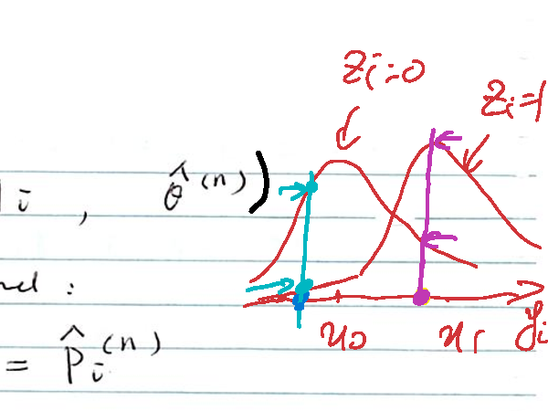
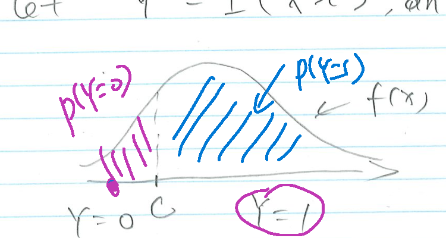

## EM Algorithm: Basic Setup and Motivation

**Basic set up:**

(1) Observed data: $Y$

(2) $L(\theta,Y) = P(Y\mid\theta)$

$P(Y\mid\theta)$ involves an integral (or sum).

**Why do we need EM?**

(1) Avoid the integral in optimization

(2) Borrow some analytical optimization result

Hidden (latent, missing) data: $Z$

$$P(Y\mid\theta) = \int P(Y,Z\mid\theta)\,dZ$$

**Basic terminologies:**

(1) Observed likelihood:
$$L_{\text{obs}}(\theta) = P(Y\mid\theta)$$
Observed log likelihood:
$$\ell_{\text{obs}}(\theta) = \log P(Y\mid\theta)$$

(2) Complete likelihood: $L_{\text{comp}}(\theta) = P(Y,Z\mid\theta)$

Complete log likelihood: $\ell_{\text{comp}}(\theta;Y,Z) = \log P(Y,Z\mid\theta)$

## Example 1: Fitting a Two-Component Mixture Model

$$Y_i \mid Z_i = 1 \sim N(\mu_1, 1)$$
$$Y_i \mid Z_i = 0 \sim N(\mu_0, 1)$$

where $Z_i \sim \text{Bern}(p)$.

Observed data: $Y_i$, $i=1,2,\ldots,n$

Hidden data: $Z_i$, $i=1,\ldots,n$

**Observed likelihood** ($\theta = (\mu_0,\mu_1,p)$):

$$P(y_1,\ldots,y_n\mid\theta) = \prod_{i=1}^n\Big[\varphi(y_i\mid\mu_0,1)(1-p) + \varphi(y_i\mid\mu_1,1)\,p\Big]$$

**Completed likelihood:**

$$P(y_1,\ldots,y_n,z_1,\ldots,z_n\mid\theta) = \prod_{i=1}^n P(y_i,z_i\mid\theta) = \prod_{i=1}^n P(y_i\mid\theta,z_i)\cdot P(z_i\mid\theta)$$

## Example 1: Observed Likelihood and Mixture Density

$$= \prod_{i=1}^n \varphi(y_i\mid\mu_{z_i},1)\, p^{z_i}(1-p)^{1-z_i}$$

**Observed likelihood:**

$$\prod_{i=1}^n \sum_{z_i=0}^{1} \varphi(y_i\mid\mu_{z_i},1)\,p^{z_i}(1-p)^{1-z_i} \qquad \Big[\,\underbrace{P(y_i\mid z_i)\cdot P(z_i)}_{}\,\Big]$$

$$= \prod_{i=1}^n\Big[\varphi(y_i\mid\mu_1,1)\cdot p + \varphi(y_i\mid\mu_0,1)\cdot(1-p)\Big]$$

Each observation comes from $\varphi(y_i\mid\mu_1,1)$ **with probability $p$**, or from $\varphi(y_i\mid\mu_0,1)$ **with probability $1-p$**, giving a bimodal marginal density $f(y_i\mid\mu_0,\mu_1,p)$:

## The EM Algorithm for the Mixture Model

Starting from $\hat\theta^{(0)}$, iterate the E-step and M-step. For $n = 0,1,2,\ldots$:

**E-step**: approximate $\ell_{\text{obs}}(\theta)$ with

$$Q(\theta\mid\hat\theta^{(n)}) = E_{Z\mid\hat\theta^{(n)},Y}\big[\ell_{\text{comp}}(\theta,Y,Z)\big]$$

Note that: $Q$ is **not** $\ell_{\text{comp}}\big(\theta;Y,E(Z\mid\hat\theta^{(n)})\big)$.

$Q$ is an average of $\ell_{\text{comp}}(\theta,Y,Z)$ with respect to $P(Z\mid\hat\theta^{(n)},Y)$:

**M-step**:
$$\hat\theta^{(n+1)} = \arg\max_\theta Q(\theta\mid\hat\theta^{(n)})$$

## Example 1: Complete Log-Likelihood (Derivation)

$$\ell_{\text{comp}}(\theta;y_i,z_i) = \log\left(\prod_{i=1}^m p^{z_i}(1-p)^{1-z_i}\,\varphi(y_i\mid\mu_{z_i},1)\right)$$

$$= \sum_{i=1}^m\Big[z_i\log p + (1-z_i)\log(1-p) + \log\varphi(y_i\mid\mu_{z_i},1)\Big]$$

Note that $y_i\mid z_i \sim N(\mu_{z_i},1)$:

$$\varphi(y_i\mid\mu_{z_i},1) = \frac{1}{\sqrt{2\pi}\,\sigma}\exp\left\{-\frac12\left(\frac{y_i-\mu_{z_i}}{\sigma}\right)^2\right\} = \frac{1}{\sqrt{2\pi}}\exp\left\{-\frac{(y_i-\mu_{z_i})^2}{2}\right\}$$

$$\log\varphi(y_i\mid\mu_{z_i},1) = -\frac{(y_i-\mu_{z_i})^2}{2} - \log\sqrt{2\pi}$$

So

$$\ell_{\text{comp}} = \sum_{i=1}^m z_i\big(\log p - \log(1-p)\big) + m\log(1-p) -\frac12\sum_{i=1}^m (y_i-\mu_{z_i})^2 + C \quad (z_i = 1 \text{ or } 0)$$

$$= \sum_{i=1}^m \hat Z_i^{(n)}\big(\log p - \log(1-p)\big) + m\log(1-p) - \frac12\sum_{i=1}^m (y_i-\mu_{z_i})^2$$

To take the E-step, $Z_i$ needs to be **averaged away** (replaced by its conditional expectation).

## E-Step: Soft Classification Probabilities

**E-Step:** finding soft classification probabilities $\hat p_i^{(n)}$ for fitting the mixture distribution with EM (better regard $n$ as $t$).

Given previous step $\theta^{(n)} = (\mu_0^{(n)}, \mu_1^{(n)}, p^{(n)})$, with $p^{(n)} = P(Z_i=1)$:

$$P(Z_i=1\mid y_i,\theta^{(n)}) = \frac{P(y_i\mid Z_i=1)\,p^{(n)}}{P(y_i\mid Z_i=0)(1-p^{(n)}) + P(y_i\mid Z_i=1)\,p^{(n)}} \equiv \hat p_i^{(n)} \ \ (\text{soft classification})$$

To illustrate, for each observation we compute the two weighted densities and normalize:

| $i$ | $y_i$ | $P(y_i\mid Z_i=0)(1-p^{(n)})$ | $P(y_i\mid Z_i=1)\,p^{(n)}$ | $\hat p_i^{(n)}$ |
|---|---|---|---|---|
| 1 | $y_1$ | 20 | 25 | $25/45$ |
| 2 | $y_2$ | $\cdots$ | $\cdots$ | $0.2$ |
| 3 | $y_3$ | $\cdots$ | $\cdots$ | $0.9$ |
| $\vdots$ | $\vdots$ | $\vdots$ | $\vdots$ | $\vdots$ |
| $m$ | $y_m$ | $\cdots$ | $\cdots$ | $\vdots$ |

$$\hat p^{(n+1)} = \frac{\sum_{i=1}^m \hat p_i^{(n)}}{m}$$

## E-Step and M-Step for the Mixture Model

**E-step:** Find $P(Z_i=1\mid y_i,\hat\theta^{(n)})$.

Suppose we have found:
$$P(Z_i=1\mid y_i;\hat\theta^{(n)}) = \hat p_i^{(n)}, \qquad P(Z_i=0\mid y_i;\hat\theta^{(n)}) = 1-\hat p_i^{(n)}$$

$$Q(\theta\mid\hat\theta^{(n)}) = E_{Z\mid\hat\theta^{(n)},Y}\big(\ell_{\text{comp}}(\theta,Y,Z)\big)$$

$$= \sum_{i=1}^m E(Z_i)\cdot\log\frac{p}{1-p} + m\log(1-p) - \frac12\sum_{i=1}^m E\big[(y_i-\mu_{Z_i})^2\big]$$

$$= \sum_{i=1}^m \hat p_i^{(n)}\log\frac{p}{1-p} + m\log(1-p) - \frac12\sum_{i=1}^m\Big[(y_i-\mu_0)^2(1-\hat p_i^{(n)}) + (y_i-\mu_1)^2\hat p_i^{(n)}\Big]$$

**M-step:**
$$\hat p^{(n+1)} = \arg\max_p \underbrace{\left[\sum_{i=1}^m \hat p_i^{(n)}\log\frac{p}{1-p} + m\log(1-p)\right]}_{Q^{(n)}(p)}$$

Differentiate $Q$ with respect to $p$ to find the optimizer for $p$:

$$\frac{\partial Q^{(n)}(p)}{\partial p} = \left(\sum_{i=1}^m \hat p_i^{(n)}\right)\frac{1}{p(1-p)} - \frac{m}{1-p} \overset{\text{set}}{=} 0$$

## M-Step: Updating $p$, $\mu_1$, $\mu_0$

$$\sum_{i=1}^m \hat p_i^{(n)} = m\cdot p \;\Longrightarrow\; p = \frac{\sum_{i=1}^m \hat p_i^{(n)}}{m} \;\Longrightarrow\; \hat p^{(n+1)} = \frac{\sum_{i=1}^m \hat p_i^{(n)}}{m}$$

$$\hat\mu_1^{(n+1)} = \arg\max_{\mu_1} \underbrace{\left[-\frac12\sum_{i=1}^m (y_i-\mu_1)^2\hat p_i^{(n)}\right]}_{Q^{(n)}(\mu_1)}$$

$$\frac{\partial Q^{(n)}(\mu_1)}{\partial \mu_1} = -\frac12\sum_{i=1}^m 2(\mu_1-y_i)\hat p_i^{(n)} \overset{\text{set}}{=} 0$$

$$\Longrightarrow \hat\mu_1^{(n+1)} = \frac{\sum_{i=1}^m y_i\hat p_i^{(n)}}{\sum_{i=1}^m \hat p_i^{(n)}}$$

By a symmetric argument (using weights $1-\hat p_i^{(n)}$):

$$\hat\mu_0^{(n+1)} = \frac{\sum_{i=1}^m y_i\big(1-\hat p_i^{(n)}\big)}{\sum_{i=1}^m \big(1-\hat p_i^{(n)}\big)}$$

We obtain $\hat\theta^{(n+1)} = \big(\hat p^{(n+1)}, \hat\mu_1^{(n+1)}, \hat\mu_0^{(n+1)}\big)$.

**Go to the E-step to update $\hat p_i^{(n)}$.**

## Truncated Distributions

Suppose $X \sim f(x)$ (e.g., normal, Poisson).

Let $Y = I(X>c)$, an indicator of $X>c$:
$$Y = \begin{cases} 1, & X>c \\ 0, & X \le c\end{cases}$$

**Joint distribution of $(X,Y)$:**

$$f_{XY}(x,y) = f(x)\cdot f_{Y\mid X}(y\mid x)$$

where the conditional distribution $Y\mid X$ is

$$f(y\mid x) = \begin{cases} 1, & y=1,\ x>c \\ 1, & y=0,\ x\le c \\ 0, & y=0,\ x>c \\ 0, & y=1,\ x\le c\end{cases} = \big[I(x>c)\big]^{y}\big[1-I(x>c)\big]^{1-y}$$

Note: $0^0 = 1$.

**Marginal distribution of $Y$:**

$$f_Y(y) = \int_{-\infty}^{+\infty} I(x>c)^{y}\big(1-I(x>c)\big)^{1-y} f(x)\,dx$$

## Truncated Distributions: Marginal and Conditional Densities

$$f_Y(1) = \int_{-\infty}^{+\infty} I(x>c)f(x)\,dx = \int_c^{+\infty} f(x)\,dx = P(X>c)$$

$$f_Y(0) = \int_{-\infty}^{c} f(x)\,dx = P(X\le c)$$

$$Y \sim \text{Bern}\big(P(X>c)\big)$$

**Conditional distribution of $X\mid Y$:**

$$f_{X\mid Y}(x\mid Y=1) = \frac{f_{XY}(x,Y=1)}{f_Y(1)} = \frac{f(x)\cdot I(x>c)}{P(X>c)} = \begin{cases}\dfrac{f(x)}{\int_c^{+\infty} f(x)\,dx}, & x>c \\[6pt] 0, & \text{o.w.}\end{cases}$$

Similarly,

$$f_{X\mid Y}(x\mid Y=0) = \frac{f(x)}{\int_{-\infty}^c f(x)\,dx}\,I(x\le c)$$

## A Picture for the Truncated Distribution

$x>c$: **censored data**

## EM for Censored Poisson Data

**Observed data:**

Form 1: $y_1,\ldots,y_m,\ y_{m+1}<2,\ \ldots,\ y_n<2$

Form 2: $y_1,\ldots,y_m,\ x_{m+1}=1,\ \ldots,\ x_n=1$, where $x_i = I(y_i<2)$

Form 3: $y_i:\ y_1,\ldots,y_m,2,2,\ldots,2\,$; $\quad \delta_i:\ 0,\ldots,0,1,1,\ldots,1$ (censored values recorded at the censoring point $2$, with indicator $\delta_i$)

**Complete likelihood** ($\underbrace{y_1,\ldots,y_m}_{\text{observed}}$, $\underbrace{y_{m+1},\ldots,y_n}_{\text{missing}}$, $\underbrace{x_{m+1}=1,\ldots,x_n=1}_{\text{observed}}$):

$$= \prod_{i=1}^m f^{\text{Pois}}(y_i\mid\lambda)\cdot \prod_{i=m+1}^n f^{\text{Pois}}(y_i\mid\lambda)\cdot \prod_{i=m+1}^n I(y_i<2,\ x_i=1)$$

**Observed likelihood:**

$$f(y_1,\ldots,y_m,x_{m+1}=1,\ldots,x_n=1) = \prod_{i=1}^m f^{\text{Pois}}(y_i\mid\lambda)\cdot \prod_{i=m+1}^n P(y_i<2\mid\lambda)$$

where $P(y_i<2\mid\lambda) = \sum_{y_i=0}^{1} f^{\text{Pois}}(y_i\mid\lambda)$.

Let $Y=(y_1,\ldots,y_m,\underbrace{y_{m+1},\ldots,y_n}_{\text{missing}})$, $\quad X=(x_{m+1},\ldots,x_n)$.

## EM Algorithm for Censored Poisson Data: E-Step

Given a previous estimate $\lambda^{(t)}$:

**E-step:** compute $E_{Y\mid\lambda^{(t)},X}\big(\log f(Y,X\mid\lambda)\big)$

$$\ell^c(\lambda\mid Y,X) = \sum_{i=1}^m \log\left(\frac{e^{-\lambda}\lambda^{y_i}}{y_i!}\right) + \sum_{i=m+1}^n \log\left(\frac{e^{-\lambda}\lambda^{y_i}}{y_i!}\right)$$

$$= -n\lambda + (\log\lambda)\sum_{i=1}^m y_i + (\log\lambda)\underbrace{\sum_{i=m+1}^n y_i}_{\text{missing}} - \underbrace{\sum_{i=1}^n \log(y_i!)}_{\text{missing for } i>m}$$

For $i=m+1,\ldots,n$ (censored, $y_i<2$, i.e., $y_i\in\{0,1\}$):

$$f(y_i\mid x_i=1,\lambda^{(t)}) = \begin{cases}\dfrac{1}{1+\lambda^{(t)}}, & y_i=0\\[6pt] \dfrac{\lambda^{(t)}}{1+\lambda^{(t)}}, & y_i=1\end{cases}$$

This is the Poisson pmf $f^{\text{Pois}}(y\mid\lambda)$ truncated to $\{0,1\}$ and renormalized:

$$E_{\lambda^{(t)}}(y_i\mid x_i=1) = \frac{\lambda^{(t)}}{1+\lambda^{(t)}} \equiv \hat y_i^{(t)}$$

We don't need to find $E_{\lambda^{(t)}}\big(\log(y_i!)\mid x_i=1\big)$! (Since $y_i<2 \Rightarrow y_i! = 1$ regardless of $y_i$, this term is already a known constant.)

## EM Is Not Just Replacing $y_i$ with Its Expectation

$$Q(\lambda\mid\lambda^{(t)}) = E_{\lambda^{(t)}}\,\ell^c(\lambda\mid Y,X)$$

$$= -n\lambda + (\log\lambda)\sum_{i=1}^m y_i + (\log\lambda)\sum_{i=m+1}^n E_{\lambda^{(t)}}(y_i\mid x_i=1) + C^{(t)}$$

$$= -n\lambda + (\log\lambda)\sum_{i=1}^m y_i + (\log\lambda)\sum_{i=m+1}^n \hat y_i^{(t)} + C^{(t)} \qquad \big(C^{(t)}\text{ unrelated to }\lambda\big)$$

**M-step:**

$$\lambda^{(t+1)} = \arg\max_\lambda Q(\lambda\mid\lambda^{(t)}) = \frac{\displaystyle\sum_{i=1}^m y_i + \sum_{i=m+1}^n \hat y_i^{(t)}}{n} = \frac{m\bar y_{1:m} + (n-m)\dfrac{\lambda^{(t)}}{1+\lambda^{(t)}}}{n}$$

**Derivation of the M-step** (let $c=n-m$):

$$\frac{\partial Q^{(t)}}{\partial \lambda} = -n + \frac1\lambda\sum_{i=1}^m y_i + \frac1\lambda\sum_{i=m+1}^n y_i^{(t)} \overset{\text{set}}{=} 0$$

$$\Longrightarrow\ \lambda = \left(\sum y_i + \sum y_i^{(t)}\right)\big/n$$

## Ascending Property of the EM Algorithm

**EM algorithm.** Observed $Y$, hidden $Z$.

**Completed likelihood:**

$$L^c(\theta;Y,Z) = P(Y,Z\mid\theta) = P(Z\mid\theta)\cdot P(Y\mid Z,\theta)$$

Note: let $P(Y,Z\mid\theta) = h(Y,Z\mid\theta)$ and $g(Y\mid\theta) = \int h(Y,Z\mid\theta)\,dZ$.

**Observed likelihood:**

$$L^o(\theta;Y) = g(Y\mid\theta)$$

Note: let $K(Z\mid\theta,Y) = \dfrac{h(Y,Z\mid\theta)}{g(Y\mid\theta)}$.

**EM algorithm:** given $\hat\theta^{(0)}$, repeat

**E-step:**
$$Q(\theta\mid\hat\theta^{(m)}) = E_{Z\mid Y,\hat\theta^{(m)}}\big[\log\big(h(Y,Z\mid\theta)\big)\big] = E_{\hat\theta^{(m)}}\big[\log\big(h(Y,Z\mid\theta)\big)\big]$$

## M-Step and the Ascending Theorem

**M-step:**
$$\hat\theta^{(m+1)} = \arg\max_\theta Q(\theta\mid\hat\theta^{(m)})$$

**Theorem 1 (Ascending property of EM):**

$$L^o\big(\hat\theta^{(m+1)}\mid Y\big) = g\big(Y\mid\hat\theta^{(m+1)}\big) \ \ge\ L^o\big(\hat\theta^{(m)}\mid Y\big) = g\big(Y\mid\hat\theta^{(m)}\big)$$

**An important equation.** For any fixed $\theta$:

$$\log L^o(\theta\mid Y) = E_{Z\mid\theta_0,Y}\big(\log h(Y,Z\mid\theta)\big) - E_{Z\mid\theta_0,Y}\big(\log K(Z\mid\theta,Y)\big)$$

$$Q(\theta\mid\theta_0) \leftarrow Q(\theta\mid\hat\theta^{(m)}) \quad \text{when } \hat\theta^{(m)} \to \theta_0$$

## Proof of the Ascending Theorem

$$Q\big(\hat\theta^{(m+1)}\mid\hat\theta^{(m)}\big) \ \ge\ Q\big(\hat\theta^{(m)}\mid\hat\theta^{(m)}\big)$$

(since $\hat\theta^{(m+1)}$ maximizes $Q(\cdot\mid\hat\theta^{(m)})$ by the M-step)

By the identity on the previous slide:

$$\log L^o\big(\hat\theta^{(m+1)}\mid Y\big) = E_{Z\mid\hat\theta^{(m)},Y}\Big[\log L^c\big(\hat\theta^{(m+1)}\mid Y,Z\big)\Big] - E_{Z\mid\hat\theta^{(m)},Y}\Big[\log K\big(Z\mid\hat\theta^{(m+1)},Y\big)\Big]$$

$$\log L^o\big(\hat\theta^{(m)}\mid Y\big) = E_{Z\mid\hat\theta^{(m)}}\Big[\log L^c\big(\hat\theta^{(m)}\mid Y,Z\big)\Big] - E_{Z\mid\hat\theta^{(m)}}\Big[\log K\big(\hat\theta^{(m)}\mid Y,Z\big)\Big]$$

## Proof (Continued): Jensen's Inequality

It suffices to show that

$$E_{Z\mid\hat\theta^{(m)},Y}\Big[\log K\big(Z\mid Y,\hat\theta^{(m+1)}\big)\Big] \ \le\ E_{Z\mid\hat\theta^{(m)},Y}\Big[\log K\big(Z\mid Y,\hat\theta^{(m)}\big)\Big]$$

$$\iff\ E_{Z\mid\hat\theta^{(m)},Y}\left[\log\frac{K(Z\mid Y,\hat\theta^{(m+1)})}{K(Z\mid Y,\hat\theta^{(m)})}\right] \ \le\ 0$$

**By Jensen's Inequality:** if $g(x)$ is a concave function, then $E(g(X)) \le g(E(X))$.

$$E_{Z\mid\hat\theta^{(m)},Y}\left[\log\frac{K(Z\mid Y,\hat\theta^{(m+1)})}{K(Z\mid Y,\hat\theta^{(m)})}\right] \le \log\left[E_{Z\mid\hat\theta^{(m)},Y}\left(\frac{K(Z\mid Y,\hat\theta^{(m+1)})}{K(Z\mid Y,\hat\theta^{(m)})}\right)\right]$$

$$= \log\int \frac{K(Z\mid Y,\hat\theta^{(m+1)})}{K(Z\mid Y,\hat\theta^{(m)})}\cdot K(Z\mid\hat\theta^{(m)},Y)\,dZ = \log(1) = 0$$

## Viewing EM as Alternating Optimization

Represented by a PDF or PMF $P(y)$, as follows:

$$F\big(\tilde P(\cdot),\theta\big) = \int \tilde P(y)\log\big(P(x,y\mid\theta)\big)\,dy - \int \tilde P(y)\log\big(\tilde P(y)\big)\,dy$$

where $\tilde P(\cdot)$ is an unknown distribution about $y$, and $\theta$ is the parameter.

(1) When $y$ is discrete, the integral in the above equation is replaced by summation.

(2) We will show that:

- **E-step** is equivalent to maximizing $F$ with $\theta$ fixed (choosing $\tilde P(\cdot)$), and
- **M-step** is equivalent to maximizing $F$ with $\tilde P(\cdot)$ fixed (choosing $\theta$).

## Rewriting the Objective Function $F$

**First:** we can rewrite $F$ in another way:

$$F\big(\tilde P(\cdot),\theta\big) = \int \tilde P(y)\log\big(P(x,y\mid\theta)\big)\,dy - \int \tilde P(y)\log\big(P(y\mid x,\theta)\big)\,dy$$

$$= \int \tilde P(y)\log\big(P(x\mid\theta)\big)\,dy - \int \tilde P(y)\log\left(\frac{\tilde P(y)}{P(y\mid x,\theta)}\right)dy$$

Note that the joint pdf of the r.v.'s $X,Y$ satisfies $f_{X,Y}(x,y) = f_{Y\mid X}(y\mid x)f_X(x)$.

$$= \log\big(P(x\mid\theta)\big)\int \tilde P(y)\,dy - \int \tilde P(y)\log\left(\frac{\tilde P(y)}{P(y\mid x,\theta)}\right)dy$$

$$= \log P(x\mid\theta) - \int \tilde P(y)\log\left(\frac{\tilde P(y)}{P(y\mid x,\theta)}\right)dy$$

$$= L(\theta,x) - KL\big(\tilde P(\cdot)\,\|\,P_{y\mid x}(\cdot\mid x,\theta)\big)$$

## $F$, the KL Divergence, and the E-Step

where $L(\theta,x) = \log P(x\mid\theta)$ is the log-likelihood function of $\theta$ based on the observed data only, and

$$KL\big(P(\cdot)\,\|\,q(\cdot)\big) = \int P(y)\log\left(\frac{P(y)}{q(y)}\right)dy$$

is called the **Kullback–Leibler divergence** between two distributions $P(\cdot)$ and $q(\cdot)$.

**Second:** we now maximize $F(\tilde P(\cdot),\theta)$ using an alternative procedure. Fixing $\theta$ at some value, say $\theta^{(0)}$, the $\tilde P(\cdot)$ that **maximizes** $F(\tilde P(\cdot),\theta^{(0)})$ is the $\tilde P(\cdot)$ that **minimizes** $KL\big(\tilde P(\cdot)\,\|\,P(\cdot\mid x,\theta^{(0)})\big)$.

Because the first term $L(\theta,x)$ has nothing to do with $\tilde P(\cdot)$, this optimization will lead to choosing $P(\cdot\mid x,\theta^{(0)})$ as $\tilde P(\cdot)$, since it is well known that $KL(P(\cdot)\,\|\,q(\cdot))$ is minimized to $0$ when $P=q$. Shown by the following inequality:

## The KL Divergence Is Non-Negative

Show that

$$KL\big(P(\cdot)\,\|\,q(\cdot)\big) = \int P(y)\log\left(\frac{P(y)}{q(y)}\right)dy = -\int P(y)\log\left(\frac{q(y)}{P(y)}\right)dy$$

$$\ge -\int P(y)\left(\frac{q(y)}{P(y)}-1\right)dy \qquad \big(\text{since } \log x \le x-1\big)$$

$$= -\int \left[q(y) - P(y)\right]dy = 0 \qquad \big(\text{when } P(\cdot) = q(\cdot)\big)$$

**This step is equivalent to the E-step.**

## Some Advanced Examples of EM

**1) Model-based clustering**

$$Y_i \mid Z_i \sim N(\mu,\Sigma), \qquad Z_i \sim \text{Categorical}(\cdot)$$

**2) Hidden Markov Model**

$$y_1,\ y_2,\ \ldots,\ y_n \qquad \text{(observed, each generated from its own hidden state } h_i\text{)}$$
$$h_1,\ h_2,\ \ldots,\ h_n \qquad \text{(hidden states, with } h_i \to y_i \text{)}$$

$$P(y_1,\ldots,y_n\mid h_1,\ldots,h_n,\theta) = \prod_{i=1}^n P(y_i\mid h_i,\theta)$$

**3) Factor Analysis Model**

$$y = \Gamma x + \varepsilon, \qquad y_i = \Gamma_i x_i + \varepsilon_i$$

where $y_i$ is **observed** and $x_i$ is **hidden**.

E-step: $x_i \mid y_i, \hat\theta^{(m)}$
