## Goal and Setup

**Goal:** find the integral

$$
A = \frac{\int a(\theta) f(\theta)\, d\theta}{\int f(\theta)\, d\theta} = E(a(\theta)), \quad \text{where } \theta \sim \frac{f(\theta)}{\int f(\theta)\, d\theta}
$$

where $f(\theta)$ is an **unnormalized** density,

$$
f(\theta) = \pi(\theta) p(x \mid \theta), \qquad C_f = \int f(\theta)\, d\theta
$$

(the shaded area under $f$ is $C_f$).

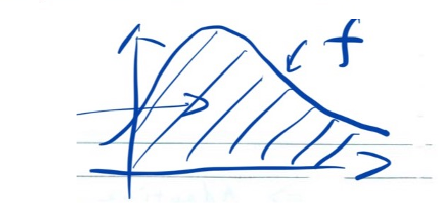{width=45%}

We **can't draw** $\theta \sim f(x)$ directly. Instead, we draw $\theta \sim g(\theta)$, where $g(\theta)$ is another unnormalized function, and we hope

$$
\frac{f(\theta)}{g(\theta)} \approx a \ \ (\text{constant}).
$$

**Requirement for $g(\theta)$:**

$$
\{\theta \mid g(\theta) > 0\} \supseteq \{\theta \mid f(\theta) > 0\}
$$

## Example of Supports of g and f

Comparing $(l_g, u_g)$ vs. $(l_f, u_f)$: if the support of $g$ does not cover the support of $f$, importance sampling is **not valid**; if it does, it is **valid**.

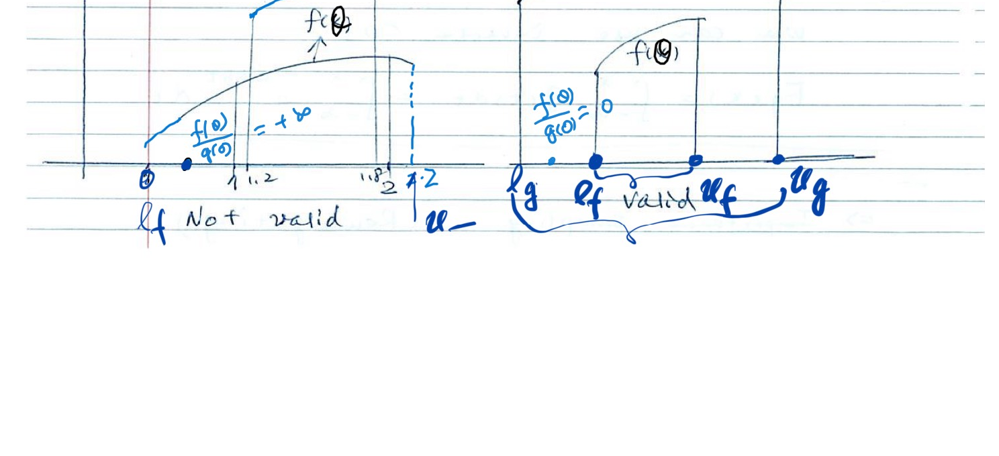{width=95%}

## Importance Reweighting Formula

1) Draw $\theta_1, \dots, \theta_n \sim g$

2)
$$
\frac{C_f}{C_g} = \sum_{i=1}^n \frac{f(\theta_i)}{g(\theta_i)} \Big/ n = \frac{\sum_{i=1}^n w(\theta_i)}{n}, \quad \text{where } w(\theta) = \frac{f(\theta)}{g(\theta)}
$$

$$
\hat{A} = \frac{\sum_{i=1}^n a(\theta_i) \dfrac{f(\theta_i)}{g(\theta_i)}}{\sum_{i=1}^n w(\theta_i)} = \frac{\left[\sum_{i=1}^n a(\theta_i) w(\theta_i)\right]/n}{\left[\sum_{i=1}^n w(\theta_i)\right]/n}, \qquad w(\theta_i) = \frac{f(\theta_i)}{g(\theta_i)}
$$

$$
\hat{A} = \sum_{i=1}^n a(\theta_i) \cdot \tilde{w}(\theta_i), \qquad \tilde{w}(\theta_i) = \frac{w(\theta_i)}{\sum_{i=1}^n w(\theta_i)}, \qquad \sum_{i=1}^n \tilde{w}(\theta_i) = 1
$$

**Example:**

| | $\theta_1$ | $\theta_2$ | $\theta_3$ |
|---|---|---|---|
| $w(\theta)$ | 100 | 40 | 60 |
| $\tilde{w}(\theta)$ | 0.5 | 0.2 | 0.3 |

## Derivation of Importance Reweighting Formula

$$
E_f(a(\theta)) = \int_{l_f}^{u_f} a(\theta) \frac{f(\theta)}{C_f}\, d\theta = \frac{1}{C_f} \int_{l_f}^{u_f} a(\theta) f(\theta)\, d\theta
$$

$$
= \frac{C_g}{C_f} \int_{l_f}^{u_f} \left(a(\theta) \frac{f(\theta)}{g(\theta)}\right) \cdot \frac{g(\theta)}{C_g}\, d\theta = \frac{C_g}{C_f} \int_{l_g}^{u_g} a(\theta) \cdot \frac{f(\theta)}{g(\theta)} \cdot \frac{g(\theta)}{C_g}\, d\theta
$$

requiring $\{\theta \mid g(\theta) > 0\} \supseteq \{\theta \mid f(\theta) > 0\}$

$$
= E_g\!\left(a(\theta) \cdot \frac{f(\theta)}{g(\theta)}\right) \Big/ \left(\frac{C_f}{C_g}\right) = E_g\!\left(a(\theta) \cdot \frac{f(\theta)}{g(\theta)}\right) \Big/ \frac{C_f}{C_g}
$$

$$
w(\theta) = \frac{f(\theta)}{g(\theta)} \text{ is called the importance weight.}
$$

$$
\frac{C_f}{C_g} = \int \frac{f(\theta)}{g(\theta)} \cdot \frac{g(\theta)}{C_g}\, d\theta = \frac{\int f(\theta)\, d\theta}{\int g(\theta)\, d\theta} = E_g\!\left(\frac{f(\theta)}{g(\theta)}\right)
$$

## Example 1: Non-overlapping Support (Invalid Case)

$$
f(\theta) = I(0 \le \theta \le 1), \qquad g(\theta) = I(0 \le \theta \le 2)
$$

![f(θ)=I(0≤θ≤1), g(θ)=I(0≤θ≤2), with C_f=1, C_g=2. w(θ)=1 on [0,1], w(θ)=0 on (1,2].](Lec 11 Importance Sampling_images/p05-boxplot.png){width=42%}

Support of $g \supseteq$ support of $f$. We want to estimate $\dfrac{C_f}{C_g}$ (true $= \tfrac{1}{2}$). Suppose $\theta_s \sim g\,[\text{unif}([0,2])]$.

$$
w(\theta_s) = \frac{f(\theta_s)}{g(\theta_s)} =
\begin{cases}
1 & \text{if } 0 \le \theta_s \le 1 \\
0 & \text{if } 1 < \theta_s \le 2
\end{cases}
$$

$$
\left(\widehat{\frac{C_f}{C_g}}\right) = \sum_{s=1}^S w(\theta_s) \Big/ S \approx \frac{1}{2}
$$

![Flat f and g densities on [0,2] with w(θ)=1 on [0,1] and w(θ)=0 on [1,2].](Lec 11 Importance Sampling_images/p05-sampleplot.png){width=40%}

$$
\hat{A} = \frac{\sum_s a(\theta_s) w(\theta_s)}{\sum_s w(\theta_s)} = \frac{\sum_{0 < \theta_s < 1} a(\theta_s)}{\sum_s I(0 < \theta_s < 1)} = \frac{1}{n_E} \sum_{0 < \theta_s < 1} a(\theta_s), \quad \text{where } n_E = \#(0 < \theta_s < 1) \approx \frac{1}{2} S
$$

## Example 2: Support of g ⊂ Support of f

$$
f(\theta) = I(0 \le \theta \le 2), \qquad g(\theta) = I(0 \le \theta \le 1)
$$

Support of $g \subset$ support of $f$ — **importance sampling here is not generally valid** since $g$ does not cover the support of $f$.

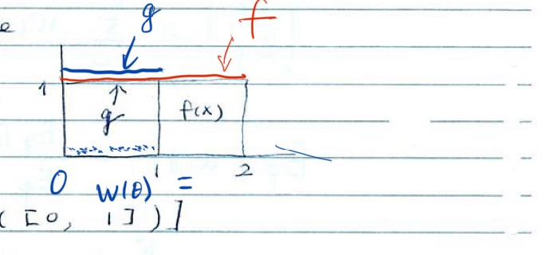{width=42%}

We want to estimate $\dfrac{C_f}{C_g}$ (true $\le 2$). Suppose $\theta_s \sim g\,[\text{unif}([0,1])]$.

$$
w(\theta_s) = \frac{f(\theta_s)}{g(\theta_s)} = 1
$$

$$
\left(\widehat{\frac{C_f}{C_g}}\right) = \frac{\sum_{s=1}^S w(\theta_s)}{S} = 1 \ne 2 \quad (\text{true value})
$$

## Example of Poor Importance Sampling

When $f$ and $g$ have little overlap, only a few samples from $g$ fall where $f$ has appreciable mass (circled region), giving highly variable, unreliable weights.

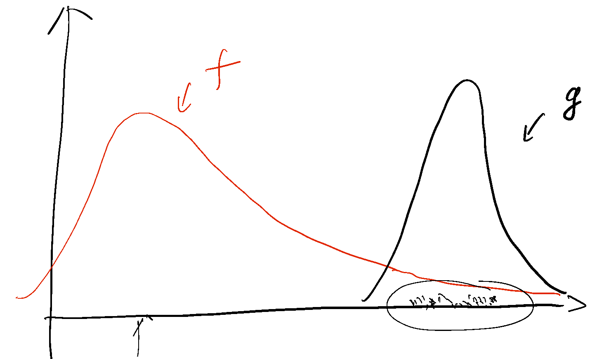{width=85%}

## Effective Sample Size

$$
S_{\text{eff}} = \frac{1}{\sum_{s=1}^S \tilde{w}(\theta_s)^2}, \qquad \text{where } \tilde{w}(\theta_s) = \frac{w(\theta_s)}{\sum_{s=1}^S w(\theta_s)}
$$

**(Not reliable)**

**A special case:** If $w(\theta_s) \approx c$ (constant), then $\tilde{w}(\theta_s) = \dfrac{c}{S \cdot c} = \dfrac{1}{S}$

then, $S_{\text{eff}} = \dfrac{1}{\sum_{s=1}^S (1/S)^2} = \dfrac{1}{1/S} = S$

$$
\text{Var}_f\!\left(\sum_{s=1}^S a(\theta_s)/S\right) = \frac{\text{Var}_f(a(\theta_s))}{S}
$$

$$
\text{Var}_g\!\left(\frac{\sum_{s=1}^S a(\theta_s) w(\theta_s)}{\sum_{s=1}^S w(\theta_s)}\right) \approx \frac{\text{Var}(a(\theta_s))}{S_{\text{eff}}}
$$

But $S_{\text{eff}}$ is **not reliable**.

## Example 3: Equal Supports

$$
f(\theta) = I(0 \le \theta \le 2), \qquad g(\theta) = I(0 \le \theta \le 1)
$$

All $\theta_s \sim \text{unif}([0,1])$. Here $w(\theta_s) = 1$, so $S_{\text{eff}} = S$.

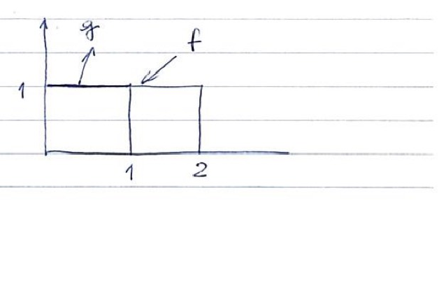{width=40%}

## Example 4: Estimating an Integral

Estimate the integral $\displaystyle\int_a^b \varphi(x)\, dx = I$, where $\varphi = \text{dnorm}(x)$, $X \sim N(0,1)$.

Let $f(x) = \varphi(x) \cdot I(a \le x \le b)$.

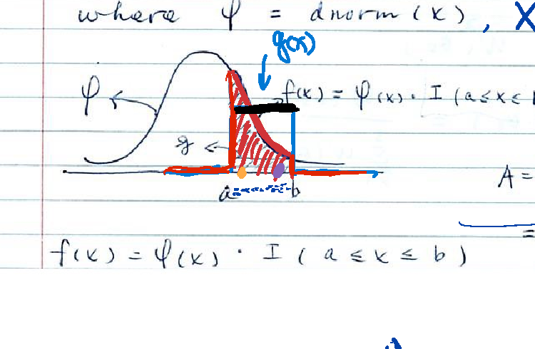{width=55%}

$$
A = \int_a^b a(x) \cdot \frac{\varphi(x)}{I}\, dx = E_f(a(x))
$$

$$
C_f = \int_{-\infty}^{b} f(x)\, dx = P(a < X < b)
$$

## Example 4 — Option 1: Uniform Proposal

**Option 1:** $g(x) = I(a \le x \le b)$, $C_g = b - a$

Suppose we have $X_s \sim g\,(\text{unif}([a,b]))$:

$$
w(X_s) = \frac{f(X_s)}{g(X_s)} = \varphi(X_s)
$$

$$
\left(\widehat{\frac{C_f}{C_g}}\right) = \frac{\sum_{s=1}^S w(X_s)}{S} = \frac{\sum_{s=1}^S \varphi(X_s)}{S}
$$

$$
\hat{A} = \frac{\sum_{s=1}^S a(X_s)\varphi(X_s)}{\sum_{s=1}^S \varphi(X_s)}
$$

We know $C_g = b - a$, so

$$
\hat{C}_f = \left(\widehat{\frac{C_f}{C_g}}\right)(b-a) = \frac{\sum_{s=1}^S \varphi(X_s)}{S}(b-a) = \sum_s \varphi(X_s) \cdot \frac{b-a}{S}
$$

![Density g (uniform on [a,b]) under f, with the hatched triangular region illustrating the randomised midpoint rule.](Lec 11 Importance Sampling_images/p11-midpoint.png){width=75%}

This is the **randomised midpoint rule**.

## Example 4 — Option 2: Using φ(x) as Proposal

**Option 2:** using $g(x) = \varphi(x)$ to approximate $f$.

![g = φ(x) (black curve) used as the proposal, matching f (red) closely between a and b; sample points shown as dots on the x-axis with w(θ)=0 outside [a,b] and w(θ)=1 inside.](Lec 11 Importance Sampling_images/p12-approxfx.png){width=60%}

Draw $\theta_1, \dots, \theta_n \sim g$, $C_g = 1$:

$$
\left(\widehat{\frac{C_f}{C_g}}\right) = \frac{\sum w(\theta_i)}{n} = \frac{\#(a < \theta_i < b)}{n}
$$

## More Choices of g(x)

Using tangent lines to $\log g(x)$ at the boundary to build proposal densities:

$$
g_1(x) = e^{l_1(x)}, \qquad g_2(x) = e^{l_2(x)}
$$

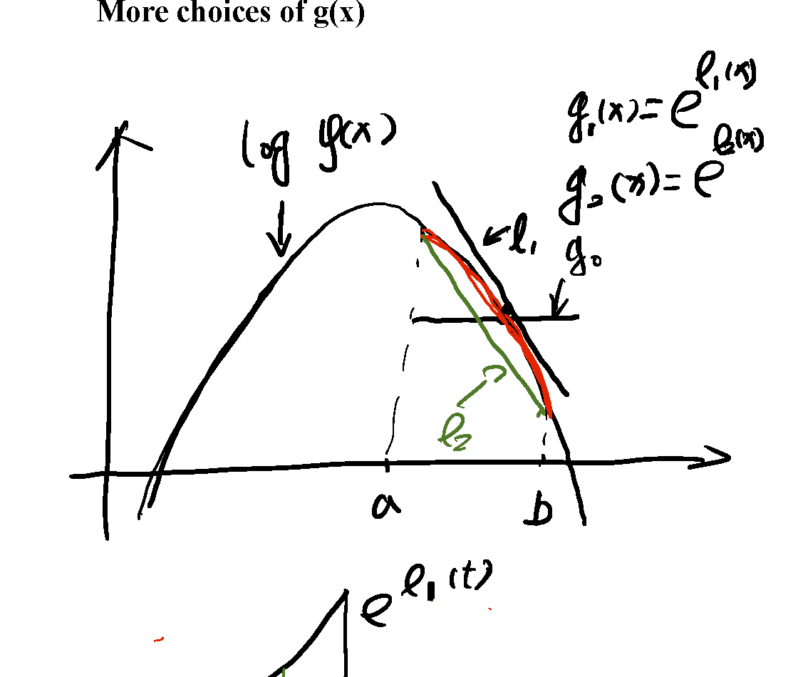{width=70%}

Inverting the CDF of $e^{l_1(t)}$ on $[a,b]$ to sample $x$:

$$
F(x) = \frac{\int_a^x e^{l_1(t)}\, dt}{\int_a^b e^{l_1(t)}\, dt}
$$

![Density e^{l1(t)} on [a,b] with shaded area up to x, and the CDF formula F(x) used for inverting the CDF to sample.](Lec 11 Importance Sampling_images/p13-invertcdf.png){width=55%}

## Example: Quadratic Approximation to log f(x)

Using a quadratic function (matching the curvature at $\theta_0$) to approximate $\log f(x)$, giving a Gaussian-shaped $\log g(x)$.

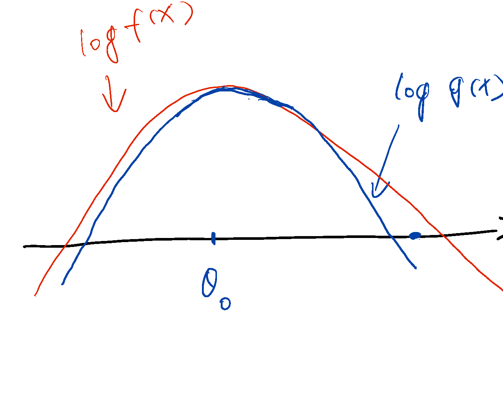{width=75%}

## Advanced Examples: Free Energy

Consider a family of unnormalized densities indexed by $\lambda$:

$$
f_\lambda(s) = e^{-E_\lambda(s)}
$$

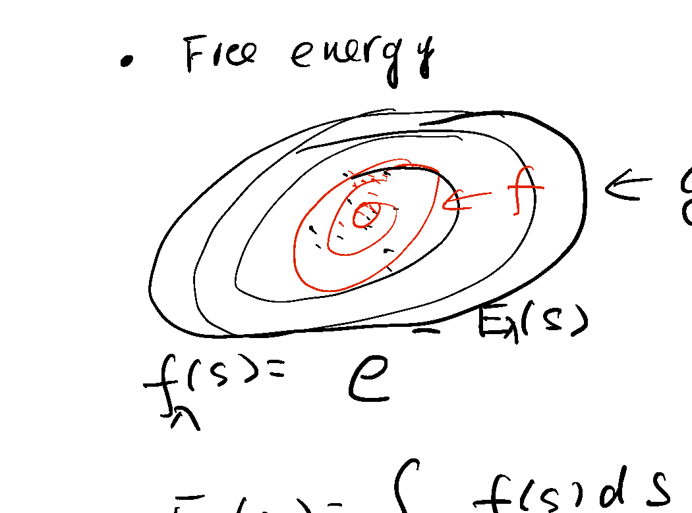{width=60%}

$$
F(\lambda) = \int f_\lambda(s)\, ds
$$

$$
f_0(s) = g(s) = e^{-E_0(s)}
$$

$$
\frac{F(\lambda)}{F(0)} = \sum_s \frac{f_\lambda(s)}{f_0(s)} \Big/ n, \qquad \text{with } s \sim f_0(s) = g(s)
$$

## Advanced Examples: Chaining Free Energy Ratios

Chain a sequence of intermediate distributions $f_0, f_1, f_2, \dots, f_{100}$ from the proposal to the target, and estimate the ratio of normalizing constants as a product of successive ratios:

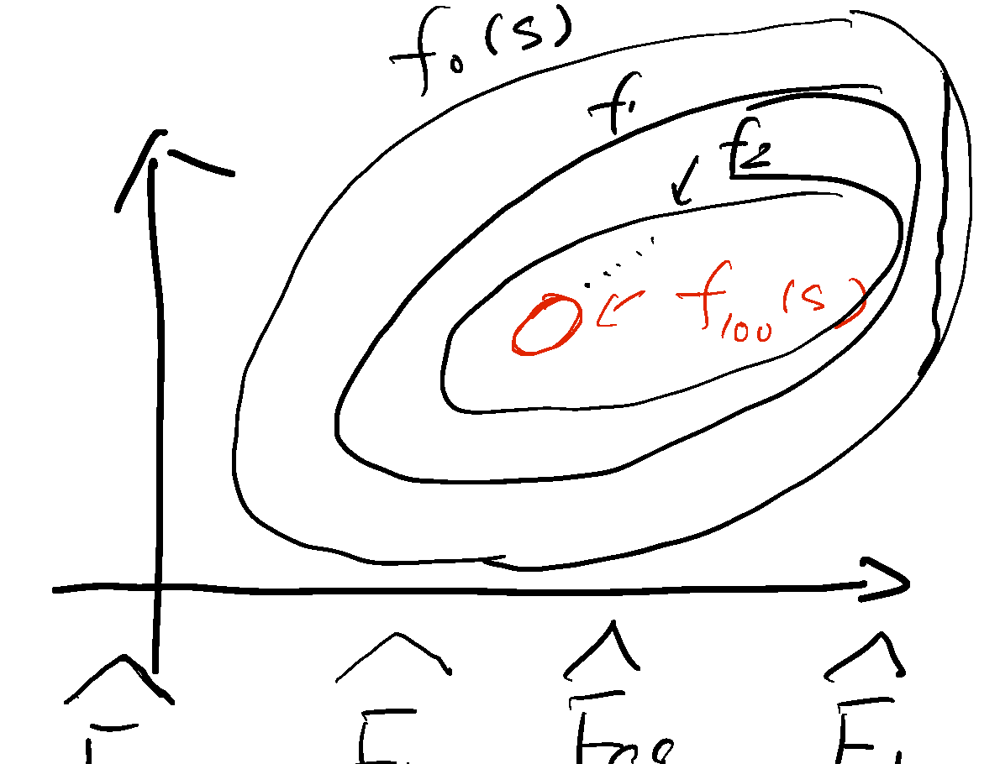{width=70%}

$$
\frac{\widehat{F}_{100}}{\widehat{F}_0} = \frac{\widehat{F}_{100}}{\widehat{F}_{99}} \cdot \frac{\widehat{F}_{99}}{\widehat{F}_{98}} \cdots \frac{\widehat{F}_1}{\widehat{F}_0}
$$

## A Toy Example: Estimating the Area of the Red Region

A nested sequence of regions $f_1 \supset f_2 \supset \dots \supset f_{99} \supset f_{100}$, where $f_{100}$ (red) is the small target region whose area we want, bridged via the chain of intermediate regions.

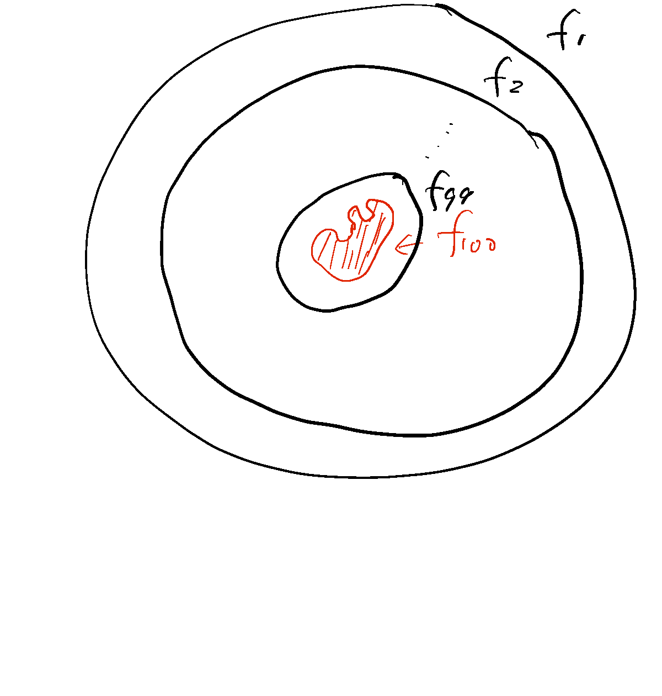{width=55%}

## Approximating Cross-Validation

Data $y_1, \dots, y_i, \dots, y_n$.

**Full data posterior:**

$$
f(\theta \mid y_1, \dots, y_n) \propto g(\theta) = \prod_{i=1}^n p(y_i \mid \theta) \cdot \pi(\theta)
$$

**Leave-one-out posterior:**

$$
f_{-i}(\theta \mid y_1, \dots, y_{i-1}, y_{i+1}, \dots, y_n) \propto f(\theta) = \prod_{j \ne i} p(y_j \mid \theta) \cdot \pi(\theta)
$$

**Importance weight:**

$$
w(\theta) = \frac{f(\theta)}{g(\theta)} = \frac{1}{p(y_i \mid \theta)}
$$
