## Definition and Notation

**Goal:** Draw $\theta_1, \theta_2, \dots, \theta_n \sim f$.

**Theory of Markov Chains:** $\theta_1, \theta_2, \theta_3, \dots$ — $\{\theta_i\}$ is a random process.

**Definition:** $\{\theta_i \mid i = 1, 2, \dots\}$ is called a **Markov chain** if

$$
P(\theta_i \mid \theta_1, \theta_2, \dots, \theta_{i-1}) = P(\theta_i \mid \theta_{i-1})
$$

We denote $P(\theta_i \mid \theta_{i-1})$ by $T(\theta_i \mid \theta_{i-1})$ and call it the **transition distribution**:

$$
\theta_0 \xrightarrow{T(\theta_1 \mid \theta_0)} \theta_1 \xrightarrow{T(\theta_2 \mid \theta_1)} \theta_2
$$

## Example: A Simple Markov Chain

**Example 1:** state space $= \{0, 1, 2\}$, with $T(1\mid 0) = \tfrac{1}{2}$, $T(2 \mid 0) = \tfrac{1}{2}$, $T(2 \mid 1) = \tfrac{1}{2}$ (and similarly cycling among states):

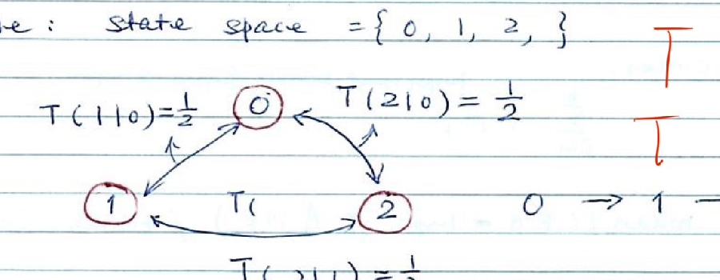{width=55%}

**Example 2:** a cyclic chain over states $0, 1, 2, \dots, n-1$ with transition probabilities $0.1$ (stay), $0.45$ (move clockwise), $0.45$ (move counter-clockwise):

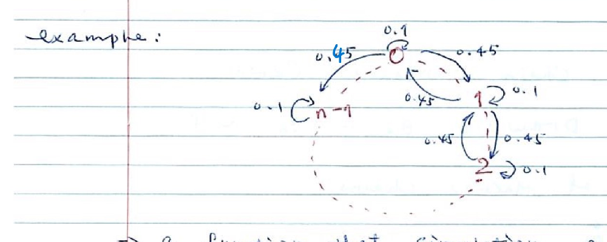{width=55%}

A Markov chain is simulated by a function/algorithm that draws each successive state from the transition distribution.

## Convergence and Invariance

**Convergence of Markov chain:** under some regularity conditions, for $\forall \theta_0$, we have

$$
\lim_{n \to \infty} P(\theta_n = \theta \mid \theta_0 = \theta_0) = \pi(\theta)
$$

The $\pi(\theta)$ is called the **equilibrium distribution** of the Markov chain.

**Invariance condition:** $\pi(\theta)$ is a distribution; $T(\cdot, \cdot)$ is a Markov chain transition. We say "$T(\cdot,\cdot)$ leaves $\pi(\theta)$ invariant" if

$$
\int \pi(\theta) T(\theta, \theta^T)\, d\theta = \pi(\theta^T)
$$

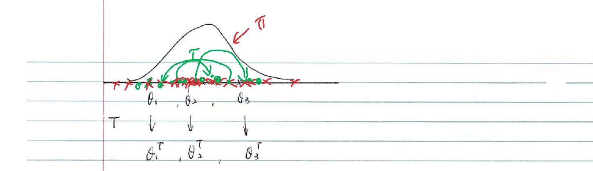{width=70%}

If $\theta \sim \pi$, $\theta^T \sim T(\theta, \cdot)$, then $\theta^T \sim \pi$.

## Theorem: Invariance from Equilibrium

**Theorem:** If a Markov chain has an equilibrium distribution $\pi$, then

$$
\int \pi(\theta) T(\theta, \theta^T)\, d\theta = \pi(\theta^T)
$$

## Designing a Markov Chain for MCMC

Given a target distribution $\pi$, we design a Markov chain $T(\cdot, \cdot)$ such that:

1) **Invariance condition**
2) $T(\cdot, \cdot)$ is **aperiodic**
3) $T(\cdot, \cdot)$ is **irreducible**

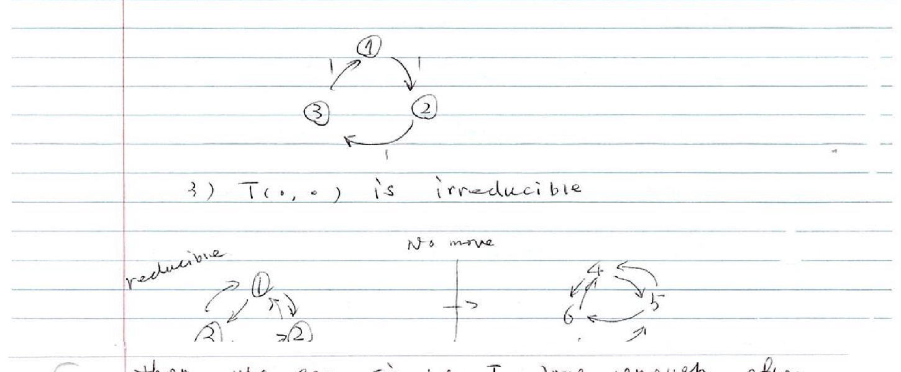{width=80%}

Then, we can simulate $T$ long enough; after we discard the initial value (burn-in), we can view the remaining steps as having distribution $\pi$.

## Detailed Balance (Reversibility) Condition

$$
\pi(\theta) T(\theta, \theta^T) = \pi(\theta^T) T(\theta^T, \theta) \quad \text{for all } \theta, \theta^T
$$

also called "**reversible**".

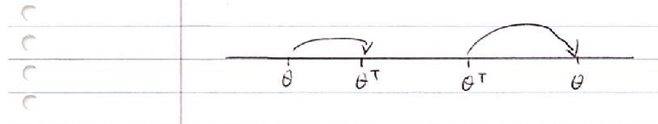{width=45%}

**Note:** $T(\theta, \theta^T) = T(\theta^T, \theta)$ (in general these need not be equal; detailed balance relates them through $\pi$).

**Theorem:** Detailed balance condition $\Rightarrow$ invariance condition.

**Proof:**
$$
\int \pi(\theta) T(\theta, \theta^T)\, d\theta \overset{?}{=} \pi(\theta^T)
$$
$$
= \pi(\theta^T) \int T(\theta^T, \theta)\, d\theta \quad \left\{\text{where } \int T(\theta^T,\theta)\,d\theta = 1\right\}
$$
$$
= \pi(\theta^T)
$$

## Gibbs Sampler

We want to draw $(\theta_1, \theta_2) \sim \pi(\theta_1, \theta_2)$.

**Gibbs sampler:** starting from $(\theta_1^{(0)}, \theta_2^{(0)})$. Repeat $n$ times:

1) Draw $\theta_1^{(t)} \sim \pi(\theta_1 \mid \theta_2^{(t-1)})$
2) Draw $\theta_2^{(t)} \sim \pi(\theta_2 \mid \theta_1^{(t-1)})$

**A toy example:** $(\theta_1, \theta_2) \sim \text{unif}(A)$, $f(\theta_1, \theta_2) = I((\theta_1,\theta_2) \in A)$.

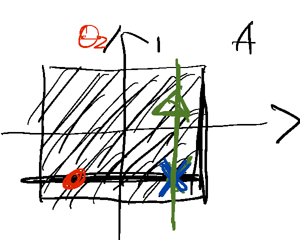{width=45%}

$$
f(\theta_2) = I(-1 < \theta_2 < 1)
$$

$$
f(\theta_1 \mid \theta_2) = \frac{f(\theta_1, \theta_2)}{\int f(\theta_1, \theta_2)\, d\theta_1} = 1, \quad \text{for } -1 < \theta_1 < 1
$$

![Region A = [-1,1]×[-1,1], with a horizontal red band showing the conditional slice at a fixed θ2.](Lec 11 MCMC_images/p07-toyregionA-cond.png){width=40%}

## Justification of Gibbs Sampling

$(\theta_1, \theta_2) \sim \pi(\theta_1, \theta_2)$. Repeat $n$ times:

1) $\theta_1^{(t)} \sim \pi(\theta_1 \mid \theta_2^{(t-1)})$
2) $\theta_2^{(t)} \sim \pi(\theta_2 \mid \theta_1^{(t-1)})$

$$
T\big((\theta_1, \theta_2) \to (\theta_1^T, \theta_2^T)\big) = I(\theta_1 = \theta_1^T)\, \pi(\theta_2^T \mid \theta_1)
$$

**The left hand side of the Detailed Balance Equation:**

$$
= \pi(\theta_1, \theta_2)\, \pi(\theta_2^T \mid \theta_2)\, I(\theta_1 = \theta_1^T)
$$

$$
= \pi(\theta_1)\, \pi(\theta_2 \mid \theta_1)\, \pi(\theta_2^T \mid \theta_1)\, I(\theta_1 = \theta_1^T)
$$

**The right hand side of the Detailed Balance Equation:**

$$
= \pi(\theta_1^T, \theta_2^T)\, \pi(\theta_2 \mid \theta_1^T)\, I(\theta_1 = \theta_1^T) \quad \text{(fixed)}
$$

$$
= \pi(\theta_1^T)\, \pi(\theta_2^T \mid \theta_1^T)\, \pi(\theta_2 \mid \theta_1^T)
$$

We can see that $\text{L.H.S.} = \text{R.H.S.}$

## Example: Posterior of a Normal Sample

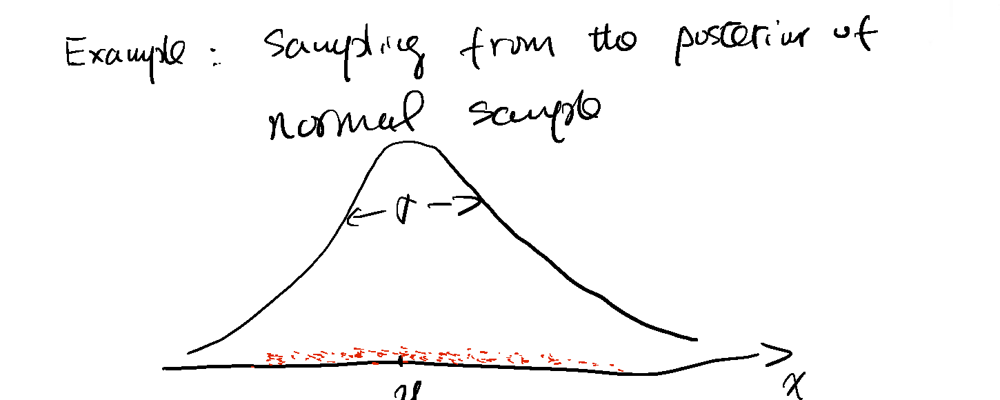{width=70%}

$$
X_1, X_2, \dots, X_n \mid (\mu, \sigma^2) \overset{iid}{\sim} N(\mu, \sigma^2)
$$

$$
\mu \sim N(\mu_0, \sigma_0^2)
$$

$$
\sigma^2 \sim IG(\text{inverse gamma})\left(\frac{\alpha}{2}, \frac{\alpha\omega}{2}\right), \qquad \left(\text{let } a_0 = \frac{\alpha}{2}, \ \lambda_0 = \frac{\alpha\omega}{2}\right)
$$

$$
\left[\frac{1}{\sigma^2} \sim G(a_0 = \alpha/2,\ \lambda_0 = \alpha\omega/2)\right]
$$

$$
P(\sigma^2) \propto \frac{1}{(\sigma^2)^{a_0 - 1}} \cdot e^{-\lambda_0/\sigma_0^2 \cdot [1/(\sigma^2)^2]} = \frac{1}{(\sigma^2)^{a_0+1}} \cdot e^{-\lambda_0/\sigma^2}
$$

where $a_0 \to$ shape parameter, $\lambda_0 \to$ scale parameter.

$$
P(\mu) \propto e^{-(\mu-\mu_0)^2/2\sigma_0^2}, \qquad IG: f(x) \propto \frac{1}{x^{a+1}} e^{-\lambda/x}
$$

## Likelihood and Joint Posterior

**Likelihood:**

$$
L(\mu, \sigma^2; \underline{X}) = \prod_{i=1}^n \frac{1}{\sqrt{2\pi}\sigma} \cdot e^{-(X_i-\mu)^2/2\sigma^2}
$$

$$
\Rightarrow L(\mu, \sigma^2; \underline{X}) \propto (\sigma^2)^{-n/2} e^{-\sum_{i=1}^n \left(\frac{(X_i-\mu)^2}{2\sigma^2}\right)}
$$

$$
\Rightarrow P(\mu, \sigma^2 \mid \underline{X}) \propto P(\mu) \cdot P(\sigma^2)\, L(\mu, \sigma^2; \underline{X})
$$

$$
\propto e^{-\frac{(\mu-\mu_0)^2}{2\sigma_0^2}} \cdot (\sigma^2)^{-(a_0+1)} e^{-\lambda_0/\sigma^2} \times (\sigma^2)^{-n/2} e^{-\sum_{i=1}^n (X_i-\mu)^2/2\sigma^2}
$$

## Derivation of Conditional Distributions for Gibbs Sampling

To apply Gibbs sampling, we need to find the conditional distributions of $\mu$ and $\sigma^2$. Those are:

$$
P(\mu \mid \sigma^2, \underline{X}) \qquad \text{and} \qquad P(\sigma^2 \mid \mu, \underline{X})
$$

**Note that:** $f(x,y) = f(x \mid y) \cdot f_y(y) \ \Rightarrow \ f(x \mid y) = f(x,y) \Big/ \int f(x,y)\, dx$

## Conditional Posterior of μ

$$
\sum_{i=1}^n (\mu - x_i)^2 = \sum_{i=1}^n (\mu - \bar{x} + \bar{x} - x_i)^2 = \sum_{i=1}^n (\mu-\bar x)^2 + \sum_{i=1}^n(\bar x - x_i)^2
$$

$$
P(\mu \mid \sigma^2, \underline{X}) \propto e^{-(\mu-\mu_0)^2/2\sigma_0^2} \cdot e^{-\sum_{i=1}^n (X_i-\mu)^2/2\sigma^2}
$$

$$
\propto e^{-\frac{\mu^2 - 2\mu\mu_0}{2\sigma_0^2}} \cdot e^{-\frac{n\mu^2 - 2n\mu\bar X}{2\sigma^2}} = e^{-\frac{1}{2}\left[\left(\frac{1}{\sigma_0^2}+\frac{n}{\sigma^2}\right)\mu^2 - 2\left(\frac{\mu_0}{\sigma_0^2}+\frac{n\bar X}{\sigma^2}\right)\mu\right]}
$$

(where $\bar X = \sum X_i / n$)

$$
f(x \mid \mu, \sigma^2) = \frac{1}{\sqrt{2\pi}\sigma} e^{-\frac{(x-\mu)^2}{2\sigma^2}} = \frac{1}{\sqrt{2\pi}\sigma} e^{-\frac{1}{2}\left(\frac{x^2}{\sigma^2} - 2\frac{\mu}{\sigma^2}x + \frac{\mu^2}{\sigma^2}\right)}
$$

**Note that:** $(\mu \mid \sigma^2, \underline X)$ is a Normal distribution, and

$$
\frac{1}{\sigma_0^2} + \frac{n}{\sigma^2} = \frac{1}{\sigma^2_{\mu \mid \sigma^2, X}} \qquad \text{and} \qquad \frac{\mu_{\mu\mid\sigma^2,X}}{\sigma^2_{\mu\mid\sigma^2,X}} = \frac{\mu_0}{\sigma_0^2} + \frac{n\bar X}{\sigma^2} \ \left(\approx \frac{\sigma^2}{n}\right)
$$

$$
E(\mu_{\mu\mid\sigma^2,X}) = \frac{\dfrac{\mu_0}{\sigma_0^2} + \dfrac{n\bar X}{\sigma^2}}{\dfrac{1}{\sigma_0^2} + \dfrac{n}{\sigma^2}} \quad (n \to \infty,\ \approx \bar X)
$$

$\frac{n}{\sigma^2}$ is called the **weight for data**.

$$
\text{Var}(\mu \mid \sigma^2, X) = \sigma^2_{\mu \mid \sigma^2, X} = \left(\frac{1}{\sigma_0^2} + \frac{n}{\sigma^2}\right)^{-1} \left(\approx \frac{\sigma^2}{n}\right)
$$

## Conditional Posterior of σ²

$$
P(\sigma^2 \mid \mu, \underline{X}) \propto (\sigma^2)^{-(n/2 + a_0 + 1)} \cdot e^{-\frac{\lambda_0 + \sum(X_i-\mu)^2/2}{\sigma^2}}
$$

$$
\sigma^2 \mid \mu, \underline{X} \sim IG\left(\frac{n}{2} + a_0,\ \frac{\sum(X_i-\mu)^2}{2} + \lambda_0\right) = IG\left(\frac{n+\alpha}{2},\ \frac{\alpha\omega + \sum(X_i-\mu)^2}{2}\right)
$$

$$
a_0 = \frac{\alpha}{2}, \qquad \lambda_0 = \frac{\alpha\omega}{2}
$$

## Gibbs Sampling for Latent Variable Models

**"About Assignment 2"**

Example: $(X = (X_1, \dots, X_n) \mid \mu, \sigma^2) \sim N(\mu, \sigma^2)$

$$
y_i = \text{floor}(x_i)
$$

$$
\mu \sim N(\mu_0, \sigma_0^2), \qquad \sigma^2 \sim IG\left(\frac{\alpha}{2}, \frac{\alpha\omega}{2}\right)
$$

$$
P(y, x, \mu, \sigma^2) \quad (i = 1, 2, \dots, n) = \pi(\mu) \cdot \pi(\sigma^2) \prod_{i=1}^n P(x_i \mid \mu, \sigma^2) \prod_{i=1}^n \left\{I(y_i = \text{floor}(x_i))\right\}
$$

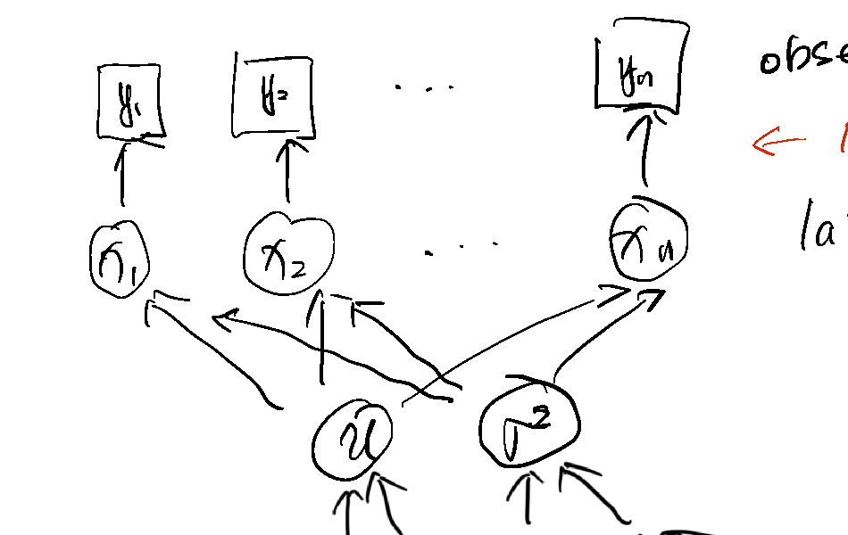{width=65%}

($y_i$ observed; $x_i$ has no parameters — latent.)

## Gibbs Sampling with a Latent Variable: Full Steps

**Gibbs sampling:** Repeat:

1) $x_i^{(t)} \sim x_i \mid \mu^{(t-1)}, (\sigma^2)^{(t-1)}, y_i$
2) $\mu^{(t)} \sim \mu \mid x_i^{(t)}, (\sigma^2)^{(t-1)}, y_i$
3) $(\sigma^2)^{(t)} \sim \sigma^2 \mid x_i^{(t)}, \mu^{(t)}, y_i$

**To find (1):**

$$
f(x_i \mid \mu, \sigma^2, y_i) = \frac{P(x_i \mid \mu, \sigma^2) \cdot I(y_i = \text{floor}(x_i))}{\int P(x_i \mid \mu, \sigma^2)\, I(y_i = \text{floor}(x_i))\, dx_i} = \frac{P(x_i \mid \mu, \sigma^2)}{\int_{y_i}^{y_i+1} P(x_i \mid \mu, \sigma^2)\, dx_i}
$$

Note that when $x_i \in (y_i, y_i+1)$, $I(y_i = \text{floor}(x_i)) = 1$.

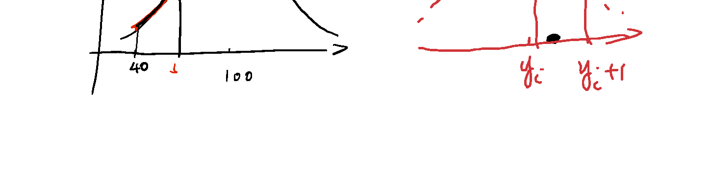{width=80%}

## Metropolis-Hastings Algorithm

Starting with $\theta^{(0)}$. Repeat $n$ times:

1) Draw $\tilde\theta^{(t)} \sim T(\theta \mid \theta^{(t)})$
2) Compute
$$
r = \min\left\{\frac{\pi(\tilde\theta^{(t)})\, T(\theta^{(t-1)} \mid \tilde\theta^{(t)})}{\pi(\theta^{(t-1)})\, T(\tilde\theta^{(t)} \mid \theta^{(t-1)})}, 1\right\}
$$
3) Draw $v \sim \text{unif}([0,1])$; if $v < r$ then $\theta^{(t)} = \tilde\theta^{(t)}$, else $\theta^{(t)} = \theta^{(t-1)}$

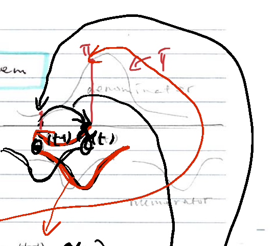{width=45%}

## Metropolis-Hastings: Algorithm and Proposal Choice

Metropolis-Hastings: starting with $\theta^{(0)}$. Repeat $n$ times:

1) draw $\theta^* \sim T(\theta \mid \theta^{(t-1)})$
2) compute accept rate
$$
r = \min\left\{\frac{\pi(\theta^*)\, T(\theta^{(t-1)} \mid \theta^*)}{\pi(\theta^{(t-1)})\, T(\theta^* \mid \theta^{(t-1)})}, 1\right\}
$$
3) draw $U \sim \text{unif}([0,1])$; if $(U < r)$ let $\theta^{(t)} = \theta^*$, else let $\theta^{(t)} = \theta^{(t-1)}$

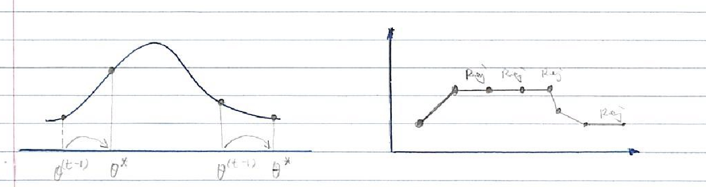{width=80%}

**Symmetric:** $T(\theta \mid \theta^{(t-1)}) = N(\theta^{(t-1)}, \sigma^2)$.

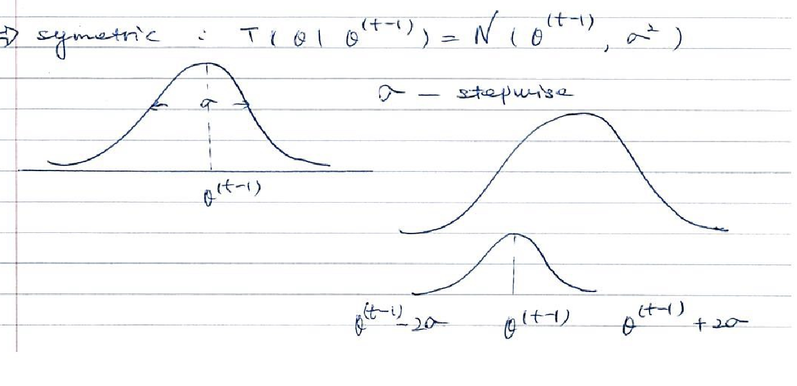{width=85%}

$\sigma$ — stepwise (tuned).

## Example: Truncated Normal Target

$$
\pi(\theta) \propto \varphi(\theta)\, I(l \le \theta \le \mu)
$$

**Rejection weight:**

$$
R = \min\left(\frac{\pi(\theta^*)}{\pi(\theta^{(t-1)})}, 1\right)
$$

![Density curve decreasing from l to μ (truncated normal shape); outside [l, μ] the proposal is always rejected.](Lec 11 MCMC_images/p19-truncnormal.png){width=45%}

Outside $[l,\mu]$, we should reject it.

## Choice of Step Size

1) Optimal accept rate $= 0.234$

2) Optimal rejection rate $= 1 - \text{accept rate} \approx 0.75$

**Note that:** rejection rate too low can cause many problems.

$$
\text{Var}(\bar X) = \frac{\sigma^2}{T}(1 + \rho_1 + \rho_2 + \cdots)
$$

## Diagnostics of Convergence

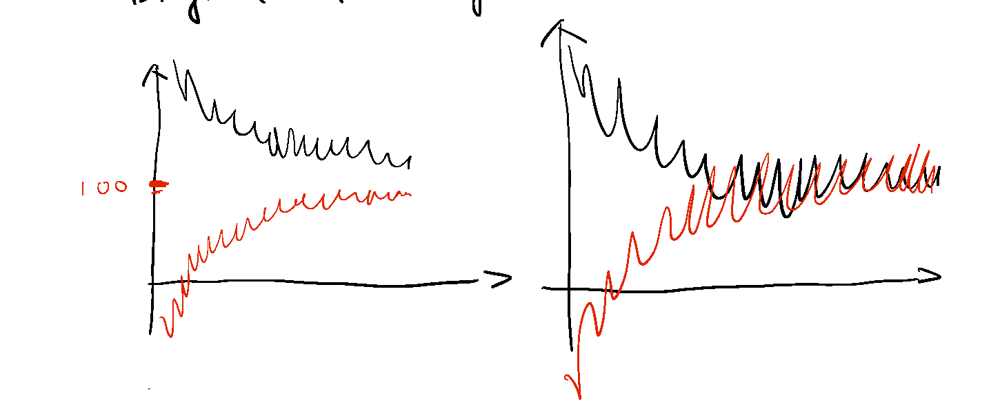{width=85%}

Chain 1: $\theta_1^{(1)}, \dots, \theta_n^{(1)} \to S^2_{(1)}$

Chain 2: $\theta_1^{(2)}, \dots, \theta_n^{(2)} \to S^2_{(2)}$

$\vdots$

Chain $m$: $\theta_1^{(m)}, \dots, \theta_n^{(m)} \to S^2_{(m)}$

$$
\hat R = \frac{S_T^2}{S_W^2}, \quad \text{where } S_W^2 = \sum_{j=1}^m S^2_{(j)} \Big/ m, \qquad S_T^2 = \sum_i \sum_j (\theta_i^{(j)} - \bar\theta_{..})^2 / (nm-1)
$$

$$
\hat R = \begin{cases} < 1.05 & \text{good} \\ \in (1.05, 1.1) & \text{fair} \\ > 1.1 & \text{bad} \end{cases}
$$

## Example: Posterior of Normal Sample via Metropolis-Hastings

**Example: Posterior of Normal Sample**

**Metropolis-Hastings:**

$$
X_1, X_2, \dots, X_n \sim N(\mu, \sigma^2), \qquad \mu \sim N(\mu_0, \sigma_0^2), \qquad \sigma^2 \sim IG\left(\frac{\alpha}{2}, \frac{\alpha\omega}{2}\right)
$$

$$
P(\mu, \sigma^2) \propto P(X_1, X_2, \dots, X_n \mid \mu, \sigma^2) \cdot P(\mu) \cdot P(\sigma^2) \cdot \sigma^2
$$

(Let $\log\sigma^2 = y$)

$$
\propto P(X_1, \dots, X_n \mid \mu, \sigma^2)\, P(\mu)\, P(\sigma^2) \cdot e^{\log\sigma^2}
$$

where $w = \log\sigma^2$, $\sigma^2 = e^w$.

To sample on the unconstrained scale, use the change of variables:

$$
X \sim f_X(x), \qquad Y \sim t(x) \Rightarrow X = t^{-1}(Y)
$$

$$
f_Y(y) = f_X(t^{-1}(y)) \left|\frac{\partial t^{-1}(y)}{\partial y}\right|
$$

$$
y = \log\sigma^2, \qquad \sigma^2 = e^y
$$

## Justification of Metropolis-Hastings

**Review:** $\pi(\theta)\, T(\theta \to \theta^T) = \pi(\theta^T)\, T(\theta^T \to \theta)$

**Metropolis-Hastings Algorithm:** From $\theta$:

1) Draw $\theta^* \sim \tilde T(\cdot \mid \theta^{(t)})$
2) Set $\theta^{(t)} = \theta^*$ with
$$
r = \min\left\{\frac{\pi(\theta^*)\, \tilde T(\theta^* \to \theta)}{\pi(\theta)\, \tilde T(\theta \to \theta^*)}, 1\right\}
$$
Or, set $\theta^T = \theta$.

The $T(\theta \to \theta^T)$ in Metropolis-Hastings:

* If $\theta = \theta^T$, we do not have expression $T(\theta \to \theta^T)$.
* If $\theta \ne \theta^T$, $T(\theta \to \theta^T) = \tilde T(\theta \to \theta^T) \times \min\left\{\dfrac{\pi(\theta^T)\, \tilde T(\theta^T \to \theta)}{\pi(\theta)\, \tilde T(\theta \to \theta^T)}, 1\right\}$

$$
\text{LHS} = \pi(\theta)\, T(\theta \to \theta^T) = \pi(\theta) \cdot \tilde T(\theta \to \theta^T) \cdot \min\left\{\frac{\pi(\theta^T)\, \tilde T(\theta^T \to \theta)}{\pi(\theta)\, \tilde T(\theta \to \theta^T)}, 1\right\}
$$

$$
= \min\big(\pi(\theta^T) \cdot \tilde T(\theta^T \to \theta),\ \pi(\theta)\, \tilde T(\theta \to \theta^T)\big)
$$

$$
\text{RHS} = \min\big(\pi(\theta)\, \tilde T(\theta \to \theta^T),\ \pi(\theta^T)\, \tilde T(\theta^T \to \theta)\big)
$$

## Metropolis-within-Gibbs

$\theta = (\theta_1, \theta_2)$. Starting $(\theta_1^{(0)}, \theta_2^{(0)})$. Repeat:

1) Draw $\theta_1^{(t)} \sim \pi(\theta_1 \mid \theta_2^{(t-1)})$
2) Draw $\theta_2^{(t)} \sim \pi(\theta_2 \mid \theta_1^{(t-1)})$

In any step, say for $\theta_i$, in Gibbs we could replace the direct sampling by a Metropolis-Hastings transition $T_i$ ($\theta_i \to \theta_i^T$) that leaves $\pi(\theta_i \mid \theta_{-i}^{(t-1)})$ invariant.

In other words, we apply M-H to the target distribution $\pi(\theta_i \mid \theta_{-i})$.

## WinBUGS and JAGS

**WinBUGS.** BUGS means **B**ayesian **I**nference **U**sing **G**ibbs **S**ampling.

**JAGS:** it is just another Gibbs sampler.

Download JAGS. `install.packages("R2jags")`, `library("R2jags")`

Example:
$$
X_1, \dots, X_n \overset{iid}{\sim} N(\mu, \sigma^2), \qquad \mu \sim N(\mu_0, \sigma_0^2), \qquad \sigma^2 \sim IG\left(\frac{\alpha}{2}, \frac{\alpha\omega}{2}\right)
$$

Go to file page $\to$ menu.

**Note that:** in JAGS,
$$
X_1, \dots, X_n \overset{iid}{\sim} N(\mu, \tau), \qquad \mu \sim N(\mu_0, \sigma_0^2), \qquad \tau \sim \text{Gamma}\left(\frac{\alpha}{2}, \frac{\alpha\omega}{2}\right)
$$
where $\tau = 1/\sigma^2$; $\tau$ doesn't mean variance, only means **precision**.

## JAGS Example: Normal Model DAG

$$
P(\mu, \sigma^2 \mid x_1, \dots, x_n) \propto \prod_{i=1}^n \varphi(x_i \mid \mu, \sigma^2) \cdot \pi(\mu)\, \pi(\sigma^2)
$$

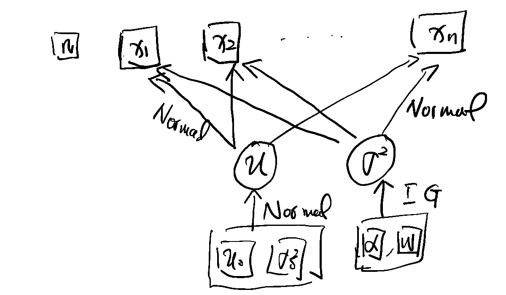{width=70%}

## Example: Logistic Regression

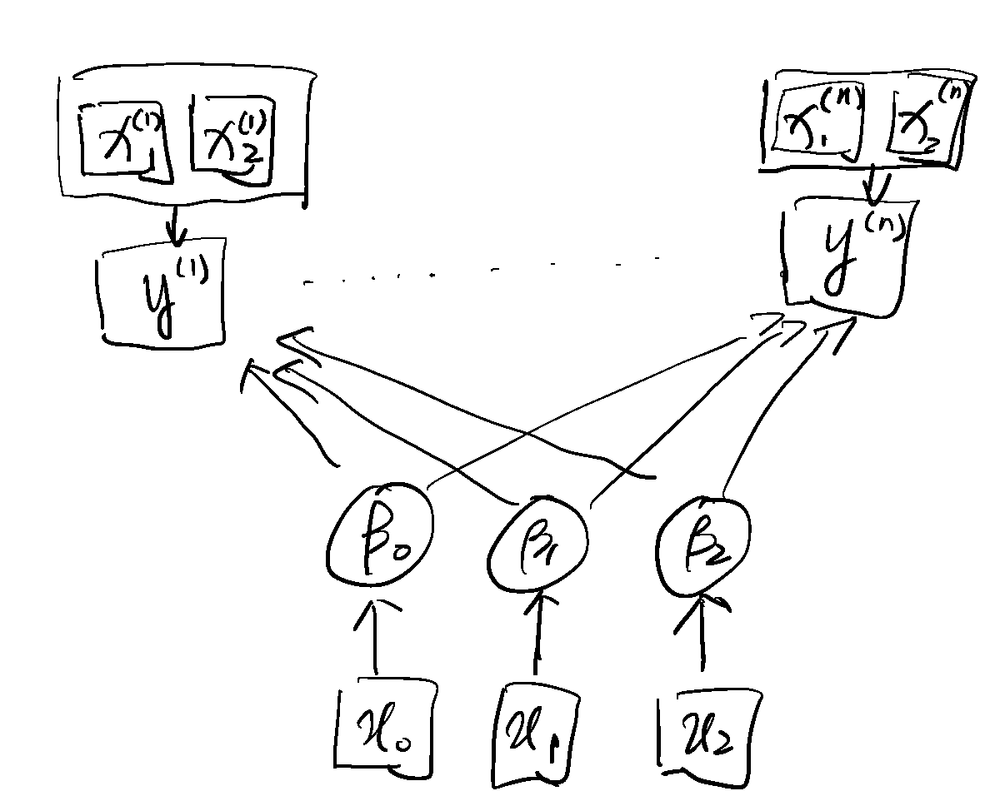{width=70%}

$$
p^{(i)} = \frac{1}{1 + e^{-\left[\beta_0 + \beta_1 x_1^{(i)} + \beta_2 x_2^{(i)}\right]}}
$$

$$
\log\left(\frac{p^{(i)}}{1-p^{(i)}}\right) = \beta_0 + \beta_1 x_1^{(i)} + \beta_2 x_2^{(i)}
$$
