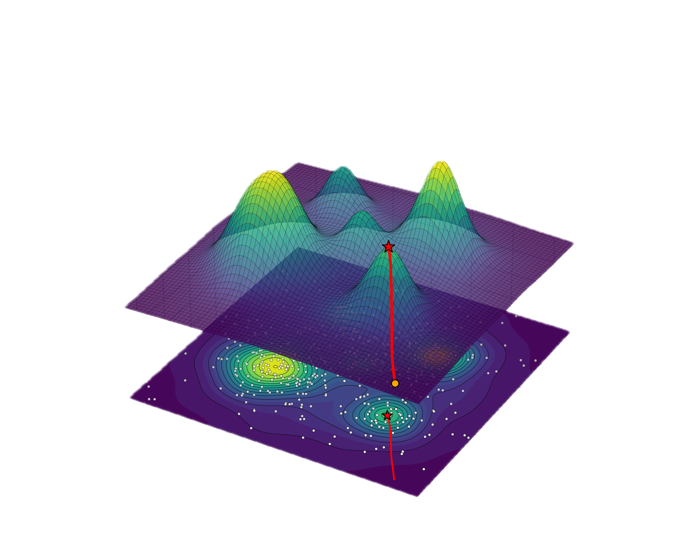
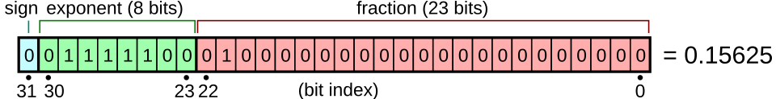
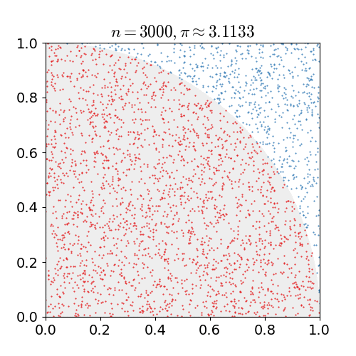
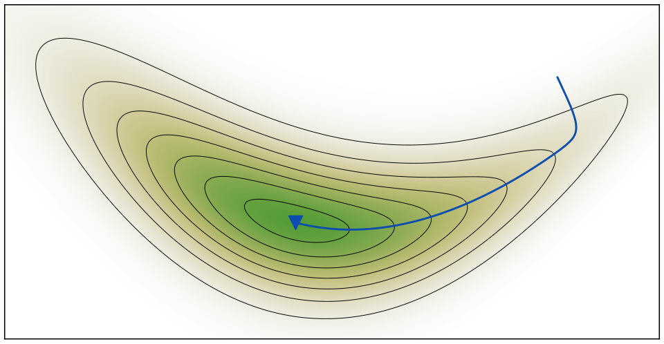
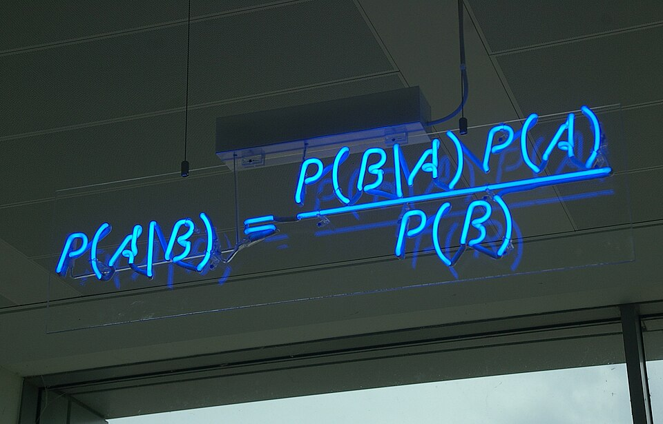
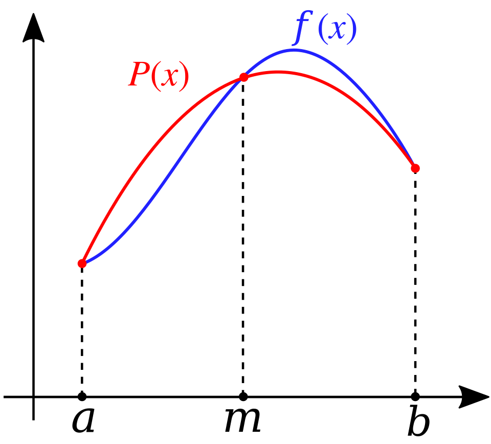
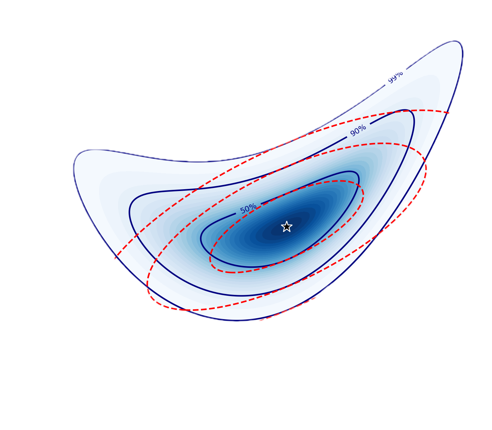
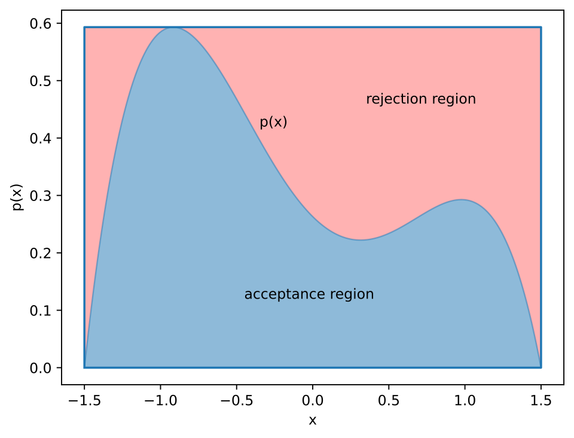
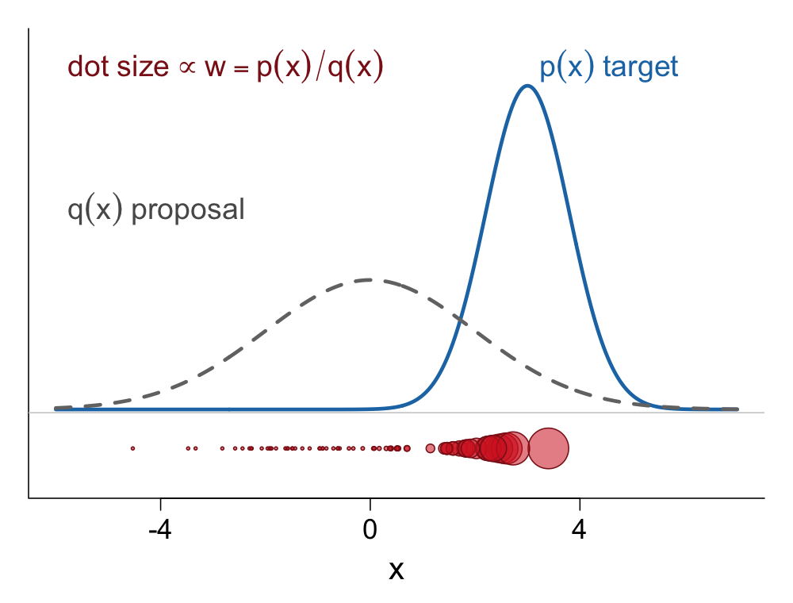
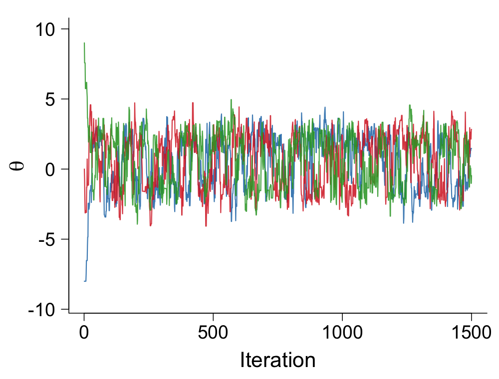

### Table of Content

<table class="toc">
<tr>
<td><a href="Lec_01_intro-course.html">1. Introduction</a></td>
<td><a href="Lec_03_arithmetics.html">2. Computer Arithmetic</a></td>
<td><a href="Lec_04_Monte_Carlo.html">3. Monte Carlo</a></td>
</tr>
<tr>
<td><a href="Lec_05_MLE.html">4. Maximum Likelihood</a></td>
<td><a href="Lec_06_EM.html">5. EM Algorithm</a></td>
<td><a href="Lec_07_bayesian_inference.html">6. Bayesian Inference</a></td>
</tr>
<tr>
<td><a href="Lec_08_numerical_quadrature.html">7. Numerical Quadrature</a></td>
<td><a href="Lec_09_laplace_approximation.html">8. Laplace Approximation</a></td>
<td><a href="Lec_10_Rejection_sampling.html">9. Rejection Sampling</a></td>
</tr>
<tr>
<td><a href="Lec_11_Importance_Sampling.html">10. Importance Sampling</a></td>
<td><a href="Lec_12_mcmc.html">11. Markov Chain Monte Carlo</a></td>
<td></td>
</tr>
</table>

Image credits:
(1) Data science disciplines Venn diagram, Colohisto, CC BY 4.0;
(2) Float example, Stannered, CC BY-SA 3.0;
(3) Pi 30K, nicoguaro, CC BY 3.0;
(4) Gradient descent maximum likelihood, Justinkunimune, CC0;
(5) EM Clustering of Old Faithful data, Chire, CC BY-SA 3.0;
(6) Bayes' Theorem MMB 01, mattbuck, CC BY-SA 3.0;
(7) Simpson's method illustration, Popletibus, CC BY-SA 4.0;
(8) Pierre-Simon Laplace, Paulin Jean-Baptiste Guérin, public domain;
(9) Rejection sampling of a bounded distribution with finite support, Armavica, CC BY-SA 4.0;
(10) importance-weights figure generated in R for this page;
(11) trace plot generated in R for this page. Images (1)–(9) are from Wikimedia Commons.

